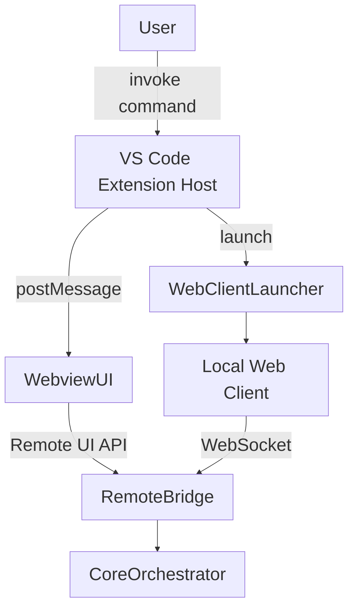

# CodeAI-Hub Extension Architecture

**Version:** 0.2.0  
**Last Updated:** 2025-10-22  
**Status:** Active reference

---

## Document Scope
Документ описывает текущую архитектуру расширения CodeAI-Hub для Visual Studio Code. Он охватывает все элементы, которые поставляются внутри VSIX: extension host слой, встроенный webview UI, локальный веб-клиент (PWA) и механизмы запуска. Подробности об автономном ядре, провайдерных стеках и удалённой инфраструктуре вынесены в профильные документы из каталога `doc/Project_Docs/` (см. ссылки в конце).

## Architectural Overview
Компоненты расширения делятся на три слоя:
- **Extension Host Layer** — точка входа `src/extension.ts`, регистрирующая команды, инициализирующая webview и управляя запуском автономного ядра.
- **VS Code Webview UI** — основной интерфейс, отображающий сессии внутри редактора.
- **Local Web Client (PWA)** — статический бандл, поставляемый вместе с VSIX и запускаемый в отдельном окне браузера без chrome-оболочки.

## Extension Host Layer
- **Activation & Lifecycle**: `src/extension.ts` активирует расширение, регистрирует команды (`codeaiHub.openSettings`, `codeaiHub.launchWebClient`, административные действия) и инициализирует `HomeViewProvider`.
- **Webview Provider**: `HomeViewProvider` создаёт webview, подготавливает HTML (подключает React bundle, CSS, дизайн-токены) и настраивает CSP.
- **Message Routing**: модуль `home-view-message-router` обрабатывает события от webview (`session:create`, `provider:select`, `settings:update`) и проксирует их в автономное ядро через Remote UI Bridge.
- **Core Bootstrap**: при старте расширение проверяет наличие автономного ядра и модулей. Если компоненты отсутствуют, запускается загрузчик (см. `doc/Project_Docs/Stacks/CoreOrchestrator.md`).
- **Shortcut Service**: модуль `src/extension-module/web-client/shortcut-manager.ts` при активации проверяет наличие ярлыка веб-клиента и при необходимости пересоздаёт его (Windows `.lnk` на Desktop, macOS `.app`-launcher на Desktop, Linux `.desktop` в `~/.local/share/applications`), пропуская выполнение в удалённых средах.

## VS Code Webview UI
- **AppHost**: корневой React-компонент управляет состоянием сессий (через hooks `useSessionStore`, `useProviderPickerState`, `useSettingsState`) и синхронизирует его с extension host через `message-handler`. Весь UI-код живёт в `src/client/ui/src` и переиспользуется веб-клиентом без дублирования.
- **Layout**: сетка `session-grid` объединяет панели `ActionBar`, `DialogPanel`, `TodoPanel`, `StatusPanel`, `InputPanel`. Все панели используют общие дизайн-токены и CSS переменные (`media/main-view.css`).
- **Provider Picker & Settings**: отдельные модули `provider-picker`, `settings/view` позволяют выбирать провайдеров и менять конфигурацию визардов. Они отправляют события в extension host и получают подтверждение от ядра.
- **Streaming Rendering**: `StreamingWordEmitter` и `useDialogMessages` формируют потоковый вывод без разрывов Markdown. Логика идентична в webview и локальном веб-клиенте.
- **Accessibility**: все компоненты соответствуют правилам Ultracite (role, aria, tabindex), что позволяет без изменений переносить UI в браузерный клиент.

## Local Web Client (PWA)
- **Bundle**: расположен в `media/web-client/` (HTML + `app.js`). Бандл `app.js` собирается из тех же React-компонентов (`src/client/ui/src`) и содержит встроенный VS Code API stub для автономного запуска. При сборке `npm run build:web-client` основной HTML получает инлайн-версию `main-view.css`, `session-view.css`, `react-chat.css`, поэтому автономный UI визуально идентичен webview даже в браузерах без доступа к `vscode-resource:`.
- **Startup**: кнопка «UI Outside» (`codeaiHub.launchWebClient`) открывает статический бандл `media/web-client/dist/index.html` во внешнем браузере. После интеграции автономного ядра запуск будет сопровождаться проверкой доступности Core Orchestrator.
- **Installation**: первый запуск маркирует PWA как установленную, так что пользователь может закрепить ярлык из меню браузера. Дополнительно расширение создаёт системный ярлык автоматически.
- **Synchronization**: текущая версия отображает заглушечный UI; после запуска Core Orchestrator оба интерфейса будут синхронизированы через Remote UI Bridge.

## Interaction with Core Orchestrator
- Расширение выступает клиентом автономного ядра, используя API, описанные в `doc/Project_Docs/Stacks/CoreOrchestrator.md`.
- Webview общается с extension host через `postMessage`, а host транслирует события по WebSocket в ядро (`session:update`, `stream:chunk`, `workflow:event`, `settings:changed`).
- Локальный веб-клиент подключается к ядру напрямую по WebSocket, используя короткоживущий токен, который выдаёт extension host при запуске.
- Extension host следит за состоянием соединения: при потере связи UI получает уведомление и предложение перезапустить ядро.

## Startup & Launch Flow
1. Пользователь устанавливает VSIX. В директории расширений разворачиваются webview bundle и локальный веб-клиент.
2. При первом запуске extension host проверяет наличие автономного ядра и провайдерных модулей. Недостающие компоненты скачиваются в `~/.codeai-hub`.
3. После успешного bootstrap создаётся/обновляется ярлык локального веб-клиента (Windows Desktop, macOS Applications/Launchpad, Linux Desktop/XDG).
4. Webview загружается по команде `CodeAI Hub: Open`. При необходимости пользователь может запустить локальный веб-клиент через кнопку «UI Outside» или системный ярлык.
5. Оба интерфейса работают параллельно; закрытие VS Code не мешает веб-клиенту продолжать работу с ядром.

## Configuration & Storage
- **VS Code storage**: UI-настройки (темы, предпочтения панелей, последняя активная сессия) хранятся через `vscode.Memento` в `globalStorage` расширения.
- **Secrets**: токены и ключи, используемые для авторизации с ядром и провайдерами, сохраняются в `SecretStorage` VS Code; при недоступности — зашифрованы на стороне ядра.
- **Cache**: временные файлы UI (иконки, снимки состояний) кешируются в каталоге расширения и могут быть очищены командой `CodeAI Hub: Reset UI cache`.

## Security Considerations
- Extension host не хранит провайдерские ключи в открытом виде; он взаимодействует с ядром через временные токены.
- Пару ключ/токен для локального веб-клиента генерирует host при каждом запуске и передаёт в браузер через защищённый канал (command args / query string с одноразовой подписью).
- CSP webview запрещает выполнение inline-скриптов, все ресурсы грузятся из `vscode-resource:` и статических каталогов расширения.
- Remote UI Bridge ограничивает число одновременных подключений и сбрасывает сессии после таймаута простоя.

## Dependencies & Tooling
- **Build**: webview собирается в `media/react-chat.js`, автономный клиент — в `media/web-client/dist/app.js` (команда `npm run build:web-client`, скрипт `scripts/build-web-client.js`). Комбинированный пайплайн запускается `npm run compile` перед упаковкой VSIX.
- **Quality Gates**: Ultracite (Biome) обеспечивает форматирование и линтинг; архитектурный скрипт контролирует структуру `src/` и `media/`.
- **Runtime**: Extension host требует VS Code ≥ 1.90 и Node.js (в составе VS Code). Веб-клиент рассчитан на Chromium-браузеры с поддержкой PWA и WebSocket.

## Related Documents
- `doc/Project_Docs/SystemArchitecture/SystemArchitecture.md`
- `doc/Project_Docs/Stacks/CoreOrchestrator.md`
- `doc/tmp/RemoteCoreBridge.md`
- `doc/TODO/todo-plan.md`
