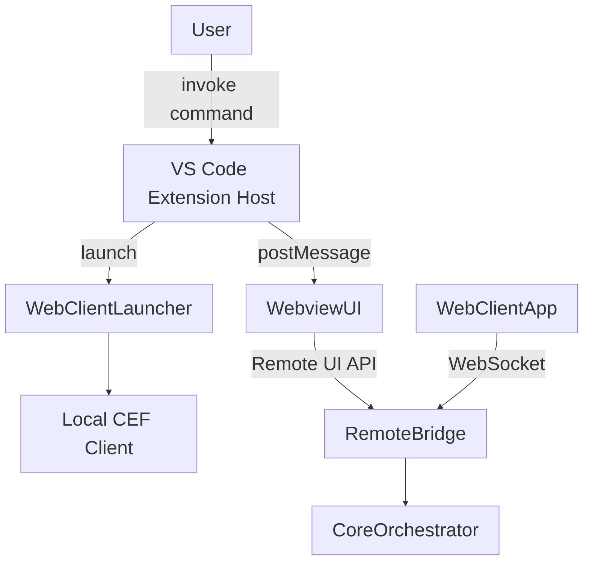

# CodeAI-Hub Extension Architecture

**Version:** 0.3.0  
**Last Updated:** 2025-10-25  
**Status:** Active reference

---

## Document Scope
Документ описывает текущую архитектуру расширения CodeAI-Hub для Visual Studio Code. Он охватывает все элементы, которые поставляются внутри VSIX: extension host слой, встроенный webview UI, локальный веб-клиент (PWA) и механизмы запуска. Подробности об автономном ядре, провайдерных стеках и удалённой инфраструктуре вынесены в профильные документы из каталога `doc/Project_Docs/` (см. ссылки в конце).

## Architectural Overview
Компоненты расширения делятся на три слоя:
- **Extension Host Layer** — точка входа `src/extension.ts`, регистрирующая команды, инициализирующая webview и управляя запуском автономного ядра.
- **VS Code Webview UI** — основной интерфейс, отображающий сессии внутри редактора.
- **Local CEF Client** — статический UI-бандл, запускаемый через Chromium Embedded Framework (cefclient) вне VS Code.

## Extension Host Layer
- **Activation & Lifecycle**: `src/extension.ts` активирует расширение, регистрирует команды (`codeaiHub.openSettings`, `codeaiHub.launchWebClient`, административные действия) и инициализирует `HomeViewProvider`.
- **Webview Provider**: `HomeViewProvider` создаёт webview, подготавливает HTML (подключает React bundle, CSS, дизайн-токены) и настраивает CSP.
- **Message Routing**: модуль `home-view-message-router` обрабатывает события от webview (`session:create`, `provider:select`, `settings:update`) и проксирует их в автономное ядро через Remote UI Bridge.
- **Core Bootstrap**: при старте расширение проверяет наличие автономного ядра и вспомогательных компонентов. `CoreProcessManager` скачивает CEF, лаунчер и бинарник ядра из GitHub Releases, проверяет SHA-1, разворачивает их в `~/.codeai-hub/**` и запускает `codeai-hub-core` на `127.0.0.1:8080`. Если компоненты отсутствуют или версия устарела, запускается загрузчик (см. `doc/Project_Docs/Stacks/CoreOrchestrator.md`).
- **Shortcut Service**: модуль `src/extension-module/web-client/shortcut-manager.ts` при активации проверяет наличие ярлыка веб-клиента и при необходимости пересоздаёт его (Windows `.lnk` на Desktop, macOS `.app`-launcher на Desktop, Linux `.desktop` в `~/.local/share/applications`), пропуская выполнение в удалённых средах.

## VS Code Webview UI
- **AppHost**: корневой React-компонент управляет состоянием сессий (через hooks `useSessionStore`, `useProviderPickerState`, `useSettingsState`) и синхронизирует его с extension host через `message-handler`. Весь UI-код живёт в `src/client/ui/src` и переиспользуется веб-клиентом без дублирования. Модуль `core-bridge` напрямую подключается к локальному ядру (HTTP `/api/v1/status`, WebSocket `/api/v1/stream`), поэтому создание/стриминг сессий не зависят от extension host round-trip.
- **Layout**: сетка `session-grid` объединяет панели `ActionBar`, `DialogPanel`, `TodoPanel`, `StatusPanel`, `InputPanel`. Все панели используют общие дизайн-токены и CSS переменные (`media/main-view.css`).
- **Provider Picker & Settings**: отдельные модули `provider-picker`, `settings/view` позволяют выбирать провайдеров и менять конфигурацию визардов. Они отправляют события в extension host и получают подтверждение от ядра.
- **Streaming Rendering**: `StreamingWordEmitter` и `useDialogMessages` формируют потоковый вывод без разрывов Markdown. Логика идентична в webview и локальном веб-клиенте.
- **Accessibility**: все компоненты соответствуют правилам Ultracite (role, aria, tabindex), что позволяет без изменений переносить UI в браузерный клиент.

## Local CEF Client
- **Bundle**: UI продолжает собираться в `media/web-client/dist/` из общих React-компонентов (`src/client/ui/src`). HTML содержит встроенный stub VS Code API и инлайн-стили (`main-view.css`, `session-view.css`, `react-chat.css`), чтобы визуально совпадать с webview.
- **Runtime Delivery**: `assets/cef/manifest.json` описывает CEF minimal-пакеты для Windows, macOS (x64/arm64) и Linux x64. Модуль `src/extension-module/cef/runtime-installer.ts` скачивает архивы в `~/.codeai-hub/cef/<platform>/<cefVersion>/`, проверяет SHA-1 и распаковывает `Release/`.
- **Launcher Delivery**: `assets/launcher/manifest.json` фиксирует версии `CodeAIHubLauncher`. Модуль `src/extension-module/cef/launcher-installer.ts` скачивает архив лаунчера, распаковывает его в `~/.codeai-hub/cef-launcher/<platform>/<launcherVersion>/` и создаёт `install.json`. При наличии собранного бинаря (локальный fallback) установка пропускается.
- **Launcher Execution**: команда `codeaiHub.launchWebClient` вызывает `ensureCefRuntime` и `ensureLauncherInstalled`, генерирует `config/config.json` рядом с бинарём и запускает `CodeAIHubLauncher` с флагами `--config` + `--url` + `--use-alloy-style`.
- **Preload**: во время `activate` расширение без прогресса вызывает `ensureCefRuntime` и `ensureLauncherInstalled`, так что требуемые архивы подкачиваются или обновляются ещё до нажатия кнопки запуска.
- **Shortcuts**: `shortcut-manager.ts` генерирует ярлыки на установленный `CodeAIHubLauncher` (`.app`/`.exe`/`codeai-hub-launcher`). После обновления лаунчера ярлыки пересоздаются.
- **Stub Mode**: пока Remote UI Bridge не реализован, UI работает на локальных заглушках (`ProviderRegistry`, `SessionLauncher`). После запуска ядра CEF-клиент перейдёт в режим прямого подключения по WebSocket.

## Interaction with Core Orchestrator
- Расширение выступает клиентом автономного ядра, используя API, описанные в `doc/Project_Docs/Stacks/CoreOrchestrator.md`.
- Webview общается с extension host через `postMessage`, а host транслирует события по WebSocket в ядро (`session:update`, `stream:chunk`, `workflow:event`, `settings:changed`).
- Локальный веб-клиент подключается к ядру напрямую по WebSocket, используя короткоживущий токен, который выдаёт extension host при запуске.
- Extension host следит за состоянием соединения: при потере связи UI получает уведомление и предложение перезапустить ядро.

## Startup & Launch Flow
1. Пользователь устанавливает VSIX. В директории расширений разворачиваются webview bundle и статический UI для локального клиента.
2. При первом запуске команды `Launch Web Client` расширение считывает манифесты CEF и лаунчера, скачивает подходящие архивы в `~/.codeai-hub/cef/` и `~/.codeai-hub/cef-launcher/`, проверяет хэши и разворачивает содержимое.
3. После успешной установки генерируется `config/config.json`, обновляются системные ярлыки (Windows Desktop, macOS `.app`, Linux `.desktop`) и записываются маркеры установки (`install.json`).
4. Webview загружается по команде `CodeAI Hub: Open`. Локальный клиент стартует через `CodeAIHubLauncher` и открывает тот же `index.html` из `media/web-client/dist/`.
5. Оба интерфейса работают параллельно; закрытие VS Code не мешает CEF-клиенту продолжать работу с ядром.

## Configuration & Storage
- **VS Code storage**: UI-настройки (темы, предпочтения панелей, последняя активная сессия) хранятся через `vscode.Memento` в `globalStorage` расширения.
- **Secrets**: токены и ключи, используемые для авторизации с ядром и провайдерами, сохраняются в `SecretStorage` VS Code; при недоступности — зашифрованы на стороне ядра.
- **Cache**: временные файлы UI (иконки, снимки состояний) кешируются в каталоге расширения и могут быть очищены командой `CodeAI Hub: Reset UI cache`.

## Security Considerations
- Extension host не хранит провайдерские ключи в открытом виде; он взаимодействует с ядром через временные токены.
- Для stub-режима CEF клиенту не требуются токены; после включения Remote UI Bridge одноразовые ключи будут передаваться через конфигурацию запуска и защищённый канал обмена с ядром.
- CSP webview запрещает выполнение inline-скриптов, все ресурсы грузятся из `vscode-resource:` и статических каталогов расширения.
- Remote UI Bridge ограничивает число одновременных подключений и сбрасывает сессии после таймаута простоя.

## Dependencies & Tooling
- **Build**: webview собирается в `media/react-chat.js`, автономный клиент — в `media/web-client/dist/app.js` (команда `npm run build:web-client`, скрипт `scripts/build-web-client.js`). Комбинированный пайплайн запускается `npm run compile` перед упаковкой VSIX.
- **Quality Gates**: Ultracite (Biome) обеспечивает форматирование и линтинг; архитектурный скрипт контролирует структуру `src/` и `media/`.
- **Runtime**: Extension host требует VS Code ≥ 1.90 и Node.js (в составе VS Code). Локальный клиент использует скачанный `CodeAIHubLauncher` (Chromium Embedded Framework) и не зависит от системного браузера.

## Known Limitations (2025-10-25)
- **Session deletion sync**: удаление сессии в VS Code webview пока не отправляет событие `session:deleted` в автономный клиент. Создание и обмен сообщениями синхронизируются через ядро, но удаление останется в Phase 11 backlog до внедрения полноценного broadcast.

## Related Documents
- `doc/Project_Docs/SystemArchitecture/SystemArchitecture.md`
- `doc/Project_Docs/Stacks/CoreOrchestrator.md`
- `doc/tmp/RemoteCoreBridge.md`
- `doc/Project_Docs/Stacks/CEF_Launcher_Build.md`
- `doc/TODO/todo-plan.md`
