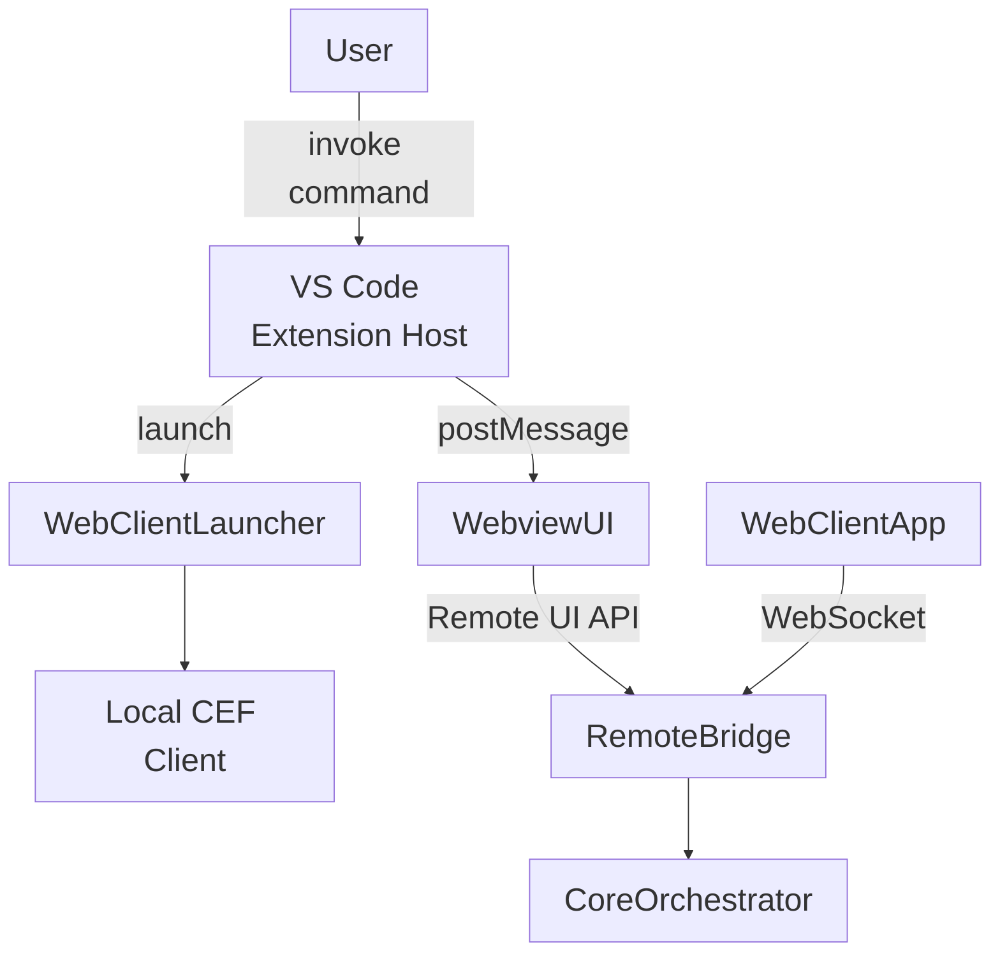

# CodeAI-Hub Extension Architecture

**Version:** 0.5.9
**Last Updated:** 2025-12-27
**Status:** Active reference
**Release Focus:** v1.1.359 — `reasoning_summary_ru` должен быть максимально близок к native reasoning по содержанию/объёму (без chain-of-thought); детали в `doc/Project_Docs/Stacks/Codex_Thinking_RU_Summary_Structured_Outputs.md`.

---

## Document Scope
Документ описывает текущую архитектуру расширения CodeAI-Hub для Visual Studio Code. Он охватывает все элементы, которые поставляются внутри VSIX: extension host слой, встроенный webview UI, локальный веб-клиент (PWA) и механизмы запуска. Подробности об автономном ядре, провайдерных стеках и удалённой инфраструктуре вынесены в профильные документы из каталога `doc/Project_Docs/` (см. ссылки в конце).

## Architectural Overview
Компоненты расширения делятся на три слоя:
- **Extension Host Layer** — точка входа `src/extension.ts`, регистрирующая команды, инициализирующая webview и управляющая подключением к автономному ядру через Core Supervisor.
- **VS Code Webview UI** — основной интерфейс, отображающий сессии внутри редактора.
- **Local CEF Client** — статический UI-бандл, запускаемый через Chromium Embedded Framework (cefclient) вне VS Code.

```mermaid
%%{init: {'themeVariables': { 'fontSize': '28px'}}}%%
graph TD
    User -->|invoke command| VSCodeHost[VS Code Extension Host]
    VSCodeHost -->|postMessage| WebviewUI
    VSCodeHost -->|launch| WebClientLauncher
    WebClientLauncher --> CefClient[Local CEF Client]
    WebviewUI -->|Remote UI API| RemoteBridge
    WebClientApp -->|WebSocket| RemoteBridge
    RemoteBridge --> CoreOrchestrator
```

## Extension Host Layer
- **Activation & Lifecycle**: `src/extension.ts` активирует расширение, регистрирует команды (`codeaiHub.openSettings`, `codeaiHub.launchWebClient`, `codeaiHub.launchProjectManager`) и инициализирует `HomeViewProvider`.
- **UI bundle bootstrap (v1.1.313)**: `ui-activation.ts` (вызывается из `activate`) читает `assets/ui/manifest.json`, ставит отсутствующие tar.bz2 из `~/.codeai-hub/releases/` в `~/.codeai-hub/packages/ui/<bundle>/<version>`, создает symlink `current`. Поддерживаются `vscode-webview`, `web-client` и `project-manager`.
- **Webview Provider**: `HomeViewProvider` создаёт webview, подготавливает HTML (подключает React bundle, CSS, дизайн-токены) и настраивает CSP, беря статику из резолвленого UI-бандла (`~/.codeai-hub/packages/ui/vscode-webview/current`, fallback — `media/`).
- **Message Routing**: модуль `home-view-message-router` обрабатывает события от webview (`session:create`, `provider:select`, `settings:update`) и проксирует их в автономное ядро через Remote UI Bridge.
- **Core Bootstrap (v1.1.353 improvements)**: Ядро переведено на мульти-тенантную архитектуру. Рабочий каталог (`workspacePath`) теперь является свойством конкретной Сессии, а не глобальным параметром процесса. Это позволяет одному экземпляру Ядра обслуживать несколько проектов одновременно.
- **Project Registry**: Внедрен сервис реестра проектов, сохраняющий историю воркспейсов в `~/.codeai-hub/state/projects.json`.
- **RemoteBridge Decomposition**: Монолитный `RemoteBridge` разделен на специализированные хендлеры (`SessionRequestHandler`, `ProjectRequestHandler`, `SystemRequestHandler`, `HttpApiRouter`, `WebSocketManager`), что позволило обеспечить высокую поддерживаемость и соблюдение лимитов размера файлов (< 300 строк).
- **UI Modularization**: Project Manager реализован как отдельный бандл с 7-секционной архитектурой Layout, обеспечивающей динамическую подстройку под контент и интеграцию с нативными диалогами выбора папок VS Code.
- **Runtime installation flow**: скрипт `build-all.sh` теперь устанавливает Core в финальное место (`~/.codeai-hub/core/<platform>/<version>/`) сразу после сборки.
- **Supervisor logging hygiene**: `CoreProcessManager` теперь инициализирует `supervisorLogger` с явными `string` типами (`info`/`error`). Это исключает случайные `[object Object]` вставки в Output Channel, когда Supervisor прокидывает структурированные объекты, и гарантирует одинаковый формат логов в VS Code и launcher.
- **Port negotiation & shutdown**: перед запуском новой версии и расширение, и лаунчер отправляют `POST /api/v1/shutdown` действующему ядру, ждут graceful-stop и при необходимости добивают процесс по PID из `/api/v1/health`. Если порт занят посторонним приложением, менеджеры перебирают пул `8080 → 8081 → 8082 → … → 8092`, выбирают первый свободный вариант и фиксируют его в `~/.codeai-hub/state/runtime-registry.json (network.corePort)` и `CORE_PORT`, поэтому последующие клиенты мгновенно подключаются к актуальному сокету. Это же значение используется в health-мониторинге launcher’а и в UI, поэтому одновременный запуск Standalone + VSIX больше не блокирует обновления.
- **Sticky keepalive & restart flow**: `CoreKeepAlive` (extension-level модуль поверх `CoreProcessManager`) запускается при активации VS Code и держит скрытое WebSocket-подключение к `ws://<host>:<port>/api/v1/stream`, поэтому ядро не зависит от состояния webview. При любом `child.on("exit")` или обрыве соединения keepalive инициирует `ensureStarted()` и переподключение, а orchestrator ждёт `shutdownGracePeriodMs` перед `idle` остановкой, что позволяет кратким разрывам (переключение UI, reconnection) проходить без перезапуска. Команда `codeaiHub.launchWebClient` лишь прогревает ядро перед запуском CEF, но не рестартит его каждый раз. Релиз v1.1.175 закрепил оптимизацию: `ensureStarted()` завершает работу сразу после `detectRunning()` при совпадении версии, поэтому `CoreKeepAlive` и launcher просто переподключаются к существующему процессу. Для Gemini модуль при необходимости инициирует `npm install -g @google/gemini-cli`, чтобы провайдер автоматически переходил в `active` без ручной подготовки.
- **Shortcut Service**: модуль `src/extension-module/web-client/shortcut-manager.ts` при активации проверяет наличие ярлыка веб-клиента и при необходимости пересоздаёт его (Windows `.lnk` на Desktop, macOS `.app`-launcher на Desktop, Linux `.desktop` в `~/.local/share/applications`), пропуская выполнение в удалённых средах.
- **Settings persistence**: `SettingsMessageHandler` сохраняет общие и провайдерские настройки в `~/.codeai-hub/settings/settings.json` (Claude thinking, Codex default model/reasoning, auto-update). При наличии legacy `claude.json` выполняется миграция.
- **Provider version service**: начиная с 1.1.326 `ProviderVersionService` читает версии CLI/SDK из глобального npm (`npm list -g` / `npm view`), а манифесты внутри VSIX используются только для установки провайдерных модулей. Настройки автообновления управляют запуском глобальных апдейтов при старте ядра.
- **Gemini dual-row display (v1.1.320)**: Settings UI показывает две строки для Gemini — CLI и CLI Core — с одной кнопкой Update на строке Core. `GeminiVersionReader` читает версии обоих пакетов из глобального npm, а `updateGeminiAll()` обновляет оба пакета через `npm install -g`.

## VS Code Webview UI
- **AppHost**: корневой React-компонент управляет состоянием сессий (через hooks `useSessionStore`, `useProviderPickerState`, `useSettingsState`) и синхронизирует его с extension host через `message-handler`. Весь UI-код живёт в `src/client/ui/src` и переиспользуется веб-клиентом без дублирования. Модуль `core-bridge` напрямую подключается к локальному ядру (HTTP `/api/v1/status`, WebSocket `/api/v1/stream`), поэтому создание/стриминг сессий не зависят от extension host round-trip.
- **Delivery**: webview грузит JS/CSS из установленного бандла `~/.codeai-hub/packages/ui/vscode-webview/current` (symlink → актуальная версия); VSIX не содержит `react-chat.js`/CSS, embedded медиа используются только в dev-сборках.
- **Empty timeline mode**: до внедрения нормализующего врапера `useSessionStore` игнорирует входящие события `session:message`, поэтому `DialogPanel` остаётся пустым и не показывает суррогатные system-events/placeholder-текст.
- **Layout**: сетка `session-grid` объединяет панели `ActionBar`, `DialogPanel`, `TodoPanel`, `StatusPanel`, `InputPanel`. Все панели используют общие дизайн-токены и CSS переменные (`media/main-view.css`).
- **Session Binding**: `InfoPanel` отображает состояние привязки к провайдеру — ожидается ли реальный `sessionId`, удалось ли его получить, либо инициализация провалилась. После подтверждения от SDK панель выводит полный идентификатор сессии (и подсказку в `title`), помогая отлаживать CLI-интеграции.
- **Clipboard handling**: `input-panel-clipboard` централизует обработку copy/paste в webview и standalone — реагирует на `ClipboardEvent`, использует `navigator.clipboard` как fallback и сохраняет высоту textarea.
- **Provider Picker & Settings**: отдельные модули `provider-picker`, `settings/view` позволяют выбирать провайдеров (Claude, Codex, Gemini) и менять конфигурацию визардов. UI отображает статус подключения каждого стека (connected / offline) и синхронизирует выбор с extension host через события ядра.
- **Provider health isolation**: `ProviderRegistry` отслеживает runtime-ошибки Claude/Codex/Gemini CLI и по сигналу Remote Bridge помечает провайдера как `inactive`, очищает адаптер и планирует автоматический retry. Ошибки `createSession`/`sendMessage`/`closeSession` больше не валят orchestrator: сессия получает статус `failed`, UI выводит предупреждение, а остальные провайдеры продолжают работать.
- **Claude Default model selector**: в разделе Settings → Claude появился новый блок `Claude Default model`, который хранит выбранный alias (`default/sonnet`, `opus`, `haiku`) в `~/.codeai-hub/settings/settings.json` и сразу обновляет переменную окружения `CLAUDE_DEFAULT_MODEL`, чтобы core передавал актуальный alias в Claude SDK при создании сессий.
- **Streaming Rendering**: `StreamingWordEmitter` и `useDialogMessages` формируют потоковый вывод без разрывов Markdown. Логика идентична в webview и локальном веб-клиенте.
- **Accessibility**: все компоненты соответствуют правилам Ultracite (role, aria, tabindex), что позволяет без изменений переносить UI в браузерный клиент.

## Local CEF Client
- **Bundle**: UI ставится в `~/.codeai-hub/packages/ui/web-client/current` (или `project-manager/current`) из release tar.bz2. HTML содержит встроенный stub VS Code API и инлайн-стили (`main-view.css`, `session-view.css`, `react-chat.css`), чтобы визуально совпадать с webview.
- **Runtime Delivery**: `assets/cef/manifest.json` описывает CEF minimal-пакеты для Windows, macOS (x64/arm64) и Linux x64. Модуль `src/extension-module/cef/runtime-installer.ts` скачивает архивы в `~/.codeai-hub/cef/<platform>/<cefVersion>/`, проверяет SHA-1 и распаковывает `Release/`.
- **Launcher Delivery**: `assets/launcher/manifest.json` фиксирует версии `CodeAIHubLauncher`. Модуль `src/extension-module/cef/launcher-installer.ts` скачивает архив лаунчера, распаковывает его в `~/.codeai-hub/packages/launcher/<platform>/<launcherVersion>/` (packages layout) и создаёт `install.json`. При наличии собранного бинаря (локальный fallback) установка пропускается.
- **Launcher Execution**: команда `codeaiHub.launchWebClient` (или `launchProjectManager`) вызывает `ensureCefRuntime` и `ensureLauncherInstalled`.
- **Independent Windows**: Для каждого приложения (Web Client, Project Manager) создается отдельная обертка `.app` (через копирование бинарника), что обеспечивает уникальный Bundle ID и независимое сохранение размеров окон (через `NSUserDefaults`).
- **Standalone bootstrap**: при запуске `CodeAIHubLauncher` внутри приложения встраивается проверка core. Если оркестратор ещё не запущен, лаунчер поднимает bundled Node runtime (`~/.codeai-hub/core/<platform>/<version>/node/bin/node`) и стартует `app/dist/index.js`, прокидывая те же переменные окружения, что и VS Code расширение. Это гарантирует, что автономный интерфейс получает финальный `core:loading-status` и снимает оверлей без участия редактора.
- **Logging**: лаунчер пишет ротационный лог в `~/.codeai-hub/logs/launcher/launcher.log`, а ядро — JSON-журнал в `~/.codeai-hub/logs/core/core.log` (путь прокидывается через `CODEAI_CORE_LOG_FILE`). Провайдеры Claude/Codex/Gemini ведут потоковые jsonl-журналы в формате `~/.codeai-hub/logs/<provider>/sdk-<provider>-<sessionId>.jsonl`, где сохраняется только сырой поток событий SDK; нормализованные `norm-*` файлы появятся вместе с враперами.
- **PATH bootstrap**: перед запуском оркестратора лаунчер дописывает `~/.codeai-hub/core/<platform>/<version>/node/bin` к `PATH`, чтобы встроенный `npm` был доступен инсталляторам Claude и Codex при автономном старте.
- **Window state persistence**: на macOS бинарь `CodeAIHubLauncher` теперь вызывает `setFrameAutosaveName(@"CodeAIHubMainWindow")` и полагается на стандартный autosave AppKit. Благодаря "Binary Copy" стратегии, каждое приложение имеет свой ключ сохранения в `~/Library/Preferences/com.codeaihub.launcher.plist`.
- **Preload**: во время `activate` расширение без прогресса вызывает `ensureCefRuntime` и `ensureLauncherInstalled`, так что требуемые архивы подкачиваются или обновляются ещё до нажатия кнопки запуска.
- **Shortcuts**: `shortcut-manager.ts` генерирует ярлыки на установленные приложения (`CodeAI Hub Web Client.app`, `CodeAI Hub Project Manager.app`).
- **Stub Mode**: пока Remote UI Bridge не реализован, UI работает на локальных заглушках (`ProviderRegistry`, `SessionLauncher`). После запуска ядра CEF-клиент перейдёт в режим прямого подключения по WebSocket.
- **File drop parity**: `RemoteBridge` теперь публикует `POST /api/v1/file-drop` и `DELETE /api/v1/file-drop`, которые опрашивают нативный `FileDropService` (AppleScript/Finder, PowerShell Explorer, xclip) для получения путей выбранных файлов. Standalone UI вызывает эти маршруты через dnd-модуль, поэтому Input Panel в CEF полностью повторяет поведение webview (Shift+drop, мультиссылки, clipboard-интеграция).

## Interaction with Core Orchestrator
- Расширение выступает клиентом автономного ядра, используя API, описанные в `doc/Project_Docs/Stacks/CoreOrchestrator.md`.
- Webview общается с extension host через `postMessage`, а host транслирует события по WebSocket в ядро (`session:update`, `stream:chunk`, `workflow:event`, `settings:changed`).
- Локальный веб-клиент подключается к ядру напрямую по WebSocket, используя короткоживущий токен, который выдаёт extension host при запуске.
- Extension host следит за состоянием соединения: при потере связи UI получает уведомление и предложение перезапустить ядро.

## Startup & Launch Flow
1. Пользователь устанавливает VSIX. При первой активации `prepareUIBundles` ставит `vscode-webview`, `web-client` и `project-manager` из `~/.codeai-hub/releases/` в `~/.codeai-hub/packages/ui/**`, логирует источник (`installed`/`embedded`) и готовит реестр. VSIX несёт только манифесты; embedded `media/` остаётся dev fallback’ом.
2. При подготовке команды `Launch Web Client` расширение считывает манифесты CEF и лаунчера, скачивает подходящие архивы в `~/.codeai-hub/cef/` и `~/.codeai-hub/packages/launcher/`, проверяет хэши и разворачивает содержимое.
3. После успешной установки генерируется `config/config.json` (или `project-manager.json`), обновляются системные ярлыки (Windows Desktop, macOS `.app`, Linux `.desktop`) и записываются маркеры установки (`install.json`).
4. Webview загружается из `~/.codeai-hub/packages/ui/vscode-webview/current` (команда `CodeAI Hub: Open`). Локальный клиент стартует через `CodeAIHubLauncher` и открывает `index.html` из `~/.codeai-hub/packages/ui/web-client/current` (dev fallback — `media/web-client/dist/`).
5. Оба интерфейса работают параллельно; закрытие VS Code не мешает CEF-клиенту продолжать работу с ядром.

## Configuration & Storage
- **VS Code storage**: UI-настройки (темы, предпочтения панелей, последняя активная сессия) хранятся через `vscode.Memento` в `globalStorage` расширения.
- **Secrets**: токены и ключи, используемые для авторизации с ядром и провайдерами, сохраняются в `SecretStorage` VS Code; при недоступности — зашифрованы на стороне ядра.
- **Cache**: временные файлы UI (иконки, снимки состояний) кешируются в каталоге расширения и могут быть очищены командой `CodeAI Hub: Reset UI cache`.
- **Claude defaults**: файл `~/.codeai-hub/settings/settings.json` теперь сохраняет `providers.claude.defaultModel`, расширение синхронизирует его с `CLAUDE_DEFAULT_MODEL`, а core/Claude module используют этот alias для всех новых сессий.

## Security Considerations
- Extension host не хранит провайдерские ключи в открытом виде; он взаимодействует с ядром через временные токены.
- Для stub-режима CEF клиенту не требуются токены; после включения Remote UI Bridge одноразовые ключи будут передаваться через конфигурацию запуска и защищённый канал обмена с ядром.
- CSP webview запрещает выполнение inline-скриптов, все ресурсы грузятся из `vscode-resource:` и статических каталогов расширения.
- Remote UI Bridge ограничивает число одновременных подключений и сбрасывает сессии после таймаута простоя.

## Dependencies & Tooling
- **Build**: VSIX больше не содержит JS/CSS бандлов. UI собирается в независимые tar.bz2 пакеты (`vscode-webview.tar.bz2`, `web-client.tar.bz2`, `project-manager.tar.bz2`) и публикуется в `~/.codeai-hub/releases/`.
- **Quality Gates**: Ultracite (Biome) обеспечивает форматирование и линтинг TS/JS‑кода; архитектурный скрипт контролирует структуру `src/` (лимит 300 строк, фасады, пустые директории). Husky‑хуки (`.husky/pre-commit`, `.husky/pre-push`) оркестрируют запуск архитектурного чека, Ultracite, ts-prune, jscpd и проверок ссылок.
- **Runtime**: Extension host требует VS Code ≥ 1.90 и Node.js (в составе VS Code). Локальный клиент использует скачанный `CodeAIHubLauncher` (Chromium Embedded Framework) и не зависит от системного браузера.

## Recent Changes (v1.1.359 - 2025-12-27)
- **Codex summary alignment**: `reasoning_summary_ru` максимально приближается к native reasoning по содержанию и объёму (без chain-of-thought).
- **Release 1.1.359**: артефакты VSIX/launcher/core/providers/UI обновлены под hotfix prompt.

## Recent Changes (v1.1.358 - 2025-12-27)
- **Codex summary prompt**: structured output инструкции префиксуются, чтобы получать непустой RU summary (пустая строка только при невозможности).
- **Release 1.1.358**: артефакты VSIX/launcher/core/providers/UI обновлены под hotfix prompt.

## Recent Changes (v1.1.357 - 2025-12-27)
- **Codex structured output schema**: `reasoning_summary_ru` обязателен (пустая строка разрешена), иначе CLI отклоняет схему и turn не возвращает ответ.
- **Release 1.1.357**: артефакты VSIX/launcher/core/providers/UI обновлены под hotfix схемы.

## Recent Changes (v1.1.356 - 2025-12-27)
- **Codex structured outputs**: native reasoning скрывается; `answer` стримится из JSON, RU thinking summary попадает в thinking-панель. Подробности: `doc/Project_Docs/Stacks/Codex_Thinking_RU_Summary_Structured_Outputs.md`.
- **Release 1.1.356**: обновлены артефакты VSIX/launcher/core/providers/UI и зафиксированы новые правила отображения thinking.

## Recent Changes (v1.1.340 - 2025-12-23)
- **Shared model card styling**: Claude and Codex selectors now reuse `shared-model-card-styles.ts` so both render the same border/hover/selected palette, radio-circle semantics, and `tabIndex={-1}`/`role="radio"` structure that avoids VS Code focus artifacts. Associated knowledge/architecture docs point out the common alias metadata (`CLAUDE_MODEL_ALIASES`) and refer to the CSS border shorthand doc for why explicit properties are required. Release 1.1.340 bundles the updated VSIX, launcher, core, provider tarballs, and UI bundles.

## Recent Changes (v1.1.339 - 2025-12-23)
- **Claude Default model deployment**: `settings.json` теперь дублируется в `CLAUDE_DEFAULT_MODEL`, Claude SDK читает alias/thinking сразу перед вызовом `query`, и все релизные tarball’ы/core/launcher/UI/VSIX пересобраны для версии 1.1.339.
- **Release 1.1.339**: Артефакты v1.1.339 задеплоены в `~/.codeai-hub/releases/` и `doc/tmp/releases/`, VSIX `codeai-hub-1.1.339.vsix` собран и готов для публикации.

## Recent Changes (v1.1.338 - 2025-12-23)
- **Claude Default model selector**: Корректно сохраняется alias (`default/sonnet`, `opus`, `haiku`) в `settings.json`, расширение дублирует значение в `CLAUDE_DEFAULT_MODEL`, а Core/Claude SDK используют alias при создании новых сессий.
- **Release 1.1.338**: Собраны и прокомпонованы все модули через `build-all.sh` и `build-release.sh`, артефакты положены в `doc/tmp/releases/`, VSIX `codeai-hub-1.1.338.vsix` упакован и готов к публикации.

## Recent Changes (v1.1.334 - 2025-12-22)
- **Codex Default model UI**: устранено наследование focus-within border у невыбранных карточек, остались только `selected`/`unselected` состояния.
- **Codex reasoning overrides**: ядро применяет `model_reasoning_effort` через CLI `--config` при старте сессий, не редактируя `~/.codex/config.toml`.
- **Codex Settings UI polish**: у каждой модели своя кнопка reasoning, старые focus-обводки для невыбранных карточек убраны (только выбран/не выбран).

## Recent Changes (v1.1.333 - 2025-12-22)
- **Codex Default model UI**: устранена фокусная белая обводка у ранее выбранных карточек, остались только `selected`/`unselected` состояния.

## Recent Changes (v1.1.332 - 2025-12-22)
- **Docs-aligned release**: VSIX пересобран вместе с README/CHANGELOG, чтобы страница расширения отображала версию 1.1.332 и актуальный список артефактов.

## Recent Changes (v1.1.327 - 2025-12-21)
- **Codex default model & reasoning**: Settings UI позволяет выбрать дефолтную модель и reasoning-профиль; значения сохраняются в settings.json и применяются при создании новых сессий.
- **Codex model registry**: Добавлен реестр рекомендованных и legacy моделей Codex, плюс справочник уровней reasoning.
- **Codex runtime defaults**: Core читает настройки Codex из settings.json, передаёт default model/reasoning при старте сессий.

## Recent Changes (v1.1.326 - 2025-12-21)
- **Provider Auto Update Service**: при старте ядра выполняется проверка свежих версий CLI/SDK для Claude/Codex/Gemini и, если включено автообновление, происходит глобальный апдейт через npm (настройки доступны в Settings UI).
- **Gemini Global Installation**: `@google/gemini-cli` и `@google/gemini-cli-core` устанавливаются только глобально в npm prefix (например, `~/.npm-global/lib/node_modules/@google`); vendor-каталоги внутри `~/.codeai-hub/providers/gemini` больше не используются.
- **Provider Model References**: добавлены справочники по моделям и утилита для получения актуальных списков (`scripts/fetch-available-models.ts`).

## Recent Changes (v1.1.320 - 2025-11-29)
- **Gemini Update Mechanism**: Settings UI now displays two rows for Gemini: CLI version and CLI Core version, with a single Update button that updates both packages simultaneously. The `GeminiInstaller.updateToLatest()` method handles runtime updates by fetching the latest version from npm registry and extracting tarballs to vendor.
- **Vendor vs Global Installation**: Gemini CLI Core is installed only in vendor directory (`~/.codeai-hub/providers/gemini/<version>/vendor/`), while Gemini CLI is installed both in vendor and globally (`~/.npm-global/`) for user convenience with `gemini login` command.
- **Settings UI Gemini Rows**: `GeminiVersionReader` now reads versions of both `@google/gemini-cli` and `@google/gemini-cli-core` from vendor directory. `ProviderVersionService.updateGeminiAll()` orchestrates the update process.

## Recent Changes (v1.1.315 - 2025-11-28)
- **Unified Quality Gates**: Lefthook заменён на Husky в качестве единственного оркестратора Git‑хуков. Pre-commit выполняет архитектурный чек, ts-prune и `npx ultracite fix` по staged‑файлам; pre-push — jscpd и проверку Markdown‑ссылок. Скрипты `build-all.sh` и `build-release.sh` требуют чистый Git и разделены на два логических шага (build vs release).

## Recent Changes (v1.1.313 - 2025-11-24)
- **Independent Launcher Windows**: Реализована стратегия "Binary Copy" для создания независимых `.app` оберток для каждого приложения (Web Client, Project Manager). Это позволяет сохранять размеры и позицию окон независимо друг от друга.
- **Project Manager**: Добавлен новый UI модуль `project-manager` для управления проектами.
- **Unified Build**: Скрипт `build-all.sh` теперь собирает и упаковывает все компоненты, включая новые UI бандлы.

## Recent Changes (v1.1.302 - 2025-11-24)
- **UI Modularization**: VS Code Webview и CEF Launcher переведены на использование внешних UI бандлов. VSIX пакет уменьшен с ~700KB до ~370KB.
- **Packages Layout**: Внедрена унифицированная структура `~/.codeai-hub/packages/` для хранения компонентов (core, launcher, ui, providers).
- **UI Installer**: Реализован механизм установки и обновления UI бандлов при старте расширения.

## Recent Changes (v1.1.300 - 2025-11-22)
- Settings provider cards теперь используют `ProviderVersionService`, который читает Gemini manifest внутри VSIX и сравнивает его с установленным кэшем `~/.codeai-hub/providers/gemini/**`, поэтому локальная версия `@google/gemini-cli-core` больше не отображается как `Not detected`.
- `HomeViewMessageRouter` прокидывает `extensionPath` в `SettingsMessageHandler` и `ProviderVersionService`, а `CoreProcessManager` приводит `supervisorLogger` к строгому `string` контракту, чтобы VS Code/launcher выводили одинаковые лог-сообщения без `object` шумов.

## Recent Changes (v1.1.94 - 2025-11-01)
- **Overlay messaging**: AppHost крутит заранее подготовленные подсказки (core/Claude/Codex/Gemini) с таймером, скрывает Action Bar до фактического завершения загрузки и сразу убирает оверлей после финального статуса.
- **Silent bootstrap**: `extension.ts` больше не показывает VS Code notifications — подготовка CEF, лаунчера, core и модулей проходит в фоне, а статусы транслируются только в webview.
- **Local artefact cache**: скрипты `build-*-module.sh` и `build-core.sh` кладут свежие tar.bz2 в `~/.codeai-hub/releases/`, удаляют старые версии и не оставляют мусора в `doc/tmp`.

## Previous Changes (v1.1.32 - 2025-10-28)
- **Gemini module v0.1.3**: менеджер сессий перезапускает CLI прозрачно, кэширует подписчиков, подтягивает реальный идентификатор сессии из логов и не падает при повторных сообщениях.
- **Core v0.2.10 bundle**: новый snapshot включает обновлённый Gemini-модуль, поэтому автономный бинарь использует ту же логику удержания сессий, что и workspace.
- **Manifest refresh**: VSIX раздаёт `gemini-module-0.1.3.tar.bz2` и `codeai-hub-core-darwin-arm64-0.2.10.tar.bz2`, что гарантирует использование актуальных артефактов.

## Earlier Changes (v1.1.27 - 2025-10-28)
- **Gemini CLI provider**: пакет `@codeai-hub/gemini-module` подключён к Core и UI. `GeminiInstaller` при первом запуске подготавливает `@google/gemini-cli-core` в `~/.codeai-hub/providers/gemini/<version>/vendor/node_modules`, а сам CLI (`@google/gemini-cli`) ожидается как глобальная установка пользователя (используется для авторизации и конфигурации). Перед инициализацией адаптер валидирует наличие CLI и публикует модуль в `ProviderRegistry`.
- **Gemini CLI isolation (v1.1.316)**: Gemini CLI is now installed in an isolated directory `~/.codeai-hub/providers/gemini/` instead of the global npm prefix (`~/.npm-global`). This prevents the extension from overwriting user's global Gemini CLI installation. The CLI binary is located at `~/.codeai-hub/providers/gemini/bin/gemini`.
- **Gemini Update mechanism (v1.1.320)**: Settings UI displays both Gemini CLI and Gemini CLI Core versions with a single Update button. The `GeminiInstaller.updateToLatest()` method fetches the latest version from npm registry, downloads tarballs, and extracts packages to the vendor directory (`~/.codeai-hub/providers/gemini/<version>/vendor/`). CLI is also installed globally to `~/.npm-global/` for user convenience. Both packages are kept in sync at the same version.
- **UI status badges**: селектор провайдеров отображает статус подключения (`Connected` / `Not connected`) и дизейблит выбор, если стек помечен как `inactive` ядром.
- **Graceful provider downgrade**: при ошибке инициализации (например, отсутствует CLI) провайдер переводится в `inactive`, Core продолжает работу и транслирует состояние в клиенты.

## Earlier Changes (v1.1.16 - 2025-10-26)
- **Claude module auto-updates**: VSIX теперь распространяет только манифест `assets/providers/claude/manifest.json`. При запуске расширение скачивает `claude-module-<version>.tar.bz2`, ставит его в `~/.codeai-hub/providers/claude/<version>/` и прокидывает путь в `CLAUDE_MODULE_PATH`, поэтому Core подхватывает свежий адаптер без пересборки.
- **CLI bootstrap fixes**: `SDKInstaller` вычисляет глобальный npm prefix (`~/.npm-global` / `%APPDATA%\\npm`) и хранит путь до реального бинаря `claude`. `ClaudeSDKManager` передаёт этот путь в SDK (`pathToClaudeCodeExecutable`), устраняя крах `ERR_REQUIRE_ESM`, который возникал при запуске CLI через pkg-Node 18.
- **Slug parity**: Core сохраняет ведущий дефис в `claudeProjectSlug`, благодаря чему SDK пишет в те же каталоги `~/.claude/projects/-<slug>` что и Claude Code CLI. Это важно для resume/JSONL-лога.
- **Provider registry hygiene**: `ProviderRegistry` объявляет только активный Claude-провайдер; заглушки Codex/Gemini удалены, UI больше их не показывает.

## Archived Changes (v1.1.33 - 2025-10-29)
- Первичная попытка перевести Gemini модуль на чистый ESM показала, что ядро на Node 18 не справляется с `require()` ESM-пакетов (`ERR_REQUIRE_ESM`). Эти наработки сохранены для истории, но заменены текущим CJS-мостом на Node 20.
- Скрипты публикации tarball по-прежнему формируют `gemini-module-*.tar.bz2` и обновляют манифесты, однако рабочей считается цепочка c версией 0.3.x и Node 20 runtime.
- Core orchestrator перешёл на ленивую загрузку провайдеров; в актуальной поставке (0.2.21) изменения совмещены с новым Node 20 runtime.

## Known Limitations (2025-10-29)
- `packages/Claude_Module` пока не приведён к полному набору стайлгайдов Ultracite (публичные модификаторы, порядок импортов). Release 1.1.16 закрывает блокер запуска, но линтинг предстоит в отдельной фазе.
- Gemini модуль по-прежнему зависит от предварительной авторизации OAuth в `~/.gemini`; поддержка Windows и расширенный логгер остаются в планах.

## Upcoming Work (2025-10-29)
- Расширить сборку ядра 0.2.11 на остальные платформы (darwin-x64, win32-x64, linux-x64) и обновить соответствующие записи в манифесте.
- Провести e2e-регрессию UI/RemoteBridge с обновлённым ESM-провайдером и задокументировать выводы в Telemetry checklist.
- Подготовить план тестирования Windows-пакета для ESM Gemini модуля после подтверждения работоспособности macOS/Linux.

## Related Documents
- `doc/Project_Docs/SystemArchitecture/SystemArchitecture.md`
- `doc/Project_Docs/Stacks/Codex_Thinking_RU_Summary_Structured_Outputs.md`
- `doc/Project_Docs/Stacks/CoreOrchestrator.md`
- `doc/tmp/RemoteCoreBridge.md`
- `doc/Project_Docs/Stacks/Launcher_CEF_Module.md`
- `doc/TODO/todo-plan.md`
- `doc/Project_Docs/knowledge/Local_Artifacts_Workflow.md`
- `doc/Project_Docs/Stacks/UI_Modules.md`
