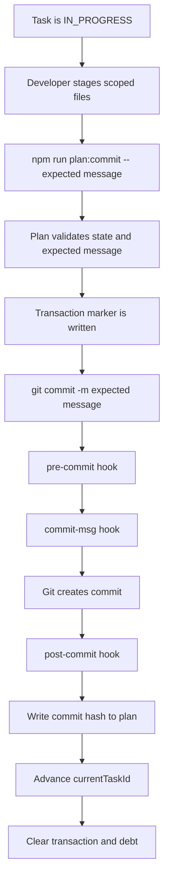
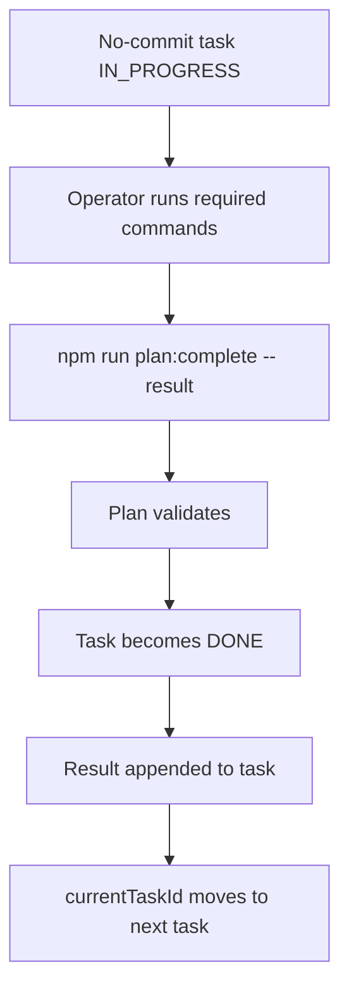

# Plan Orchestrator Implementation Guide

**Дата:** 2026-05-04  
**Назначение:** подробное техническое описание реализации Plan Orchestrator и инструкции по воспроизведению системы в другом репозитории.  
**Статус папки:** переносимый documentation pack; папка не добавлена в `doc/SolidWorks-WorkFlow/Docs_Index.md`.

## 1. Зачем Нужен Plan Orchestrator

Обычный plan-first процесс ломается в трех местах:

1. Агент может помнить план в контексте, но не иметь надежного machine-readable состояния между сессиями.
2. Коммит может пройти, но `todo-plan.md` не обновится, и следующая сессия увидит неправильный active task.
3. Закрытый план может остаться в активной папке, визуально выглядеть активным и конфликтовать с новым intake.

Plan Orchestrator решает эти проблемы через локальный machine-managed state в `doc/TODO/todo-plan.md`, Git hooks, transactional commit wrapper и closeout automation.

Главный принцип: агент не должен вручную "додумывать", какая задача текущая.
Текущая задача, ожидаемый commit message, branch, последняя записанная revision и debt status должны читаться из одного JSON блока.

## 2. Что Было Реализовано

Система была реализована в три этапа.

### 2.1 MVP Orchestrator

Planning reference:

- [reference/planning/Plan_Orchestrator_Architecture.md](reference/planning/Plan_Orchestrator_Architecture.md)

Результат:

- machine-readable `codeai-plan-state`;
- `plan:status`;
- `plan:validate`;
- `plan:complete`;
- `plan:commit`;
- `pre-commit`, `commit-msg`, `post-commit` integration;
- transaction/debt recovery;
- dogfood проверка mixed workflow.

Archived evidence:

- [reference/evidence/session-recovery-check.md](reference/evidence/session-recovery-check.md)
- [reference/evidence/commit-workflow-check.md](reference/evidence/commit-workflow-check.md)
- [reference/evidence/mixed-workflow-acceptance.md](reference/evidence/mixed-workflow-acceptance.md)
- [reference/archives/todo-plan-mixed-orchestrator-test-2026-05-04.md](reference/archives/todo-plan-mixed-orchestrator-test-2026-05-04.md)

### 2.2 Deferred Verification Cycle

Planning reference:

- [reference/planning/Plan_Orchestrator_Deferred_Verification_Architecture.md](reference/planning/Plan_Orchestrator_Deferred_Verification_Architecture.md)

Результат:

- `pre-push` guard;
- `plan:snapshot`;
- `plan:closeout`;
- branch advisory hooks;
- full deferred workflow acceptance;
- full closeout archive.

Archived evidence:

- [reference/evidence/pre-push-guard-check.md](reference/evidence/pre-push-guard-check.md)
- [reference/evidence/snapshot-automation-check.md](reference/evidence/snapshot-automation-check.md)
- [reference/evidence/closeout-command-check.md](reference/evidence/closeout-command-check.md)
- [reference/evidence/branch-hooks-check.md](reference/evidence/branch-hooks-check.md)
- [reference/evidence/deferred-workflow-acceptance.md](reference/evidence/deferred-workflow-acceptance.md)
- [reference/archives/todo-plan-closeout-plan-orchestrator-deferred-verification-2026-05-04.md](reference/archives/todo-plan-closeout-plan-orchestrator-deferred-verification-2026-05-04.md)

### 2.3 Closeout Replacement Follow-up

Planning reference:

- [reference/planning/Plan_Orchestrator_Closeout_Replacement_Architecture.md](reference/planning/Plan_Orchestrator_Closeout_Replacement_Architecture.md)

Результат:

- closeout commit finalization теперь заменяет active `doc/TODO/todo-plan.md` на terminal `NONE` template;
- terminal template очищает `currentTaskId`, `expectedCommitMessage`, `debt`;
- terminal template указывает latest closeout archive и archived planning source;
- terminal template не содержит `AGENTS.md`;
- старый reserved post-closeout handoff anchor не сохраняется в active template.

Archived evidence:

- [reference/evidence/closeout-replacement-check.md](reference/evidence/closeout-replacement-check.md)
- [reference/evidence/closeout-replacement-acceptance.md](reference/evidence/closeout-replacement-acceptance.md)
- [reference/archives/todo-plan-closeout-plan-orchestrator-closeout-replacement-2026-05-04.md](reference/archives/todo-plan-closeout-plan-orchestrator-closeout-replacement-2026-05-04.md)

## 3. Файловая Архитектура

Минимальная файловая структура:

```text
doc/
  TODO/
    todo-plan.md
    Archive/
  SolidWorks-WorkFlow/
    Plans/
    Plans/Archive/
scripts/
  plan-orchestrator/
    *.mjs
    *.test.mjs
.husky/
  pre-commit
  commit-msg
  post-commit
  pre-push
  post-checkout
package.json
```

Reference copies:

- [reference/scripts/plan-orchestrator/](reference/scripts/plan-orchestrator/)
- [reference/hooks/](reference/hooks/)
- [PACKAGE_SCRIPTS.md](PACKAGE_SCRIPTS.md)

## 4. Active Plan Как Machine-managed State

`doc/TODO/todo-plan.md` содержит обычный Markdown план и embedded machine state block.
Скрипты не пытаются парсить весь Markdown как AST.
Они используют:

- JSON block между markers;
- task ids в тексте;
- статусы `[TODO]`, `[IN_PROGRESS]`, `[DONE]`, `[BLOCKED]`;
- paired `Git Commit: ...` items.

### 4.1 State Block

Обязательный блок:

````markdown
<!-- codeai-plan-state:start -->
```json
{
  "schema": "codeai-plan-v1",
  "executionScopeStatus": "ACTIVE",
  "planId": "example-scope-2026-05-04",
  "branch": "main",
  "baseHead": "abc1234",
  "lastRecordedCommit": "abc1234",
  "planningSource": "doc/SolidWorks-WorkFlow/Plans/Example_Architecture.md",
  "currentTaskId": "phase1.stream1.task1",
  "expectedCommitMessage": "docs: add example plan",
  "debt": null
}
```
<!-- codeai-plan-state:end -->
````

В реальном Markdown используйте fence длиннее вложенного `json` fence, если показываете state block как пример.

### 4.2 Поля State

`schema`
: Версия схемы. Текущая версия: `codeai-plan-v1`.

`executionScopeStatus`
: `ACTIVE`, `BLOCKED` или `NONE`.

`planId`
: Стабильный идентификатор scope. Используется для archive path.

`branch`
: Git branch, на котором scope должен выполняться.

`baseHead`
: Commit, от которого начался scope.

`lastRecordedCommit`
: Последний commit hash, который оркестратор записал в active plan state.

`planningSource`
: Путь к planning-документу, на котором основан active plan.

`currentTaskId`
: Task id текущего пункта. Для terminal `NONE` равен `null`.

`expectedCommitMessage`
: Сообщение коммита, которое обязано быть использовано для текущей commit-task. Для no-commit tasks и terminal `NONE` равно `null`.

`debt`
: `null`, если debt нет. Объект, если commit transaction сломалась и требуется repair.

## 5. Статусы Execution Scope

### 5.1 ACTIVE

Есть активный scope.
Агент должен:

- читать только Context Pack из `todo-plan.md`;
- выполнять текущий `currentTaskId`;
- использовать `plan:complete` или `plan:commit`;
- не искать legacy recovery reports;
- не начинать новый plan intake.

### 5.2 BLOCKED

План остановлен.
Агент должен:

- выполнить `npm run plan:status`;
- прочитать blocker/debt reason;
- не продолжать реализацию;
- выполнить `npm run plan:repair` или получить явное решение пользователя.

### 5.3 NONE

Активного scope нет.
Агент должен:

- прочитать system-level architecture;
- согласовать новый scope;
- выбрать релевантные docs через docs index;
- создать planning-doc;
- только после acceptance создать новый active `todo-plan.md`.

Terminal `NONE` template намеренно короткий.
Он не должен содержать старый полный план.

## 6. Шаблон Active Plan

Active plan должен иметь:

- Context Pack;
- Recovery Pack;
- Execution Rules;
- Phase/Stream/Task структуру;
- отдельные Git Commit items после каждой commit-task;
- final streams: tooling/release verification, user acceptance, closeout.

Пример task пары:

```markdown
1. [IN_PROGRESS] `phase1.stream1.task1` Add validator support (scope: `scripts/plan-orchestrator/plan-validator.mjs`, `scripts/plan-orchestrator/plan-validator.test.mjs`; expected commit: `feat: add plan validator`).
2. [TODO] `phase1.stream1.commit1` Git Commit: `feat: add plan validator` (hash: TBD)
```

Пример no-commit task:

```markdown
1. [IN_PROGRESS] `phase2.stream1.task1` Run tooling verification and record result via `plan:complete` (scope: commands only; expected commit: not required).
```

## 7. Context Pack

Context Pack - единственный recovery context текущего execution cycle.
Он должен быть коротким и точным.

Хороший Context Pack:

```markdown
## Context Pack For This Cycle

- **Execution Scope Status:** ACTIVE
- **Planning source:** `doc/SolidWorks-WorkFlow/Plans/Example_Architecture.md`
- **Branch:** `main`
- **Target outcome:** implement example workflow.
- **Out of scope:** release build, provider runtime.
- **Read this context before implementation:**
  - `doc/SolidWorks-WorkFlow/Plans/Example_Architecture.md`
  - `doc/SolidWorks-WorkFlow/Contracts/FacadeClassDiagram_DesignAndMaintenance.md`
  - `scripts/plan-orchestrator/`
  - `package.json`
- Only this list is the recovery context for this execution cycle.
```

`AGENTS.md` не нужно добавлять в Context Pack, если среда уже подает его содержимое при старте каждой сессии.
Это важно: иначе active plan начинает дублировать session bootstrap и раздувает recovery context.

## 8. Команды Оператора

Все команды приведены в [PACKAGE_SCRIPTS.md](PACKAGE_SCRIPTS.md).

### 8.1 status

```bash
npm run plan:status
```

Печатает:

- schema;
- execution scope status;
- plan id;
- branch;
- last recorded commit;
- current task;
- expected commit;
- debt status;
- validation result.

Implementation:

- [reference/scripts/plan-orchestrator/plan-cli.mjs](reference/scripts/plan-orchestrator/plan-cli.mjs)
- [reference/scripts/plan-orchestrator/plan-validator.mjs](reference/scripts/plan-orchestrator/plan-validator.mjs)

### 8.2 validate

```bash
npm run plan:validate
```

Проверяет, что active plan согласован с machine state.

Implementation:

- [reference/scripts/plan-orchestrator/plan-validator.mjs](reference/scripts/plan-orchestrator/plan-validator.mjs)
- [reference/scripts/plan-orchestrator/plan-state-parser.mjs](reference/scripts/plan-orchestrator/plan-state-parser.mjs)
- [reference/scripts/plan-orchestrator/plan-task-locator.mjs](reference/scripts/plan-orchestrator/plan-task-locator.mjs)

### 8.3 complete

```bash
npm run plan:complete -- "<short result>"
```

Используется для no-commit tasks.
Скрипт:

- проверяет active plan;
- убеждается, что current task не требует commit;
- переводит current task в `[DONE]`;
- добавляет `Result: ...`;
- продвигает `currentTaskId` к следующей задаче;
- обновляет `expectedCommitMessage`.

Implementation:

- [reference/scripts/plan-orchestrator/plan-complete.mjs](reference/scripts/plan-orchestrator/plan-complete.mjs)
- [reference/scripts/plan-orchestrator/plan-markdown-updater.mjs](reference/scripts/plan-orchestrator/plan-markdown-updater.mjs)

### 8.4 commit

```bash
npm run plan:commit -- "<expected commit message>"
```

Это единственный штатный путь для commit-task.
Скрипт:

- проверяет active plan;
- сверяет argument с `expectedCommitMessage`;
- создает commit transaction marker;
- запускает `git commit -m "<message>"`;
- не обходит hooks;
- оставляет финализацию `post-commit` hook.

Implementation:

- [reference/scripts/plan-orchestrator/plan-commit.mjs](reference/scripts/plan-orchestrator/plan-commit.mjs)
- [reference/scripts/plan-orchestrator/plan-transaction.mjs](reference/scripts/plan-orchestrator/plan-transaction.mjs)
- [reference/scripts/plan-orchestrator/plan-debt.mjs](reference/scripts/plan-orchestrator/plan-debt.mjs)

### 8.5 repair

```bash
npm run plan:repair
```

Используется, когда `.git/codeai-plan-debt` существует.

Repair может:

- доказать, что commit был создан, но plan finalize не прошел;
- записать missing hash;
- продвинуть план;
- очистить debt.

Если безопасный repair невозможен, plan переводится в `BLOCKED`.

Implementation:

- [reference/scripts/plan-orchestrator/plan-repair.mjs](reference/scripts/plan-orchestrator/plan-repair.mjs)
- [reference/scripts/plan-orchestrator/plan-debt.mjs](reference/scripts/plan-orchestrator/plan-debt.mjs)
- [reference/scripts/plan-orchestrator/plan-git-state.mjs](reference/scripts/plan-orchestrator/plan-git-state.mjs)

### 8.6 snapshot

```bash
npm run plan:snapshot -- "<snapshot note>"
```

Создает tracked snapshot active plan в `doc/TODO/Archive/`.
Нужен, когда active `todo-plan.md` ignored/local, но состояние должно быть сохранено в Git history до closeout.

Implementation:

- [reference/scripts/plan-orchestrator/plan-snapshot.mjs](reference/scripts/plan-orchestrator/plan-snapshot.mjs)

### 8.7 closeout

```bash
npm run plan:closeout -- "<acceptance evidence>"
```

Closeout не завершает commit сам.
Он подготавливает tracked artifacts:

- closeout archive в `doc/TODO/Archive/`;
- перенос planning source в `Plans/Archive/`;
- обновление docs navigation, если найден точный путь;
- обновление active plan planningSource на archived path.

Финальная замена active `todo-plan.md` на terminal `NONE` template происходит после closeout commit в `post-commit` finalization.

Implementation:

- [reference/scripts/plan-orchestrator/plan-closeout.mjs](reference/scripts/plan-orchestrator/plan-closeout.mjs)
- [reference/scripts/plan-orchestrator/plan-markdown-updater.mjs](reference/scripts/plan-orchestrator/plan-markdown-updater.mjs)

## 9. Husky Hooks

Hooks - это enforcement layer.
Они не заменяют operator commands, но закрывают обходные пути.

### 9.1 pre-commit

File:

- [reference/hooks/pre-commit](reference/hooks/pre-commit)

Flow:

1. Запускает [plan-hook-pre-commit.mjs](reference/scripts/plan-orchestrator/plan-hook-pre-commit.mjs).
2. Запускает architecture check.
3. Запускает `npm run lint`.
4. Запускает `npm run check:knip`.
5. Форматирует только staged files через Ultracite.
6. Re-add staged files.
7. Возвращает formatter exit code.

Почему staged-only formatting важен:

- hook не должен переписывать незастейдженные пользовательские изменения;
- hook не должен случайно включить чужие изменения в commit;
- formatter должен быть частью commit gate, но не глобальным refactor.

Plan pre-commit guard блокирует прямой commit при active machine-managed plan, если commit не идет через transaction marker.

### 9.2 commit-msg

File:

- [reference/hooks/commit-msg](reference/hooks/commit-msg)

Flow:

1. Запускает обычный project commit message check.
2. Запускает [plan-hook-commit-msg.mjs](reference/scripts/plan-orchestrator/plan-hook-commit-msg.mjs).

Plan commit-msg guard проверяет, что actual commit message совпадает с `expectedCommitMessage`.
Это защищает план от drift: task ожидает один commit, Git history получает другой.

### 9.3 post-commit

File:

- [reference/hooks/post-commit](reference/hooks/post-commit)

Flow:

1. Запускает [plan-hook-post-commit.mjs](reference/scripts/plan-orchestrator/plan-hook-post-commit.mjs).
2. Если есть pending transaction, получает новый HEAD hash.
3. Записывает hash в paired `Git Commit` item.
4. Переводит task и commit item в `[DONE]`.
5. Продвигает `currentTaskId`.
6. Обновляет `expectedCommitMessage`.
7. Удаляет transaction/debt markers при успехе.

Последний closeout commit имеет особое поведение: вместо продвижения к reserved handoff anchor `post-commit` создает terminal `NONE` template.

### 9.4 pre-push

File:

- [reference/hooks/pre-push](reference/hooks/pre-push)

Flow:

1. Запускает [plan-hook-pre-push.mjs](reference/scripts/plan-orchestrator/plan-hook-pre-push.mjs).
2. Запускает duplication check.
3. Запускает markdown links check.

Plan pre-push guard блокирует push, если:

- active plan invalid;
- `.git/codeai-plan-debt` существует;
- active plan branch не совпадает с текущим Git branch;
- `lastRecordedCommit` недостижим из текущего HEAD.

Если `executionScopeStatus: NONE`, push guard разрешает push.

### 9.5 post-checkout

File:

- [reference/hooks/post-checkout](reference/hooks/post-checkout)

Flow:

1. Определяет repository root.
2. Запускает [plan-hook-branch-advisory.mjs](reference/scripts/plan-orchestrator/plan-hook-branch-advisory.mjs).
3. Не блокирует checkout.

Branch advisory предупреждает о mismatch active plan branch и текущей Git branch.
Это advisory, потому что блокировать checkout неудобно: разработчик может переключаться для диагностики.

## 10. Внутренние Модули Скриптов

### 10.1 CLI Layer

- [plan-cli.mjs](reference/scripts/plan-orchestrator/plan-cli.mjs)

Единая CLI точка для:

- `status`;
- `validate`;
- `complete`;
- `commit`;
- `repair`.

`plan:closeout` и `plan:snapshot` вынесены отдельными entrypoints, потому что они создают файловые artifacts и имеют отдельные usage contracts.

### 10.2 State Parser

- [plan-state-parser.mjs](reference/scripts/plan-orchestrator/plan-state-parser.mjs)
- [plan-state-types.mjs](reference/scripts/plan-orchestrator/plan-state-types.mjs)

Отвечает за:

- поиск `codeai-plan-state` block;
- JSON parse;
- проверку базовой формы state;
- понятные ошибки для missing/malformed/unsupported schema.

### 10.3 Task Locator

- [plan-task-locator.mjs](reference/scripts/plan-orchestrator/plan-task-locator.mjs)

Отвечает за поиск task items в Markdown.
Логика intentionally simple:

- task id находится как inline code;
- status находится в bracket marker;
- paired commit item находится рядом после task;
- expected commit читается из текста task и commit item.

### 10.4 Validator

- [plan-validator.mjs](reference/scripts/plan-orchestrator/plan-validator.mjs)

Проверяет:

- state block существует;
- schema поддерживается;
- current task существует;
- current task имеет `[IN_PROGRESS]`, если scope `ACTIVE`;
- expected commit в state совпадает с task;
- paired `Git Commit` item существует для commit-task;
- commit item message совпадает;
- нет duplicate task ids;
- branch совпадает;
- debt отсутствует;
- `NONE` state не требует current task.

### 10.5 Markdown Updater

- [plan-markdown-updater.mjs](reference/scripts/plan-orchestrator/plan-markdown-updater.mjs)

Это центральный модуль изменения plan Markdown.
Он делает:

- mark current task done;
- mark paired commit done;
- write commit hash;
- advance to next task;
- write no-commit result;
- update state;
- create terminal `NONE` template after closeout finalization.

Ключевое поведение closeout replacement:

- если closeout commit закрывает scope, updater не оставляет старый полный plan active;
- он возвращает короткий terminal `NONE` Markdown;
- template содержит latest archive path;
- template не содержит `AGENTS.md`.

### 10.6 Transaction And Debt

- [plan-transaction.mjs](reference/scripts/plan-orchestrator/plan-transaction.mjs)
- [plan-debt.mjs](reference/scripts/plan-orchestrator/plan-debt.mjs)

Transaction marker нужен, чтобы hooks знали: commit идет легально через `plan:commit`.

Debt marker нужен для crash-safe поведения.
Типовой сбой:

1. `plan:commit` создал transaction.
2. `git commit` успешно создал commit.
3. `post-commit` упал до обновления `todo-plan.md`.
4. Git history уже изменена, active plan еще нет.

В этом случае нельзя молча продолжать.
Создается `.git/codeai-plan-debt`, и следующие операции блокируются.

### 10.7 Repair

- [plan-repair.mjs](reference/scripts/plan-orchestrator/plan-repair.mjs)

Repair должен быть conservative.
Он чинит только доказуемо безопасные состояния.
Если нельзя надежно доказать, какой commit должен быть записан в active plan, repair переводит plan в `BLOCKED`.

### 10.8 Git State

- [plan-git-state.mjs](reference/scripts/plan-orchestrator/plan-git-state.mjs)

Минимальный Git adapter:

- current branch;
- HEAD hash;
- reachability checks.

### 10.9 Snapshot

- [plan-snapshot.mjs](reference/scripts/plan-orchestrator/plan-snapshot.mjs)

Пишет active plan copy в tracked archive path.
Используется как страховка, если active plan ignored/local.

### 10.10 Closeout

- [plan-closeout.mjs](reference/scripts/plan-orchestrator/plan-closeout.mjs)

Closeout делает файловые операции до финального commit:

- требует explicit acceptance evidence;
- валидирует active plan;
- проверяет, что scope `ACTIVE`;
- вычисляет archive path из `planId`;
- проверяет, что archive path не ignored;
- переносит planning source в `Plans/Archive/`;
- обновляет active plan planningSource на archived path;
- пишет closeout archive.

### 10.11 Hook Modules

- [plan-hook-pre-commit.mjs](reference/scripts/plan-orchestrator/plan-hook-pre-commit.mjs)
- [plan-hook-commit-msg.mjs](reference/scripts/plan-orchestrator/plan-hook-commit-msg.mjs)
- [plan-hook-post-commit.mjs](reference/scripts/plan-orchestrator/plan-hook-post-commit.mjs)
- [plan-hook-pre-push.mjs](reference/scripts/plan-orchestrator/plan-hook-pre-push.mjs)
- [plan-hook-branch-advisory.mjs](reference/scripts/plan-orchestrator/plan-hook-branch-advisory.mjs)

Каждый hook module маленький и отвечает за одну точку enforcement.

## 11. Commit Lifecycle

Нормальный commit-task проходит так:



Важная деталь: `plan:commit` не использует `--no-verify`.
Все project quality gates остаются обязательными.

## 12. No-commit Lifecycle

No-commit task не должен создавать пустой commit.
Он закрывается так:

```bash
npm run plan:complete -- "tooling verification passed: suite 46/46, status OK, validate OK"
```

Flow:



## 13. Session Recovery Lifecycle

В начале новой сессии агент должен открыть `doc/TODO/todo-plan.md` и смотреть на `executionScopeStatus`.

### 13.1 Если ACTIVE

Действия:

1. Выполнить `npm run plan:status`.
2. Прочитать Context Pack из active plan.
3. Не читать legacy reports.
4. Продолжить current task.
5. Проверить debt.

### 13.2 Если BLOCKED

Действия:

1. Выполнить `npm run plan:status`.
2. Прочитать blocker/debt.
3. Не продолжать implementation.
4. Запустить `npm run plan:repair` или спросить пользователя.

### 13.3 Если NONE

Действия:

1. Прочитать system architecture.
2. Использовать docs index для выбора релевантных документов.
3. Согласовать новый scope.
4. Создать planning-doc.
5. После acceptance создать новый `todo-plan.md`.

## 14. Branch Change Lifecycle

Branch mismatch не должен тихо ломать active plan.
При checkout hook запускает advisory.

Если branch отличается:

- пользователь видит предупреждение;
- checkout не блокируется;
- push guard позже заблокирует push active plan с branch mismatch.

Почему не блокировать checkout:

- диагностика часто требует переключения веток;
- hard block в `post-checkout` создает плохой UX;
- реальная защита нужна перед commit/push.

## 15. Pre-push Lifecycle

Перед push система проверяет:

- active plan валиден;
- debt отсутствует;
- branch совпадает;
- `lastRecordedCommit` достижим из текущего HEAD;
- duplication threshold проходит;
- markdown links проходят.

Это защищает remote branch от состояния, где код ушел, а plan state не догнал.

## 16. Closeout Lifecycle

Closeout intentionally split на две части.

### 16.1 Подготовка Artifacts

Команда:

```bash
npm run plan:closeout -- "<acceptance evidence>"
```

Создает:

- `doc/TODO/Archive/todo-plan-closeout-<planId>.md`;
- archived planning source в `doc/SolidWorks-WorkFlow/Plans/Archive/`;
- active plan copy с planning source замененным на archive path.

### 16.2 Финальный Commit

Команда:

```bash
npm run plan:commit -- "<expected closeout commit message>"
```

После commit `post-commit`:

- записывает closeout commit hash;
- видит, что scope закрывается;
- создает terminal `NONE` template;
- очищает active state.

### 16.3 Terminal NONE Template

Пример результата:

````markdown
# Development TODO Plan

<!-- codeai-plan-state:start -->
```json
{
  "schema": "codeai-plan-v1",
  "executionScopeStatus": "NONE",
  "planId": "example-scope-2026-05-04",
  "branch": "main",
  "baseHead": "abc1234",
  "lastRecordedCommit": "def5678",
  "planningSource": "doc/SolidWorks-WorkFlow/Plans/Archive/Example_Architecture.md",
  "currentTaskId": null,
  "expectedCommitMessage": null,
  "debt": null
}
```
<!-- codeai-plan-state:end -->

## No Active Execution Scope

- **Execution Scope Status:** NONE
- **Latest closeout archive:** `doc/TODO/Archive/todo-plan-closeout-example-scope-2026-05-04.md`
- **Planning source:** `doc/SolidWorks-WorkFlow/Plans/Archive/Example_Architecture.md`
- **Last recorded commit:** `def5678`

## Start Next Scope

There is no active execution scope. Before starting new implementation work:

- read `doc/SolidWorks-WorkFlow/System/SystemArchitecture.md`;
- use `doc/SolidWorks-WorkFlow/Docs_Index.md` to choose relevant documents;
- create or update a planning document under `doc/SolidWorks-WorkFlow/Plans/`;
- create a new active `doc/TODO/todo-plan.md` only after the new scope is accepted.
````

В этом template нет `AGENTS.md`.

## 17. Debt Model

Debt - это не "технический долг" в обычном смысле.
Это transaction safety marker.

Debt означает: состояние Git и состояние plan могли разойтись.

Правила:

- при debt нельзя продолжать task execution;
- при debt нельзя push;
- repair должен быть первым действием;
- если repair не уверен, plan переводится в `BLOCKED`.

Типовые debt причины:

- commit succeeded, post-commit failed before hash write;
- transaction marker остался после interrupted commit;
- active plan был изменен вручную в момент transaction.

## 18. Validation Rules

Валидатор должен fail-close.

Он должен считать plan invalid, если:

- state block отсутствует;
- JSON malformed;
- schema неизвестна;
- `ACTIVE` без current task;
- current task отсутствует в Markdown;
- current task status не `[IN_PROGRESS]`;
- duplicate task ids;
- expected commit mismatch;
- paired commit item отсутствует;
- paired commit message mismatch;
- branch mismatch;
- debt exists.

Он должен разрешать:

- `NONE` state без current task;
- active no-commit task без expected commit;
- valid active task with paired commit.

## 19. Почему `AGENTS.md` Не В Context Pack

В этой среде `AGENTS.md` передается агенту при старте сессии.
Если добавить его в `Read this context before implementation`, получится:

- дублирование bootstrap instructions;
- лишний recovery context;
- риск, что plan начнет выглядеть зависимым от файла, который уже обрабатывается платформой;
- хуже переносимость terminal `NONE` template.

Поэтому правило такое:

- `AGENTS.md` может быть project bootstrap instruction;
- `AGENTS.md` не должен быть обязательным item в generated terminal template;
- active plan Context Pack должен перечислять только scope-specific recovery docs.

## 20. Testing Strategy

Тесты являются executable specification.

Полный suite:

```bash
node --test scripts/plan-orchestrator/*.test.mjs
```

Текущий подтвержденный результат:

- `46/46` tests passed.

Основные test files:

- [plan-state-parser.test.mjs](reference/scripts/plan-orchestrator/plan-state-parser.test.mjs)
- [plan-validator.test.mjs](reference/scripts/plan-orchestrator/plan-validator.test.mjs)
- [plan-complete.test.mjs](reference/scripts/plan-orchestrator/plan-complete.test.mjs)
- [plan-markdown-updater.test.mjs](reference/scripts/plan-orchestrator/plan-markdown-updater.test.mjs)
- [plan-transaction.test.mjs](reference/scripts/plan-orchestrator/plan-transaction.test.mjs)
- [plan-repair.test.mjs](reference/scripts/plan-orchestrator/plan-repair.test.mjs)
- [plan-hook-pre-commit.test.mjs](reference/scripts/plan-orchestrator/plan-hook-pre-commit.test.mjs)
- [plan-hook-post-commit.test.mjs](reference/scripts/plan-orchestrator/plan-hook-post-commit.test.mjs)
- [plan-hook-pre-push.test.mjs](reference/scripts/plan-orchestrator/plan-hook-pre-push.test.mjs)
- [plan-hook-branch-advisory.test.mjs](reference/scripts/plan-orchestrator/plan-hook-branch-advisory.test.mjs)
- [plan-closeout.test.mjs](reference/scripts/plan-orchestrator/plan-closeout.test.mjs)
- [plan-snapshot.test.mjs](reference/scripts/plan-orchestrator/plan-snapshot.test.mjs)
- [plan-dogfood.test.mjs](reference/scripts/plan-orchestrator/plan-dogfood.test.mjs)

## 21. Dogfood Evidence

Evidence documents фиксируют не только "тесты прошли", а что именно было проверено в реальном workflow.

Примеры:

- [session-recovery-check.md](reference/evidence/session-recovery-check.md) - восстановление сессии по active plan.
- [commit-workflow-check.md](reference/evidence/commit-workflow-check.md) - штатный `plan:commit`.
- [mixed-workflow-acceptance.md](reference/evidence/mixed-workflow-acceptance.md) - mixed next-session recovery / complete / commit workflow.
- [pre-push-guard-check.md](reference/evidence/pre-push-guard-check.md) - push guard.
- [snapshot-automation-check.md](reference/evidence/snapshot-automation-check.md) - plan snapshot.
- [closeout-command-check.md](reference/evidence/closeout-command-check.md) - closeout command.
- [branch-hooks-check.md](reference/evidence/branch-hooks-check.md) - branch advisory.
- [deferred-workflow-acceptance.md](reference/evidence/deferred-workflow-acceptance.md) - deferred cycle acceptance.
- [closeout-replacement-check.md](reference/evidence/closeout-replacement-check.md) - terminal template replacement.
- [closeout-replacement-acceptance.md](reference/evidence/closeout-replacement-acceptance.md) - final acceptance.

## 22. Practical Operator Workflow

### 22.1 Начать Сессию

```bash
npm run plan:status
```

Если `ACTIVE`, открыть `doc/TODO/todo-plan.md`, прочитать Context Pack, выполнить current task.

### 22.2 Выполнить Commit Task

```bash
git add <files>
npm run plan:commit -- "<expected commit message>"
npm run plan:status
```

Проверить:

- commit created;
- post-commit finalized;
- current task advanced;
- debt none.

### 22.3 Выполнить No-commit Task

```bash
<run required commands>
npm run plan:complete -- "<result>"
npm run plan:status
```

### 22.4 Закрыть Scope

```bash
# 1. получить user acceptance
# 2. записать acceptance evidence
git add doc/TODO/OrchestratorTest/<acceptance>.md
npm run plan:commit -- "<acceptance commit message>"

# 3. подготовить closeout artifacts
npm run plan:closeout -- "<acceptance evidence>"

# 4. закоммитить closeout artifacts
git add doc/TODO/Archive/<archive>.md doc/SolidWorks-WorkFlow/Plans/Archive/<planning>.md
npm run plan:commit -- "<closeout commit message>"

# 5. проверить terminal state
npm run plan:status
npm run plan:validate
```

## 23. Install Notes For Another Repository

### 23.1 Dependencies

Минимально нужны:

- Node.js with ESM support;
- Git;
- Husky-compatible hooks;
- package scripts for quality gates.

Если вы не используете Ultracite, замените:

```bash
npx ultracite check
npx ultracite fix
```

на ваши команды lint/format.

Если вы не используете Knip, замените:

```bash
npm run check:knip
```

на ваш static analysis gate.

Если у вас нет `check-architecture.sh`, либо добавьте аналог, либо удалите эту строку из hook.
Но лучше оставить отдельный architecture gate, потому что Plan Orchestrator контролирует процесс, а не архитектурное качество кода.

### 23.2 Paths To Adapt

По умолчанию scripts ожидают:

- `doc/TODO/todo-plan.md`;
- `doc/TODO/Archive/`;
- `doc/SolidWorks-WorkFlow/Docs_Index.md`;
- `doc/SolidWorks-WorkFlow/Plans/Archive/`.

Если в другом репозитории пути другие, адаптировать constants:

- [plan-cli.mjs](reference/scripts/plan-orchestrator/plan-cli.mjs)
- [plan-closeout.mjs](reference/scripts/plan-orchestrator/plan-closeout.mjs)
- [plan-snapshot.mjs](reference/scripts/plan-orchestrator/plan-snapshot.mjs)
- [plan-markdown-updater.mjs](reference/scripts/plan-orchestrator/plan-markdown-updater.mjs)

### 23.3 Git Ignore Policy

Есть два варианта.

Вариант A: active `todo-plan.md` tracked.

- Проще понять историю.
- Больше churn в Git.
- Нужно внимательно не коммитить промежуточные local-only changes.

Вариант B: active `todo-plan.md` ignored/local.

- Меньше churn.
- Нужны tracked snapshots/archives.
- Closeout archive обязателен.

В CodeAI Hub используется local machine-managed active plan plus tracked archives/evidence.

## 24. Troubleshooting

### 24.1 `Plan validation: FAILED`

Действия:

```bash
npm run plan:status
npm run plan:validate
```

Смотреть issue codes.
Обычно причина:

- current task status не `[IN_PROGRESS]`;
- expected commit mismatch;
- duplicate task id;
- branch mismatch;
- open debt.

### 24.2 `Debt: open`

Действия:

```bash
npm run plan:repair
npm run plan:status
```

Если repair перевел plan в `BLOCKED`, не продолжать без ручного решения.

### 24.3 Commit Message Blocked

Причина:

- actual commit message не совпал с `expectedCommitMessage`.

Решение:

```bash
npm run plan:status
npm run plan:commit -- "<Expected Commit from status>"
```

### 24.4 Direct Commit Blocked

Причина:

- active machine-managed plan запрещает direct `git commit`.

Решение:

```bash
npm run plan:commit -- "<expected commit message>"
```

### 24.5 Push Blocked

Проверить:

```bash
npm run plan:status
git branch --show-current
git log --oneline -5
test ! -e .git/codeai-plan-debt
```

Типовые причины:

- branch mismatch;
- debt exists;
- invalid plan;
- last recorded commit unreachable.

### 24.6 Closeout Archive Path Ignored

`plan:closeout` проверяет, что archive path не ignored.
Если path ignored:

- поправить `.gitignore`;
- выбрать tracked archive path;
- повторить closeout.

### 24.7 Terminal NONE Template Still Contains Full Old Plan

Это старое поведение, исправленное closeout replacement follow-up.
Проверить, что используется обновленный:

- [plan-markdown-updater.mjs](reference/scripts/plan-orchestrator/plan-markdown-updater.mjs)
- [plan-markdown-updater.test.mjs](reference/scripts/plan-orchestrator/plan-markdown-updater.test.mjs)

Проверка:

```bash
rg -n "No Active Execution Scope|Reserved post-closeout handoff anchor|AGENTS\\.md" doc/TODO/todo-plan.md
```

Ожидаемо:

- есть `No Active Execution Scope`;
- нет `Reserved post-closeout handoff anchor`;
- нет `AGENTS.md`.

## 25. Проверка Успешной Установки

После переноса в новый репозиторий выполнить:

```bash
npm run plan:status
npm run plan:validate
node --test scripts/plan-orchestrator/*.test.mjs
```

Затем сделать controlled dogfood:

1. Создать маленький active plan с одной docs task и одним commit item.
2. Изменить один docs файл.
3. Застейджить файл.
4. Выполнить `npm run plan:commit -- "<expected message>"`.
5. Проверить, что hash записался в `todo-plan.md`.
6. Выполнить no-commit task через `plan:complete`.
7. Получить acceptance.
8. Закрыть через `plan:closeout`.
9. Закоммитить closeout через `plan:commit`.
10. Проверить terminal `NONE`.

## 26. Что Не Делает Plan Orchestrator

Plan Orchestrator не заменяет:

- архитектурный дизайн;
- code review;
- тестовую стратегию продукта;
- release build;
- dependency management;
- human acceptance.

Он обеспечивает процесс:

- какая задача текущая;
- какой commit ожидается;
- какие gates обязательны;
- когда scope считается закрытым;
- как восстановиться после сессии или сбоя transaction.

## 27. Ключевые Инварианты

1. Active plan - единственный recovery owner.
2. `plan:commit` - единственный штатный commit path для active commit-task.
3. Direct `git commit` blocked при active machine-managed plan.
4. `commit-msg` должен совпадать с expected message.
5. `post-commit` обязан записать hash и продвинуть plan.
6. Debt блокирует продолжение.
7. Push blocked при invalid active plan или debt.
8. Closeout требует explicit user acceptance.
9. Closeout archive должен быть tracked.
10. Terminal `NONE` template должен быть коротким и не содержать старый полный план.
11. `AGENTS.md` не включается в generated terminal template context.

## 28. Итог

Реализованная система делает plan-first workflow воспроизводимым и проверяемым.
Она связывает Markdown plan, Git history, hooks, quality gates и session recovery в один процесс.

Главный практический эффект:

- новая сессия может продолжить работу без догадок;
- commit нельзя пропустить или назвать неверно;
- post-commit drift становится repairable debt, а не silent corruption;
- push не уносит broken plan state;
- closeout оставляет чистый terminal handoff для следующего scope.
