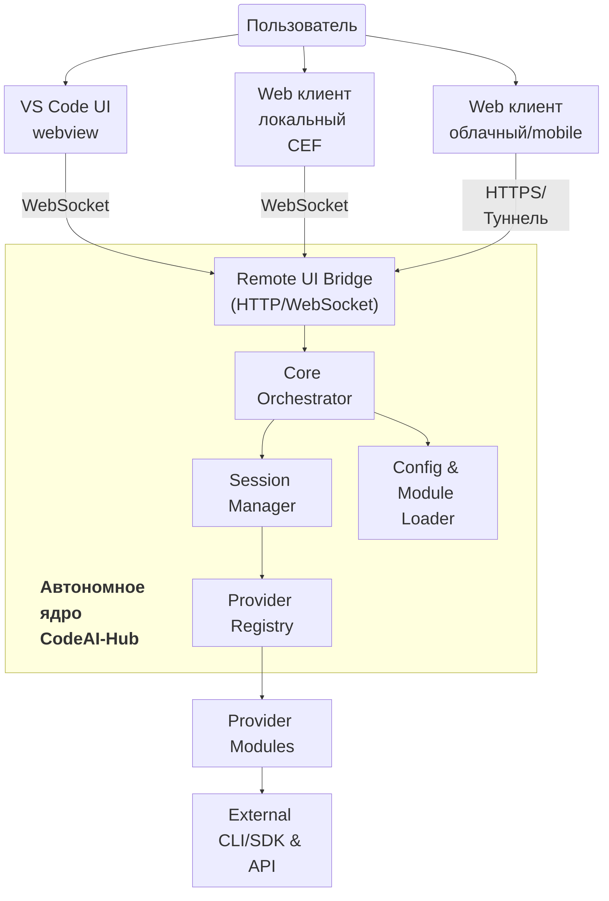

# Архитектура системы CodeAI-Hub

## Обзор
CodeAI-Hub — это автономная платформа управления AI-сессиями. VS Code расширение теперь рассматривается как один из клиентов, подключающийся к общему ядру. Основная логика, оркестрация, хранение конфигурации и мультимодульность вынесены в отдельный сервис, который можно запускать и обновлять независимо от оболочки редактора. Все дополнительные модули и SDK подгружаются из публичных источников во время установки или при старте, что освобождает VSIX от тяжёлых бинарников и позволяет автоматически поддерживать актуальные версии.

## Компоненты системы
- **Автономное ядро** — Node.js-сервис, который скачивается при установке VSIX, устанавливает зависимости из публичных репозиториев и управляет жизненным циклом всех сессий. Внутри ядра работают реестр провайдеров, маршрутизатор сообщений, менеджер конфигураций, хранилища и Remote UI Bridge (HTTP/WebSocket). Ядро продолжает работу после закрытия VS Code и доступно другим клиентам.
- **Клиенты интерфейса**
  - `VS Code UI` — существующее webview расширения. Оно инициирует скачивание ядра, следит за версиями модулей и подключается к сервису через защищённый канал, чтобы отрисовывать текущие сессии.
  - `Web клиент (локальный CEF)` — десктопный клиент на Chromium Embedded Framework. Расширение автоматически скачивает CEF и собственный лаунчер `CodeAIHubLauncher` согласно манифестам (`assets/cef/manifest.json`, `assets/launcher/manifest.json`), разворачивает их в `~/.codeai-hub/cef*/` и запускает UI из `media/web-client/dist/index.html`. Ярлыки (`.lnk`/`.app`/`.desktop`) пересоздаются автоматически.
  - `Web клиент (облачный/mobile)` — облегчённый интерфейс для удалённого доступа и мобильных устройств. Общается с ядром по HTTPS/туннелю, поддерживает адаптивную верстку и авторизацию по токену.
- **Провайдерные модули и расширения** — пакеты, которые ядро загружает и инициализирует динамически. Они инкапсулируют логику конкретных стеков (Claude, Codex, Gemini), обеспечивают установку CLI/SDK и регистрируют свои контракты в оркестраторе.
- **Внешние CLI/SDK и API** — бинарники и сервисы, к которым обращаются провайдерные модули. Версии и наличие проверяются ядром при каждом запуске, недостающие компоненты докачиваются автоматически.

## Диаграмма Mermaid

## Ответственности модулей
- **Core Orchestrator**: единая точка маршрутизации событий. Управляет жизненным циклом сессий, координирует вызовы провайдеров, следит за соблюдением контрактов и публикует события для клиентов.
- **Remote UI Bridge**: HTTP/WebSocket-шлюз, который принимает подключения от VS Code, локального и облачного веб-клиентов. Отвечает за авторизацию токеном, multiplex потоков и синхронизацию состояний интерфейсов.
- **Session Manager**: хранит данные сессий, черновики, истории обращений и состояния визардов. Обеспечивает восстановление после перезапуска ядра и выгружает холодные сессии.
- **Provider Registry**: каталог доступных провайдеров и функций. Держит capability-флаги, точки входа модулей, статусы установки и метаданные о версиях.
- **Module Loader & Update Service**: скачивает и обновляет провайдерные плагины и связанные CLI/SDK из публичных источников, контролирует совместимость версий, выполняет проверки целостности и оформляет журналы обновлений.
- **Shared Services**: конфигурационное хранилище, управление секретами, пайплайн логирования и экспорт диагностик. Поддерживает как локальные, так и удалённые сценарии.
- **Workflow Layer**: плагины оркестраций (визарды, multi-agent сценарии), работающие поверх core API. Они комбинируют несколько провайдеров, используют shared services и возвращают результат во все подключённые клиенты.

## Жизненный цикл и управление зависимостями
- VSIX поставляет только UI и загрузчики. При установке или на первом запуске расширение скачивает автономное ядро и обязательные провайдерные модули из публичных репозиториев в пользовательскую директорию (`~/.codeai-hub`).
- После загрузки расширение запускает Node.js-процесс ядра, выполняет handshake по локальному API и регистрирует собственный токен для соединения через Remote UI Bridge.
- Ядро при старте проверяет версии установленных провайдеров, наличие CLI/SDK и при необходимости докачивает или обновляет их. Все операции сопровождаются проверкой целостности, журналированием и откатом в случае ошибок.
- Автообновление выполняется при каждом запуске VS Code и при ручном рестарте ядра. Клиенты уведомляются только если требуется действие пользователя (например, повторная авторизация или согласие на установку новой глобальной зависимости).
- Локальный и облачный веб-клиенты используют те же протоколы обновления схемы: при подключении они запрашивают версию контрактов и при несовпадении получают свежие дескрипторы от ядра.

## Контракты взаимодействия
- Базовые контракты формируются вокруг фасадов и микроклассов диалогового движка (см. референсную реализацию в `Claude Code Fusion`). Каждый провайдер реализует набор операций (`installOrUpdate`, `configure`, `startSession`, `streamEvents`, `stopSession`, `capabilities`) и публикует адаптер, приводящий свои события к унифицированной модели UI.
- Для упрощения разработки выбирается опорный формат сообщений (например, Codex), остальные провайдеры обеспечивают совместимость через адаптеры, добавляя недостающие поля или декомпозируя собственные структуры.
- Реестр провайдеров хранит метаданные о версиях, поддерживаемых функциях и эндпойнтах авторизации, а ядро использует их для маршрутизации запросов и согласования возможностей (стриминг, работа с файлами, запуск инструментов).
- Клиенты (VS Code, локальный CEF и облачный веб-интерфейсы) подключаются к Remote UI Bridge по WebSocket/HTTPS. Они используют унифицированный контракт событий (`session:update`, `stream:chunk`, `workflow:event`, `settings:changed`), что обеспечивает идентичный опыт независимо от оболочки.
- В релизе v1.1.6 уже реализовано подключение VS Code webview и локального CEF клиента к ядру по WebSocket `ws://127.0.0.1:8080/api/v1/stream`. Создание сессий и потоковые сообщения синхронизируются, однако событие удаления сессии пока не транслируется — ограничение зафиксировано для следующей итерации.
- UI взаимодействует только с унифицированным контрактом, что позволяет обновлять или заменять провайдеры без изменения представления диалогов и логики визардов.

## Обработка ошибок и ограничений
- Сервисы установки и адаптеры отслеживают состояние CLI/SDK. При сбоях предпринимаются автоматические попытки восстановления: повторные подключения, перезапуск воркеров провайдеров, обновление токенов.
- Если ошибка не устраняется, пользователю предлагаются следующие шаги: перезапуск ядра через команду расширения, временное отключение провайдера, повторная авторизация или проверка сетевых ограничений. Все действия фиксируются в логах.
- Ограничения тарифов и квот провайдеров мониторятся ядром. Уведомления доставляются во все подключённые клиенты заранее, чтобы пользователь успел поменять провайдера или скорректировать запрос.
- Диагностика доступна через единый журнал ядра и отдельных провайдеров. Веб-клиенты могут запрашивать последние ошибки по API, что упрощает удалённую поддержку.

## Хранение конфигураций и данных
- Конфигурация ядра, провайдерные модули и кэши размещаются в директории `~/.codeai-hub` (на Windows — `%APPDATA%\\CodeAI-Hub`). Структура включает папки `core/`, `providers/`, `logs/`, `cache/` с версионированием и файлами манифестов.
- Расширение VS Code хранит только настройки UI и параметры подключения в своем `globalStorage`, включая токен для Remote UI Bridge и предпочтения интерфейса.
- Каждый провайдер получает собственный namespace внутри `providers/` (конфигурации, кэш, локальные настройки) и не может обращаться к данным другого стека без разрешения.
- Секреты (API keys, refresh tokens) сохраняются через платформенные механизмы: macOS Keychain, Windows Credential Manager, Linux Secret Service. Если система недоступна, используется зашифрованное хранилище ядра с master key.
- Логи и диагностика агрегируются ядром; пользователю доступны команды очистки отдельных пространств (конкретного провайдера, кэша или всей платформы).

## Дополнительные опции
- **Remote UI Bridge**: управляется из настроек ядра, поднимает HTTP/WebSocket сервис, поддерживает включение HTTPS (через локальные сертификаты или reverse proxy) и ограничение доступа по токенам/IP.
- **Аутентификация TOTP/токенами**: ядро генерирует секрет для Google Authenticator/Authy, проверяет одноразовые коды, выдаёт короткоживущие сессионные ключи и умеет отзывать их по требованию.
- **Веб-клиенты**: локальный CEF-клиент (desktop-first) и облегчённый облачный/mobile UI. Оба используют один контракт, но имеют собственные темы, breakpoints и сценарии (например, быстрые жесты на мобильном).
- **Провайдеры как плагины**: Claude/Codex/Gemini распространяются отдельными пакетами. Ядро поддерживает auto-install/update, гибкие лицензии и отключение конкретных пакетов без перезапуска сервиса.
- **Открытый shell**: UI и core могут оставаться open source, монетизация достигается за счёт закрытых провайдеров, расширенных workflow и интеграций.
- **Документация Remote Bridge**: отдельный документ описывает топологию развёртывания, требования к шифрованию, схему туннелей и чек-лист безопасности.

## Расширяемость
- **Новые провайдеры**: подключаются к реестру через тот же контракт, что и существующие. Модуль провайдера предоставляет адаптер, описывает зависимости и размещает инструкции по авторизации; после установки он автоматически включается в визарды и UI-переключатель.
- **Новые функции оркестратора**: реализуются внутри автономного ядра. Для сложных сценариев (визард подготовки спецификаций, multi-agent алгоритмы) создаются отдельные фасады, которые комбинируют провайдеров через унифицированный контракт.
- **Документация стеков**: подробные руководства (установка, особенности API, ограничения) ведутся в отдельных файлах по каждому стеку и ссылаются из этого документа.
- **Обновление алгоритмов**: изменения внутри приватных модулей поставляются как релизы; расширение фиксирует зависимость на конкретной версии и инициирует обновление через систему управления зависимостями.

## Нефункциональные требования
- Платформа поддерживает мультисессионность и одновременные подключения нескольких клиентов. Состояние каждой сессии синхронизируется между UI в режиме реального времени.
- Ядро сериализует истории диалогов, черновики и контекст визардов в собственное хранилище. При перезапуске ядра или отключении клиента данные восстанавливаются без участия VS Code.
- Автообновления CLI/SDK и модулей выполняются без остановки активных сессий; при необходимости ядро запускает плавный рестарт и уведомляет клиентов.
- Безопасность: обязательная аутентификация токенами, изоляция данных провайдеров, аудит действий, возможность включения TLS для удалённых клиентов.
- Качество кодовой базы контролируется через Ultracite, архитектурные проверки и план `Type Safety Hardening (Remove any)`, охватывающий как webview, так и ядро с удалёнными контрактами.
