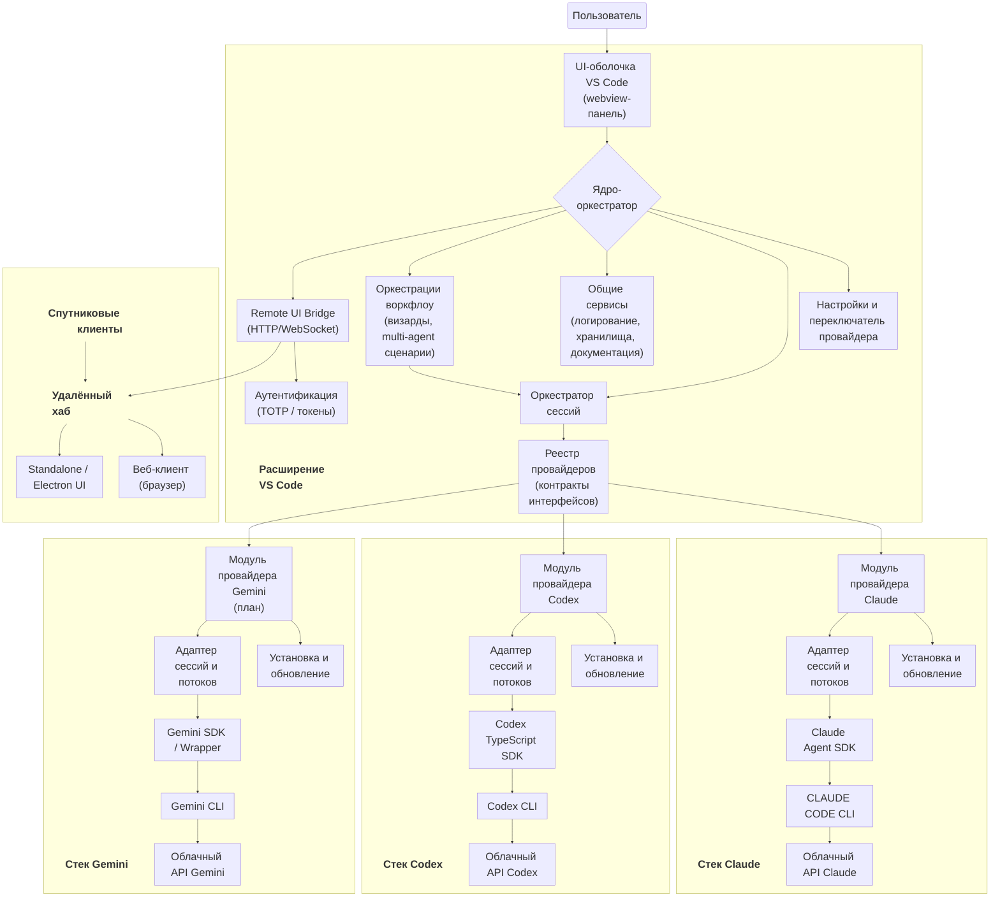

# Архитектура системы CodeAI-Hub

## Обзор
CodeAI-Hub выступает единой надстройкой VS Code: общий UI-контур и координационный слой остаются внутри расширения, а взаимодействие с ИИ делегируется подключаемым провайдерам (Claude, Codex, в перспективе Gemini и другие). Расширение по запросу устанавливает, обновляет и оркестрирует CLI/SDK каждого провайдера, позволяя пользователю совмещать нескольких агентов в одном рабочем пространстве.

## Многоуровневая структура
- **UI-оболочка VS Code** – интерфейс на webview с вкладками сессий, диалоговыми блоками, переключателем провайдера и настройками визардов; по настройке может запускать спутниковые UI. В релизе 0.0.12 webview научили отображать поток событий даже для временных `temp_*` сессий; в 0.0.14 добавлена нормализация сохранённого состояния для восстановления вкладок, 0.0.15 типизировал DraftManager и исключил `any` из публичного API типов. Текущие релизы добавили inline-диалог выбора провайдеров (Provider Picker), React-компонент `ActionBar` с быстрыми действиями, сетку `session-grid`, обеспечивающую растяжение `DialogPanel` на всю доступную высоту, Info Panel (1.0.20+) как промежуточный модуль между вкладками и диалогом, а также полностью перенесённое окно настроек с обработчиками `settings:*`. В 1.0.18 Provider Picker получил затемнённый фон `#242A2F` и скрывает сессионную сетку во время выбора, чтобы избежать мерцаний, 1.0.22 добавил фильтр активных задач в Session TODO с компактным заголовком, а 1.0.23 уменьшил кегль заголовка и элементов списка для дополнительной экономии пространства.
- **Ядро-оркестратор** – координирует провайдеров, управляет жизненным циклом сессий, маршрутизирует сообщения и предоставляет общие сервисы (логирование, хранилища, конфигурации, удалённый мост). В текущей фазе реализованы `ProviderRegistryFacade`, `SessionOrchestratorFacade`, `DraftFileManager`, а также заглушечный `ClaudeProviderStub`, который транслирует события в `OutputChannel` (`CodeAI Hub`).
- **Удалённый мост (опция)** – HTTP/WebSocket слой для трансляции UI наружу, включающий аутентификацию (TOTP/токены) и поддержку туннелей/HTTPS.
- **Модули провайдеров** – независимые пакеты, внутри которых решаются установка зависимостей, адаптация сессий и преобразование потоков для конкретного AI-стека; могут поставляться как закрытые плагины с триалом.
- **Внешние CLI/SDK и API** – глобально установленные бинарники и SDK, к которым обращаются модули провайдеров, чтобы достучаться до Claude, Codex, Gemini и других сервисов.

## Диаграмма Mermaid

## Ответственности модулей
- **Ядро-оркестратор**: регистрирует провайдеров, гарантирует соблюдение контракта, диспетчеризует события сессий и размещает плагины воркфлоу (визарды, составные агенты).
- **Provider Registry & Orchestrator**: хранит дескрипторы `ProviderModule`, управляет capability-флагами, подписывается на события (`stream_event`, `assistant`, `system`, `result`, `user_input`) и транслирует их в extension-слой (`provider:sessionEvent`, `provider:sessionError`, `provider:sessionIdChanged`).
- **Реестр провайдеров**: хранит метаданные установленных модулей, разрешает их для действий UI и выставляет флаги возможностей (стриминг, тулзы, файловые операции).
- **Сервисы установки и обновления**: проверяют авторизацию, ставят глобальные версии CLI/SDK и при запуске контролируют дрейф версий.
- **Адаптеры сессий и потоков**: переводят событийную модель провайдера в унифицированный диалоговый формат UI, ведут состояние по сессии, поддерживают resume/replay.
- **Общие сервисы**: конфигурационное хранилище, интеграция с хранилищем секретов, пайплайн логов, интеграция с базой знаний и экспорт документации.
- **Слой воркфлоу**: высокоуровневые координаторы (визарды, multi-agent сценарии), которые комбинируют нескольких провайдеров и возвращают результат в общий UI.

## Жизненный цикл и управление зависимостями
- Расширение VS Code остаётся open source и отвечает за UI, оркестратор и общие сервисы. Модули стеков провайдеров (Claude, Codex, Gemini) распространяются как приватные пакеты с релизами и описанием версий.
- Во время установки расширение сканирует систему на предмет глобальных CLI/SDK (`Codex CLI`, `Claude Code CLI`, `Gemini CLI`, соответствующие SDK). При отсутствии — инициирует глобальную установку и запрашивает у пользователя разрешения и авторизацию у каждого поставщика.
- На первом запуске расширение скачивает приватные модули стеков из соответствующих репозиториев релизов, регистрирует их в реестре и проводит первоначальную настройку.
- При каждом старте VS Code ядро проверяет версии CLI, SDK и модулей стеков, сравнивает их с доступными релизами и автоматически обновляет, обеспечивая синхронизацию между open source частью и приватными дополнениями.
- Процесс обновления сопровождается журналированием и ненавязчивыми уведомлениями пользователю, если требуется ручное действие (например, повторная авторизация).

## Контракты взаимодействия
- Базовые контракты формируются вокруг фасадов и микроклассов диалогового движка (см. референсную реализацию в `Claude Code Fusion`). Каждый провайдер реализует набор операций (`installOrUpdate`, `configure`, `startSession`, `streamEvents`, `stopSession`, `capabilities`) и публикует адаптер, приводящий свои события к унифицированной модели UI.
- Для упрощения разработки выбирается опорный формат сообщений (например, Codex), остальные провайдеры обеспечивают совместимость через адаптеры, добавляя недостающие поля или декомпозируя собственные структуры.
- Реестр провайдеров хранит метаданные о версиях, поддерживаемых функциях и эндпойнтах авторизации, а ядро использует их для маршрутизации запросов и согласования возможностей (стриминг, работа с файлами, запуск инструментов).
- UI взаимодействует только с унифицированным контрактом, что позволяет обновлять или заменять провайдеры без изменения представления диалогов и логики визардов.

## Обработка ошибок и ограничений
- Сервисы установки и адаптеры отслеживают состояние CLI/SDK. При сбоях предпринимаются несколько автоматических попыток восстановления (повторное подключение, перезапуск процесса, обновление токенов).
- Если ошибка не устраняется, пользователь получает предупреждение с рекомендациями: перезагрузить VS Code, временно отключить провайдера в настройках, повторно пройти авторизацию или проверить сетевые ограничения.
- Учитываются ограничения тарифов и квот провайдеров: система заранее мониторит остаток лимитов и уведомляет пользователя до наступления блокировки.
- Все ошибки фиксируются в журнале и в диагностических событиях, чтобы упростить анализ при обращении в поддержку.

## Хранение конфигураций и данных
- Конфигурация и служебные данные расширения размещаются в стандартной директории VS Code, в подпапке с именем проекта (например, `~/.config/Code/User/globalStorage/<id расширения>`).
- Каждый провайдер пользуется собственным пространством хранения (кэш моделей, токены, локальные настройки) и не вмешивается в данные других стеков.
- Секреты (API keys, refresh tokens) помещаются в защищённое хранилище VS Code или системный keychain, ссылки на которые выдаёт конфигурационный сервис ядра.
- Журналы и диагностические дампы сохраняются с разбивкой по провайдерам, что упрощает аудит и раздельное удаление данных по запросу пользователя.

## Дополнительные опции
- **Remote UI Bridge**: включается через Settings, поднимает HTTP/WebSocket сервер, транслирует события в спутниковые клиенты и позволяет работать удалённо.
- **Аутентификация TOTP/токенами**: генерирует секрет для Google Authenticator/Authy, проверяет одноразовые коды и выдаёт сессионные ключи для удалённых клиентов.
- **Спутниковые клиенты**: веб-интерфейс в браузере, standalone/Electron-сборка, поддержка нескольких окон/мониторов и сценариев через интернет/туннели.
- **Провайдеры как плагины**: Claude/Codex/Gemini поставляются отдельными пакетами, поддерживают auto-install/update, trial на 30 дней и коммерческое лицензирование.
- **Открытый shell**: UI и core могут быть опубликованы как open source, тогда платными остаются только закрытые провайдеры и расширенный функционал.
- **План по Remote Bridge**: подробная топология (развёртывание, шифрование, безопасность) выносится в отдельный документ и прорабатывается после стабилизации базовой функциональности.

## Расширяемость
- **Новые провайдеры**: подключаются к реестру через тот же контракт, что и существующие. Модуль провайдера предоставляет адаптер, описывает зависимости и размещает инструкции по авторизации; после установки он автоматически включается в визарды и UI-переключатель.
- **Новые функции оркестратора**: реализуются в open source части расширения. Для сложных сценариев (визард подготовки спецификаций, multi-agent алгоритмы) создаются отдельные фасады, которые комбинируют провайдеров через унифицированный контракт.
- **Документация стеков**: подробные руководства (установка, особенности API, ограничения) ведутся в отдельных файлах по каждому стеку и ссылаются из этого документа.
- **Обновление алгоритмов**: изменения внутри приватных модулей поставляются как релизы; расширение фиксирует зависимость на конкретной версии и инициирует обновление через систему управления зависимостями.

## Нефункциональные требования
- Система поддерживает мультисессионность: пользователь может вести несколько диалогов одновременно, переключаться между ними и восстанавливать контекст после перезагрузки VS Code или потери фокуса.
- Состояния сессий, черновики сообщений и результаты визардов сериализуются и сохраняются между запусками. С 0.0.14 AppChat авто-конвертирует устаревшие снепшоты `vscode.getState`, 0.0.15 дополнил typed DraftManager для обмена с файловым хранилищем и global `no-explicit-any`.
- Обновления CLI/SDK и приватных модулей выполняются без блокировки активных сессий; при необходимости пользователь информируется о необходимости повторного запуска.
- Требования по безопасности и производительности (изоляция данных провайдеров, мониторинг ресурсов, аудит действий) учитываются в дальнейших специализирующих документах и тест-кейсах.
- Активная инициатива качества: план `Type Safety Hardening (Remove any)` (см. `doc/TODO/todo-plan.md`) вводит строгие типы для webview и контрактов, чтобы снизить риск рантайм-ошибок.
