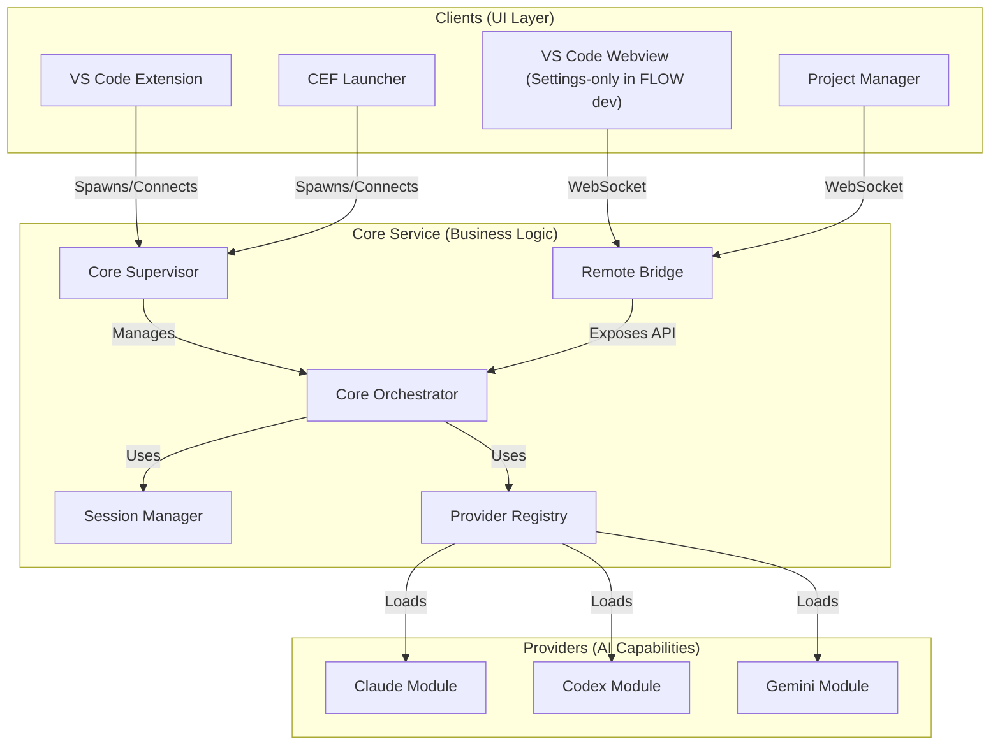

# CodeAI-Hub System Architecture

**Version:** 1.1.514
**Last Updated:** 2026-02-06
**Status:** Active reference (source of truth)

---

## Document Scope

Этот документ — **единственный источник правды** по архитектуре CodeAI-Hub. Он охватывает:
- Автономное ядро (Core Orchestrator)
- Extension Host Layer (VS Code)
- UI Bundles (VS Code Webview, Project Manager)
- CEF Launcher
- Провайдерные модули (Claude, Codex, Gemini)

Детальная документация по отдельным стекам вынесена в `doc/Project_Docs/Stacks/`.

---

## 1. Architectural Overview

CodeAI-Hub — автономная платформа управления AI-сессиями. VS Code расширение — один из клиентов, подключающийся к общему ядру.


```mermaid
graph TD
    subgraph "Clients (UI Layer)"
        VSCode["VS Code Extension"]
        Launcher["CEF Launcher"]
        Webview["VS Code Webview (Settings-only in FLOW dev)"]
        ProjectManager["Project Manager"]
    end

    subgraph "Core Service (Business Logic)"
        Orchestrator["Core Orchestrator"]
        Supervisor["Core Supervisor"]
        Bridge["Remote Bridge"]
        SessionMgr["Session Manager"]
        Registry["Provider Registry"]
    end

    subgraph "Providers (AI Capabilities)"
        Claude["Claude Module"]
        Codex["Codex Module"]
        Gemini["Gemini Module"]
    end

    %% Client Connections
    VSCode -->|Spawns/Connects| Supervisor
    Launcher -->|Spawns/Connects| Supervisor
    Webview -->|WebSocket| Bridge
    ProjectManager -->|WebSocket| Bridge

    %% Core Internal Flow
    Supervisor -->|Manages| Orchestrator
    Orchestrator -->|Uses| SessionMgr
    Orchestrator -->|Uses| Registry
    Bridge -->|Exposes API| Orchestrator

    %% Provider Connections
    Registry -->|Loads| Claude
    Registry -->|Loads| Codex
    Registry -->|Loads| Gemini
```

### Три слоя компонентов

1. **Extension Host Layer** — точка входа `src/extension.ts`, регистрация команд, webview и Core Supervisor.
2. **VS Code Webview UI** — React-приложение внутри редактора.
3. **Local CEF Client** — статический UI-бандл через Chromium Embedded Framework.

---

## 2. Core Components

### 2.1 Автономное ядро

Node.js сервис (`@codeai-hub/core@1.1.502`), упакованный как JS-бандл + официальный Node 20 runtime.

**Установка:** `~/.codeai-hub/core/<platform>/<version>/`

**Core Supervisor** (`@codeai-hub/core-supervisor`) выбирает runtime, запускает через:
```
<runtime>/node/bin/node <app>/dist/index.js
```

Переменные окружения: `CORE_HOST`, `CORE_PORT`, `CORE_MANAGED_MODE`, `*_WORKSPACE_PATH`, `*_MODULE_PATH`.

### 2.2 UI Bundles (v1.1.502)

Интерфейсы вынесены из VSIX в отдельные пакеты:
- `vscode-webview`: React-приложение для панели VS Code (на период разработки FLOW — Settings-only)
- `project-manager`: Статическая сборка Project Manager (единственный активный UI-клиент Core на период разработки FLOW)

**Установка:** `~/.codeai-hub/packages/ui/<bundleId>/<version>/` с symlink `current`.

### 2.3 TTL и Graceful Shutdown

Параметр `CORE_SHUTDOWN_GRACE_MS` задаёт интервал ожидания после ухода последнего клиента. Пока есть WebSocket-клиенты — ядро работает бесконечно.

### 2.4 Порты и владение ядром

`CorePortManager` и Supervisor используют `runtime-registry.json` (`network.corePort`). Перед стартом клиенты вызывают `detectRunning()` — если версия совпадает, просто attach к живому orchestrator.

### 2.5 Provider Version Telemetry

`ProviderVersionService` читает версии CLI/SDK через глобальный npm (`npm list -g`/`npm view`).

### 2.6 Session Continuity (CRITICAL)

Для долгоживущих workflow-сессий в системе нужен механизм непрерывности: при исчерпании контекстного бюджета модель должна автоматически сформировать handoff-отчёт, после чего Core создаёт новую сессию и продолжает работу, подавая отчёт как входной контекст.

Архитектура: `doc/Project_Docs/SessionContinuity/SessionContinuity_Architecture.md`.
Порог запуска handoff рассчитывается по token usage (used/limit) и может быть настроен per-provider (например, Claude и Codex: remaining% threshold, default 30%).
Внутренние handoff-инструкции отправляются через `sendInternalMessage` и не должны попадать в user-facing историю.

### 2.7 Turn-state + Continuity Lock UI Contract (CRITICAL)

Чтобы исключить залипания working-strip после финального сообщения агента, UI следует каноническому контракту stream-событий:

1. `turn_state` (`running|idle`) — единственный источник истины о состоянии turn.
2. `continuity_lock` (`locked|unlocked`) — source-of-truth блокировки ввода на окно bootstrap continuity rollover (`threshold_reached` -> `report_in_progress` -> `resume_bootstrap` -> `resume_ready|resume_failed|resume_timeout`).
3. `turn_state=idle` снимает ожидание только при неактивном `continuity_lock`.
4. Legacy `handoff_state` сохраняется для обратной совместимости старых handoff-path, но для flow-node rollover приоритет у `continuity_lock`.
5. На границе `turn_completed` применяется атомарный arbitration: Core сначала решает continuity rollover, и только потом выбирает `turn_state=idle` или continuity lock-path (без `idle -> locked` окна).
6. Пока flow-node rollover pending/active, send в old session блокируется на стороне Core (MVP policy: reject с bridge-error `continuity_rollover_pending`).
7. На accepted user submit Core обязан эмитить `turn_state=running` немедленно (до `adapter.sendMessage`) для provider-agnostic мгновенного lock.
8. Если `adapter.sendMessage` завершается ошибкой, Core обязан выполнить rollback: `turn_state=idle` + стандартный `session:error` (без залипания lock).

State-table для Session UI:

| Stream marker | Session status.connectionState | Input/Send | Working strip |
|---|---|---|---|
| `turn_state=running` | `running` | заблокирован (send) | показываем по правилам running |
| `turn_state=idle` | `idle` | доступен | скрываем "Agent is working..." |
| `continuity_lock=locked` | `blocked` | заблокирован (input+send) | показываем |
| `continuity_lock=unlocked` | снять continuity-lock, вернуть `idle` если нет running | доступен (если нет running) | скрываем |

Инварианты:
- Continuity lock не заменяет lifecycle turn и не должен жить дольше bootstrap-turn новой сессии.
- `continuity_lock` передаётся как `session:stream`/`stream_event` и не добавляется в историю пользовательских сообщений.
- Unlock должен быть детерминированным: для каждого `locked` должен приходить `unlocked` по success/failure/timeout, иначе UI останется в dead-lock.
- Запрещён user-visible сценарий `running -> idle/unlocked -> continuity_lock(locked)` для одного и того же turn completion.
- Запрещён provider-specific late-lock сценарий: accepted submit без немедленного `turn_state=running` до первого provider marker.
- Запрещён send-failure сценарий без `turn_state=idle` rollback (stuck `running/blocked` после ошибки отправки).

Референс реализации Phase 101: `doc/Project_Docs/SessionContinuity/FlowNodeContinuity_TurnEnd_AtomicLock_Architecture.md`.

### 2.8 Claude One-Shot Session Contract (Phase 98)

Для `Claude_Module` целевая модель исполнения выровнена с Codex:

1. Один user/internal turn = один отдельный `query(...)` запуск (one-shot), обработка через FIFO очередь.
2. Source-of-truth `providerSessionId` — только stream-события SDK (`session_id`), а не file discovery.
3. Resume существующей Claude-сессии выполняется через `options.resume=<providerSessionId>` без `forkSession`.
4. Для каждого user turn обязателен lifecycle-контракт `turn_started` -> (`turn_completed` | `turn_failed`) ровно один раз.
5. Logger при resume/rebind дописывает существующий session лог (`append`), без truncate уже накопленных записей.

---

## 3. Extension Host Layer

### 3.1 Activation & Lifecycle

`src/extension.ts` активирует расширение, регистрирует команды (`codeaiHub.openSettings`, `codeaiHub.launchProjectManager`) и инициализирует `HomeViewProvider`.

### 3.2 UI Bundle Bootstrap

`ui-activation.ts` читает `assets/ui/manifest.json`, устанавливает отсутствующие tar.bz2 из `~/.codeai-hub/releases/` в `~/.codeai-hub/packages/ui/<bundle>/<version>`, создает symlink `current`.

### 3.3 Webview Provider

`HomeViewProvider` создаёт webview, подготавливает HTML и CSP, беря статику из `~/.codeai-hub/packages/ui/vscode-webview/current` (fallback — `media/`).

### 3.4 Message Routing

`home-view-message-router` обрабатывает события от webview (`session:create`, `provider:select`, `settings:update`) и проксирует в ядро через Remote UI Bridge.

### 3.5 Core Bootstrap

Ядро на мульти-тенантной архитектуре. `workspacePath` — свойство конкретной Сессии, не глобальный параметр. Один экземпляр ядра обслуживает несколько проектов.

### 3.6 Port Negotiation & Shutdown

Перед запуском новой версии расширение и лаунчер отправляют `POST /api/v1/shutdown`, ждут graceful-stop. При занятом порте перебирают пул `8080 → 8081 → … → 8092`.

### 3.7 Sticky Keepalive

`CoreKeepAlive` держит скрытое WebSocket-подключение к `ws://<host>:<port>/api/v1/stream`, поэтому ядро не зависит от состояния webview.

---

## 4. VS Code Webview UI

### 4.1 AppHost

Корневой React-компонент в режиме FLOW показывает Settings-only UI и не подключается к Core (сессии/чаты выполняются только в Project Manager).

### 4.2 Delivery

Webview грузит JS/CSS из `~/.codeai-hub/packages/ui/vscode-webview/current`. VSIX не содержит `react-chat.js`/CSS.

### 4.3 Settings UI

Панель настроек доступна из webview, без сессионного UI.

---

## 5. Local CEF Client (Project Manager)

### 5.1 Bundle

UI устанавливается в `~/.codeai-hub/packages/ui/project-manager/current`.

### 5.2 Runtime & Launcher Delivery

- `assets/cef/manifest.json` — CEF minimal-пакеты для Windows, macOS, Linux
- `assets/launcher/manifest.json` — версии `CodeAIHubLauncher`

Модули `runtime-installer.ts` и `launcher-installer.ts` скачивают архивы в `~/.codeai-hub/cef/` и `~/.codeai-hub/packages/launcher/`.

### 5.3 Standalone Bootstrap

При запуске `CodeAIHubLauncher` проверяет core. Если не запущен — поднимает bundled Node runtime и стартует `app/dist/index.js`.

### 5.4 Logging

- Launcher: `~/.codeai-hub/logs/launcher/launcher.log`
- Core: `~/.codeai-hub/logs/core/core.log`
- Providers: `~/.codeai-hub/logs/<provider>/sdk-<provider>-<sessionId>.jsonl`

### 5.5 Workspaces (Project Manager)

- Список workspace хранится в Core registry `~/.codeai-hub/state/projects.json` и синхронизируется в UI через WebSocket (`projects:list` / `projects:update`).
- Каждый workspace имеет стабильный `workspaceSlug` (source-of-truth в registry) и используется как ключ для:
  - путей `.codeai-hub/<workspaceSlug>/...`;
  - polling `workflow-state` / `workflow-events` в Project Manager.
- Core хранит workflow state snapshot в `<workspaceRoot>/.codeai-hub/<workspaceSlug>/workflow/state.json` (включая `lastActive` для core-driven auto-resume).
- Add workspace:
  - VS Code bridge: `projects:pickFolder`;
  - CEF macOS: нативный Finder folder picker (возвращает абсолютный путь через `projects:folderPicked`);
  - CEF fallback (Windows/Linux): модалка ввода абсолютного пути;
  - после add/activate UI делает `POST /api/v1/orchestrator/workspace-session` (best effort), чтобы создать `.codeai-hub/<workspaceSlug>/` и включить watcher.
- При выборе workspace UI делает `POST /api/v1/orchestrator/workspace-activate` (best effort), чтобы Core мог инициировать core-driven auto-resume (resume authority = Core).
- После добавления workspace UI автоматически выбирает новый workspace в Project Manager.
- При смене workspace UI сбрасывает выбранный артефакт/просмотрщик.
- При смене workspace UI больше не инициирует resume напрямую (например, из `workflow-state` polling) — resume выполняется в Core и публикуется через `session:created`.
- Для пустого workspace (нет артефактов/continuity, все стадии `idle`) UI авто-открывает анкету описания и начинает процесс с нуля.

---

## 6. Providers

### 6.1 Claude & Codex

CommonJS модули, tarballs через `npm pack`. Инсталляторы диагностируют наличие пользовательских CLI.

**Claude defaults:** `~/.codeai-hub/settings/settings.json` хранит `providers.claude.defaultModel`.

### 6.2 Gemini

CommonJS модуль с динамическим `import()` для ESM-пакетов. Глобальная установка `@google/gemini-cli` и `@google/gemini-cli-core`.

---

## 7. Artifact Layout

```
~/.codeai-hub/
├── core/
│   └── darwin-arm64/1.1.502/
│       ├── node/
│       ├── app/
│       └── install.json
├── packages/
│   ├── launcher/macos-arm64/1.1.502/
│   └── ui/
│       ├── vscode-webview/
│       │   ├── 1.1.502/
│       │   └── current -> 1.1.502
│       └── project-manager/
│           ├── 1.1.502/
│           └── current -> 1.1.502
├── providers/
│   ├── claude/1.1.502/
│   ├── codex/1.1.502/
│   └── gemini/1.1.502/
├── state/
│   └── projects.json
├── settings/
│   └── settings.json
├── sessions/<workspaceKey>/<providerId>/<providerSessionId>.jsonl
└── releases/
    ├── CodeAIHubLauncher-macos-arm64-1.1.502.tar.bz2
    ├── vscode-webview-1.1.502.tar.bz2
    ├── project-manager-1.1.502.tar.bz2
    ├── claude-module-1.1.502.tar.bz2
    ├── codex-module-1.1.502.tar.bz2
    ├── gemini-module-1.1.502.tar.bz2
    └── codeai-hub-core-darwin-arm64-1.1.502.tar.bz2
```

---

## 8. Current Versions

| Component | Version |
|-----------|---------|
| VSIX | 1.1.502 |
| Core | 1.1.502 |
| UI Bundles | 1.1.502 |
| Claude Module | 1.1.502 |
| Codex Module | 1.1.502 |
| Gemini Module | 1.1.502 |
| Agent Shared | 1.1.387 |
| Description Agent | 1.1.387 |
| Virtual Simulation Agent | 1.1.387 |
| Diagram Modules Agent | 1.1.387 |
| Diagram Facades Agent | 1.1.387 |

---

## 9. Workflow (File-First Architecture)

С версии 1.1.440 workflow стадии (Description, Virtual Simulation, Diagrams) используют **file-first** подход:
- Structured output отключён
- Артефакты пишутся напрямую в `.codeai-hub/<workspaceSlug>/<stage>/...` (сущность `runs` удаляется)
- Watcher отслеживает файлы и обновляет workflow state для UI gating

**Подробнее:** `doc/Project_Docs/Workflow_CLI_Steps_And_Watcher_Architecture.md`

---

## 10. Security & Configuration

### 10.1 Secrets

Токены и ключи сохраняются в `SecretStorage` VS Code; при недоступности — зашифрованы на стороне ядра.

### 10.2 CSP

Webview запрещает inline-скрипты, ресурсы грузятся из `vscode-resource:`.

### 10.3 Remote UI Bridge

Ограничивает число одновременных подключений и сбрасывает сессии после таймаута простоя.

---

## 11. Build & Tooling

### 11.1 Build Pipeline

VSIX не содержит JS/CSS бандлов. UI собирается в независимые tar.bz2:
- `vscode-webview.tar.bz2`
- `project-manager.tar.bz2`

### 11.2 Quality Gates

- `./scripts/check-architecture.sh`
- `npx ultracite check`
- `npx ts-prune`
- `npx jscpd --threshold 3 --silent --reporters console src --ignore "**/node_modules/**"`
- `npm run check:links`

### 11.3 Adding New Modules

Любой новый пакет должен быть подключён к pipeline сборки через `scripts/build-<module>.sh` или добавлен в `scripts/build-all.sh`. Gate перед релизом: `curl http://127.0.0.1:<port>/api/v1/health`.

---

## 12. Related Documents

- **Stacks:** `doc/Project_Docs/Stacks/` (CoreOrchestrator, Claude, Codex, Gemini, UI_Modules, Launcher_CEF)
- **Workflow:** `doc/Project_Docs/Workflow_CLI_Steps_And_Watcher_Architecture.md`
- **Agent Packages:** `doc/Project_Docs/AgentPackages_Architecture.md`
- **SolidWorks Flow:** `doc/SolidWorks-Flow/`
- **Knowledge:** `doc/Project_Docs/knowledge/`
