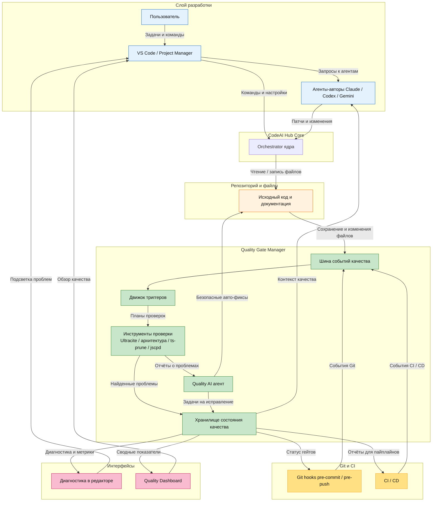

# Quality Gate Manager — Консолидированная диаграмма (RU)

Ниже представлена объединённая диаграмма архитектуры непрерывного контроля качества кода в CodeAI Hub. Она собирает ключевые идеи из диаграмм Claude / Codex / Kimi в один целостный вид.

