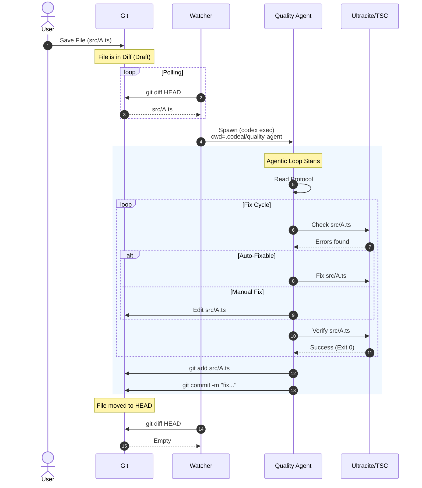

# Диаграмма Git-конвейера (Agentic Loop)

```mermaid
sequenceDiagram
    autonumber
    actor User
    participant Git
    participant Watcher
    participant Agent as Quality Agent
    participant Tools as Ultracite/TSC

    User->>Git: Save File (src/A.ts)
    Note over Git: File is in Diff (Draft)

    loop Polling
        Watcher->>Git: git diff HEAD
        Git-->>Watcher: src/A.ts
    end

    Watcher->>Agent: Spawn (codex exec)<br/>cwd=.codeai/quality-agent
    
    rect rgb(240, 248, 255)
        Note over Agent: Agentic Loop Starts
        Agent->>Agent: Read Protocol
        
        loop Fix Cycle
            Agent->>Tools: Check src/A.ts
            Tools-->>Agent: Errors found
            
            alt Auto-Fixable
                Agent->>Tools: Fix src/A.ts
            else Manual Fix
                Agent->>Git: Edit src/A.ts
            end
            
            Agent->>Tools: Verify src/A.ts
            Tools-->>Agent: Success (Exit 0)
        end

        Agent->>Git: git add src/A.ts
        Agent->>Git: git commit -m "fix..."
    end

    Note over Git: File moved to HEAD
    
    Watcher->>Git: git diff HEAD
    Git-->>Watcher: Empty
```
