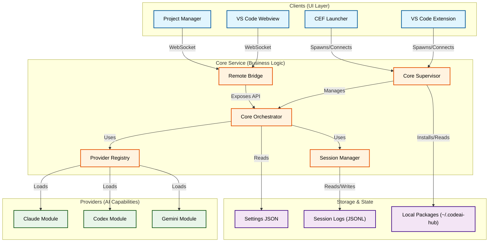

# CodeAI Hub — Project Structure Map

**Status:** ARCHIVED (superseded)
**Archived:** 2026-02-17
**Owner:** Oleksandr + Codex

Этот документ перенесён в `Archive/`, потому что визуальная карта встроена в системный SSOT:
- `doc/SolidWorks-Flow/System/SystemArchitecture.md` (раздел «Project Structure Map (visual)»)

---

## Visual Architecture

Примечание: исторический «навигационный» текст удалён, чтобы не дублировать SSOT и не ломать `npm run check:links`.
