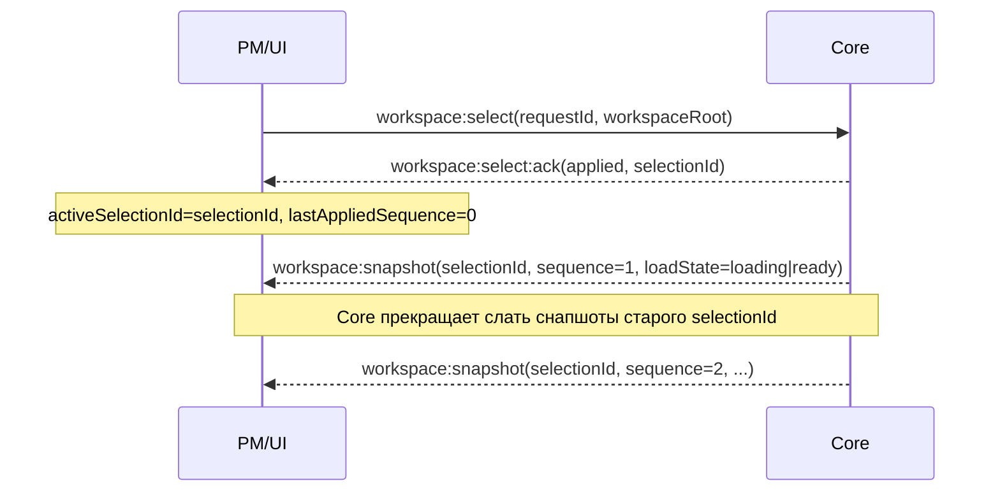
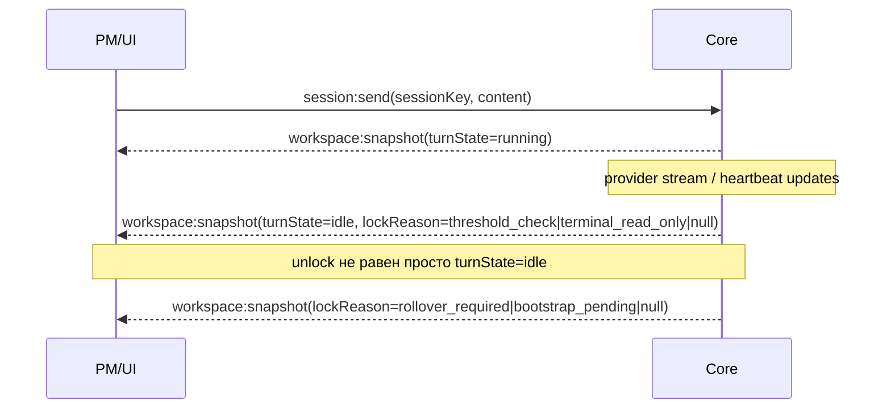

# Interface Map — Workspace Runtime (MVP)

**Date:** 2026-02-07  
**Version:** 1.1.523  
**Related:** `doc/SolidWorks-Flow/WorkspaceRuntime_LayeredArchitecture.md`

---

## 1. Scope

Этот документ фиксирует интерфейсы и wire-контракты для MVP архитектуры `Workspace Runtime`:
- идентичность и ключи (`workspaceRoot`, `SessionKey`, `NodeKey`);
- команды (ingress) от UI/PM к Core;
- снапшоты и обновления состояния (egress) от Core к UI/PM;
- правила атомарного переключения workspace (anti “dual subscription”).

Цель: дать реализационный контракт без скрытого event sourcing/CQRS.

---

## 2. Terms & Keys

### 2.1 Identity
- `workspaceRoot: string` — канонический абсолютный путь к корню workspace. Единственный routing key.
- `workspaceSlug: string` — storage-only (пути `.codeai-hub/<slug>/...`), вне маршрутизации.

### 2.2 IDs
- `nodeId: string` — идентификатор узла workflow tree (например: `description`, `virtual_simulation`, ...).
- `sessionId: string` — UUID, генерируется Core и считается уникальным (минимум: уникален внутри workspace, предпочтительно глобально).
- `artifactId: string` — идентификатор артефакта в рамках узла (например: `draft`, `final`, `report`).

### 2.3 Compound keys
Ключи — обязательный формат для всех команд, влияющих на состояние.

```ts
type NodeKey = {
  workspaceRoot: string;
  nodeId: string;
};

type SessionKey = {
  workspaceRoot: string;
  nodeId: string;
  sessionId: string;
};
```

---

## 3. Primary Facade (logical)

MVP публично экспонирует один “фасад” на уровне контракта:

- `WorkspaceRuntimeFacade`
  - `select(workspaceRoot | null)` (atomic switch)
  - `getSnapshot(workspaceRoot)`
  - `subscribe(workspaceRoot)`
  - `session.send(SessionKey, ...)`
  - `artifact.edit(NodeKey, ...)`
  - `workflow.rebuild(NodeKey | subtree)`

Важно: это логический фасад. На wire-уровне он выражается через сообщения `type/payload`.

---

## 4. Wire Envelope

Все сообщения (WebSocket) используют envelope:

```ts
type WireMessage = {
  type: string;
  payload?: unknown;
};
```

MVP допускает добавление `meta` в payload (например `requestId`, `sequence`, `generatedAt`).

---

## 5. Commands (PM/UI -> Core)

### 5.1 `workspace:select`
Атомарное переключение активного workspace для конкретного websocket-клиента.

```ts
type WorkspaceSelect = {
  type: "workspace:select";
  payload: {
    requestId: string;
    workspaceRoot: string | null;
    reason: "workspace_selected" | "reconnect" | "workspace_cleared";
  };
};
```

Правила:
- `reason="workspace_cleared"` требует `workspaceRoot=null`.
- При `workspaceRoot=null` Core отписывает клиента от всех workspace-апдейтов и не шлёт `workspace:snapshot` до следующего select.

Ожидание: Core отвечает `workspace:select:ack`. При `applied` Core начинает слать снапшоты активного workspace.

### 5.2 `workspace:snapshot:request` (optional)
Форсированный запрос полного снапшота (resync), например при подозрении на пропуск апдейтов.

```ts
type WorkspaceSnapshotRequest = {
  type: "workspace:snapshot:request";
  payload: {
    requestId: string;
    workspaceRoot: string;
    reason: "resync" | "debug";
  };
};
```

Примечание:
- `workspace:select` = atomic reset подписки/активного workspace.
- `workspace:snapshot:request` = “дай snapshot сейчас”, без смены активного workspace.

### 5.3 `session:send`
Отправка сообщения в session runtime узла.

```ts
type SessionSend = {
  type: "session:send";
  payload: {
    requestId: string;
    sessionKey: SessionKey;
    content: string;
    options?: {
      // MVP: только то, что реально нужно сейчас.
      outputSchema?: unknown;
    };
  };
};
```

Требование: на accepted send состояние должно перейти в `turnState="running"` синхронно (через следующий `workspace:snapshot`).

### 5.4 `artifact:edit`
Редактирование артефакта узла (перевод downstream в `OUTDATED` делает Graph logic).

```ts
type ArtifactEdit = {
  type: "artifact:edit";
  payload: {
    requestId: string;
    nodeKey: NodeKey;
    artifactId: string;
    newContent: string;
    reason?: "user_edit" | "retry";
  };
};
```

### 5.5 `workflow:rebuild`
Запуск rebuild для узла или поддерева.

```ts
type WorkflowRebuild = {
  type: "workflow:rebuild";
  payload: {
    requestId: string;
    nodeKey: NodeKey;
    scope: "node" | "subtree";
  };
};
```

---

## 6. Responses & Snapshots (Core -> PM/UI)

### 6.1 `workspace:select:ack`

```ts
type WorkspaceSelectAck = {
  type: "workspace:select:ack";
  payload: {
    requestId: string;
    status: "applied" | "rejected";
    workspaceRoot: string | null;
    selectionId: string | null;
    error?: string | null;
  };
};
```

Семантика `selectionId`:
- при `status="applied"` Core устанавливает новое `selectionId` для активной подписки клиента;
- `selectionId` включается в каждый `workspace:snapshot`;
- при смене workspace Core гарантирует, что после `ack(applied)` больше не будет `workspace:snapshot` от предыдущего `selectionId`.

### 6.2 `workspace:snapshot`
MVP стратегия live updates: **push full snapshot** при каждом значимом изменении.

```ts
type WorkspaceSnapshotPush = {
  type: "workspace:snapshot";
  payload: {
    workspaceRoot: string;
    selectionId: string;
    sequence: number;      // монотонно растёт внутри selectionId (может начинаться заново после select)
    generatedAt: string;   // ISO
    snapshot: WorkspaceSnapshot;
  };
};
```

Клиентские правила применения:
- применять только если `workspaceRoot` совпадает с текущим активным;
- применять только если `selectionId` совпадает с `activeSelectionId`;
- сбрасывать `lastAppliedSequence=0` при получении `workspace:select:ack(status=applied)`;
- игнорировать снапшоты, если `sequence <= lastAppliedSequence`.

### 6.3 `command:error` (mandatory)
Единый ответ для ошибок в командах, которые не имеют отдельного ack.

```ts
type CommandError = {
  type: "command:error";
  payload: {
    requestId: string;
    command: string;
    message: string;
    code?: string;
    details?: unknown;
  };
};
```

Рекомендация: ошибки `session:send`/`artifact:edit`/`workflow:rebuild` всегда должны быть видимы либо как `command:error`, либо как error-поле в следующем снапшоте (предпочтительно `command:error`).

### 6.4 Значимые изменения для snapshot push (MVP)

Снапшот (`workspace:snapshot`) пушится только при изменениях, которые меняют пользовательское состояние (state transitions), а не при "шуме" стрима.

Рекомендуемые триггеры:

| Триггер | Push full snapshot? | Примечание |
|---|---:|---|
| `turnState` change (`idle`↔`running`) | да | High priority: влияет на lock, но сам по себе не гарантирует unlock. |
| `continuityLockActive` change | да | High priority: прямой lock-gate. |
| `lockReason` change | да | High priority: при rollover/context exceeded меняется причина lock без unlock. |
| `resumeMode` / `finalTurnCompleted` change | да | High priority: определяет terminal read-only для no-resume. |
| `bindingStatus` / `providerSessionId` change | да | Влияет на видимость/диагностику состояния сессии. |
| `NodeStatus` change | да | Основной драйвер workflow tree UI. |
| `loadState` change (`loading`→`ready`/`error`) | да | UX: переход между состояниями загрузки. |
| Artifact pointer change (written/updated) | да | Меняет “текущие” артефакты узла. |
| Session added/removed | да | Меняет доступность сессий в workspace. |
| Workflow node added/removed | да | Редко, но меняет дерево. |
| `lastHeartbeatAt` update (stream chunk) | нет | Watchdog серверный; UI не должен получать снапшот на каждый chunk. |

Debounce/coalesce:
- допускается coalesce нескольких триггеров в один снапшот (например, 25–100ms окно);
- для `turnState`/`continuityLockActive`/`lockReason` рекомендуется flush без заметной задержки.


---

## 7. WorkspaceSnapshot (точный MVP контракт)

```ts
type WorkspaceLoadState = "loading" | "ready" | "error";

type NodeStatus =
  | "TODO"
  | "IN_PROGRESS"
  | "DONE"
  | "BLOCKED"
  | "OUTDATED"
  | "ERROR";

type NodeSnapshot = {
  status: NodeStatus;
  deps?: readonly string[];        // optional: если зависимости приходят с Core
  label?: string;                 // optional: UI-friendly
  reason?: string | null;         // optional: human-readable
  updatedAt?: string;             // optional: ISO
};

type SessionTurnState = "idle" | "running";
type SessionResumeMode = "no_resume" | "resume_in_place" | "resume_via_rollover";
type SessionLockReason =
  | "running"
  | "threshold_check"
  | "rollover_required"
  | "bootstrap_pending"
  | "terminal_read_only"
  | null;

type SessionSnapshot = {
  nodeId: string;
  turnState: SessionTurnState;
  resumeMode: SessionResumeMode;
  finalTurnCompleted: boolean;
  continuityLockActive: boolean;
  lockReason: SessionLockReason;
  lastHeartbeatAt?: string;       // optional: ISO
  providerId?: string;            // optional
  providerSessionId?: string;     // optional
  bindingStatus?: "pending" | "ready" | "failed";
};

type ArtifactPointer = {
  artifactId: string;
  version: string;
  path: string;
  updatedAt?: string;             // optional: ISO
};

type WorkspaceSnapshot = {
  workspaceRoot: string;
  loadState: WorkspaceLoadState;
  error?: string | null;

  workflow: {
    nodes: Record<string /* nodeId */, NodeSnapshot>;
  };

  // sessionId считается уникальным, поэтому key = sessionId.
  sessions: Record<string /* sessionId */, SessionSnapshot>;

  // MVP: node может иметь несколько артефактов (draft/final/etc).
  artifacts: {
    currentByNodeId: Record<
      string /* nodeId */,
      Record<string /* artifactId */, ArtifactPointer>
    >;
  };
};
```

Принцип: snapshot должен быть компактным для частых push (с debounce/coalesce).

Chat transcript в MVP snapshot не входит: его можно получать отдельным API (например, существующий `session:history`) или отдельным WS типом.

---

## 8. Atomic Switch: Sequence (mandatory)

`workspace:select` обязан быть атомарным переключением подписки.



Если `workspace:select:ack` = rejected:
- Core не переключает активный workspace клиента;
- UI остаётся на предыдущем workspace или показывает ошибку.

---

## 9. Turn/Lock Timeline (MVP)



Lock вычисляется так:
- server-driven lock: `inputLocked = sessionTerminal OR (turnState != idle) OR continuityLockActive`
- client-local доп. lock (если поддерживаем очередь сообщений): `inputLocked = serverLock OR (queuedMessage != null)`

Важно: `queuedMessage` — клиентское состояние, не часть snapshot.

Unlock contract:
- `resumeMode=no_resume`: после `finalTurnCompleted=true` input не unlock (terminal/read-only).
- `resumeMode=resume_in_place`: unlock только если `turnState=idle` **и** `continuityLockActive=false` **и** `lockReason=null` (Core подтвердил `no_rollover_needed`).
- если context threshold exceeded: `continuityLockActive=true`, input остаётся locked; меняется только `lockReason`.
- `resumeMode=resume_via_rollover`: старый и новый segment остаются locked до первого bootstrap assistant answer в новом segment (служебный, скрыт от пользователя); после него `lockReason=null`, `continuityLockActive=false`.

---

## 10. Migration Note (Phase 104)

Текущие механизмы scoped delivery/handshake (Phase 104) допустимы как переходные.

Переходная стратегия:
- до внедрения шардирования они остаются;
- после внедрения `WorkspaceStore` и snapshot-first корректность lock/state не должна зависеть от фильтра доставки;
- scoped delivery фильтр затем удаляется или сводится к минимальному ingress-guard.
