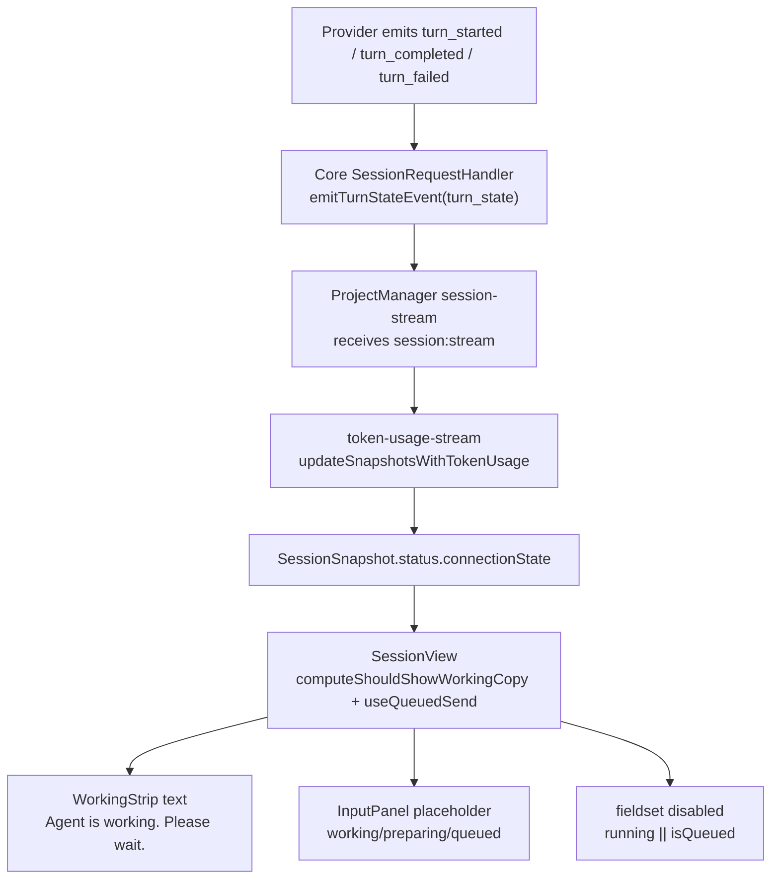

# Session UI Trace Map — `Agent is working` / input lock copy

**Date:** 2026-02-06  
**Scope:** Полная карта кода для двух пользовательских надписей ожидания в Session UI и всех связанных триггеров.

---

## 1. Что именно ищем

В UI сейчас существуют **две разные пользовательские надписи ожидания**:

1. Плашка между диалогом и input:
- `Agent is working. Please wait.`

2. Текст в input-зоне (placeholder при блокировке/ожидании):
- `Agent is working… Please wait.`
- `Agent is preparing a continuation… Please wait.`
- `Message queued. Sending as soon as it is ready…`

Этот документ фиксирует **все места в коде**, где эти надписи и их триггеры участвуют.

---

## 2. Источники строк (source of truth)

### 2.1 Плашка между диалогом и input

- `src/client/ui/src/session/working-strip.tsx:21`  
  Текст: `Agent is working. Please wait.`
- `src/client/ui/src/session/working-strip.tsx:30`  
  Там же подключается `AnimatedDots` (12 точек).

### 2.2 Input placeholder / lock copy

- `src/client/ui/src/session/input-panel.tsx:22`  
  `Message queued. Sending as soon as it is ready…`
- `src/client/ui/src/session/input-panel.tsx:25`  
  `Agent is preparing a continuation… Please wait.`
- `src/client/ui/src/session/input-panel.tsx:28`  
  `Agent is working… Please wait.`

### 2.3 Легаси/неиспользуемый источник с тем же копирайтом

- `src/client/ui/src/session/session-view-helpers.tsx:25`  
  `buildAgentWorkingBanner(...)` (с текстом `Agent is working` на `:45`) — в текущей сборке **не используется**.
- `src/client/ui/src/session/session-view-helpers.tsx:20`  
  `resolveVisibleBanner(...)` — также сейчас не используется.

---

## 3. Где эти тексты реально рендерятся

### 3.1 Working strip (между Dialog и Input)

- `src/client/ui/src/session/session-view.tsx:150`  
  Подключение `<WorkingStrip isWorking={shouldShowWorkingCopy} ... />`
- `src/client/ui/src/session/session-view.tsx:131`  
  `shouldShowWorkingCopy = computeShouldShowWorkingCopy(...)`
- `src/client/ui/src/session/session-view-helpers.tsx:238`  
  `computeShouldShowWorkingCopy(...)` вычисляет, показывать ли strip.

### 3.2 Input copy + фактическая блокировка

- `src/client/ui/src/session/session-view.tsx:154`  
  В `InputPanel` пробрасываются `connectionState` и `isQueued`.
- `src/client/ui/src/session/input-panel.tsx:19`  
  `isDisabled = connectionState === "running" || isQueued`
- `src/client/ui/src/session/input-panel.tsx:64`  
  `fieldset disabled={isDisabled}` (реальная блокировка ввода)
- `src/client/ui/src/session/input-panel.tsx:20`  
  Placeholder переключается по `isQueued` / `blocked` / `running`.

Важно: в `blocked` input сам по себе не disabled, но при отправке сообщение уходит в queue и `isQueued=true`, после чего поле блокируется.

---

## 4. Полный pipeline триггеров (Core → PM → SessionView)

### 4.1 Эмиссия `turn_state` в Core

- `packages/core/src/remote-bridge/handlers/session-request-handler.ts:303`  
  `emitTurnStateEvent({ state: "running" | "idle" })`
- `packages/core/src/remote-bridge/handlers/session-request-handler.ts:1431`  
  На `turn_started` эмитится `running`
- `packages/core/src/remote-bridge/handlers/session-request-handler.ts:1434`  
  На `turn_completed` эмитится `idle`
- `packages/core/src/remote-bridge/handlers/session-request-handler.ts:1445`  
  На `turn_failed` эмитится `idle`

### 4.2 Доставка stream event в Project Manager

- `src/client/project-manager/components/sessions/session-stream.ts:174`  
  Обработка `session:stream`
- `src/client/project-manager/components/sessions/project-manager-session-view.tsx:228`  
  `handleSessionStream` вызывает `updateSnapshotsWithTokenUsage(...)`

### 4.3 Преобразование stream event в `connectionState`

- `src/client/project-manager/components/sessions/token-usage-stream.ts:48`  
  `extractTurnState` читает `event.data.kind === "turn_state"`
- `src/client/project-manager/components/sessions/token-usage-stream.ts:110`  
  `flow_node_rollover` выставляет `blocked/idle`
- `src/client/project-manager/components/sessions/token-usage-stream.ts:147`  
  Ключевая логика: если текущее состояние `blocked`, то `turn_state` **не перебивает** его (`current === "blocked" ? "blocked" : turnState`).

Это напрямую влияет на обе надписи ожидания.

### 4.4 Как SessionView превращает `connectionState` в UI

- `src/client/ui/src/session/session-view.tsx:86`  
  Берётся `connectionState` из snapshot.
- `src/client/ui/src/session/session-view.tsx:89`  
  `useQueuedSend(...)` формирует `isQueued`.
- `src/client/ui/src/session/session-view.tsx:108`  
  `useAgentWorkingSilenceIndicator(...)` для delayed-индикатора.
- `src/client/ui/src/session/session-view.tsx:131`  
  `computeShouldShowWorkingCopy(...)` для strip-текста/точек.

### 4.5 Queue-send поведение (которое выглядит как «блокировка в input»)

- `src/client/ui/src/session/session-view-helpers.tsx:53`  
  `useQueuedSend`
- `src/client/ui/src/session/session-view-helpers.tsx:91`  
  При `connectionState === "blocked"` входящий submit помещается в queue
- `src/client/ui/src/session/session-view-helpers.tsx:86`  
  `isQueued = queuedMessage !== null`
- `src/client/ui/src/session/session-view-helpers.tsx:64`  
  Queue автоматически отправляется, когда состояние снова `idle`.

---

## 5. Компонент 12-dot анимации (сохранить)

### 5.1 Компонент

- `src/client/ui/src/session/animated-dots.tsx:66`  
  Компонент `AnimatedDots`
- `src/client/ui/src/session/animated-dots.tsx:90`–`101`  
  12 `span`-точек (`--1` ... `--12`)
- `src/client/ui/src/session/animated-dots.tsx:10`  
  Fallback-style id: `codeaihub-animated-dots-fallback-style`

### 5.2 CSS

- `media/session-view.css:305`  
  `.animated-dots`
- `media/session-view.css:326`  
  `.animated-dots__dot`
- `media/session-view.css:338`–`407`  
  Параметры 12 точек
- `media/session-view.css:410`–`599`  
  keyframes `animated-dots-reveal-1..12`

### 5.3 Где используется сейчас

- `src/client/ui/src/session/working-strip.tsx:30`
- `src/client/ui/src/session/session-view-helpers.tsx:46` (legacy helper, сейчас не подключён)

---

## 6. Смежный overlay (не путать с надписями ожидания)

Есть отдельный overlay для drag&drop, не связанный с `Agent is working`:

- `src/client/ui/src/session/input-textarea.tsx:213`  
  `<output className={resolvedClasses.overlay}>{overlayLabel}</output>` показывается только при `isDragging`
- `media/session-view.css:898`  
  стиль `.session-input__overlay`

---

## 7. Generated artifacts, где строки тоже присутствуют

После сборки дубликаты строк попадают в generated файлы:

- `packages/ui/project-manager/dist/app.js:23975` (`preparing continuation`)
- `packages/ui/project-manager/dist/app.js:23978` (`working… Please wait.`)
- `packages/ui/project-manager/dist/app.js:24675` (`Agent is working. Please wait.`)
- `media/react-chat.js:22428`
- `media/react-chat.js:22431`
- `media/react-chat.js:22434`
- `media/react-chat.js:23131`

Важно: source-of-truth для правок — `src/client/ui/src/session/*` и `media/session-view.css`. Generated файлы обновляются сборкой.

---

## 8. Архитектурная схема (текущее поведение)

---

## 9. Целевая задача для следующего плана (фиксируем намерение)

Ниже — задача, которую нужно будет добавить в следующий Stream планирования:

1. **Сохранить** `AnimatedDots` (12-dot) и весь его CSS/runtime fallback для переиспользования.
2. **Полностью удалить** текст `Agent is working. Please wait.` из working-strip плашки и все ссылки на этот конкретный текст.
3. Удалить/очистить legacy-ссылки (`buildAgentWorkingBanner` и связанные остатки), чтобы не осталось скрытых мест с этим копирайтом.
4. После source-правок пересобрать UI, чтобы строка исчезла и из generated файлов (`packages/ui/project-manager/dist/app.js`, `media/react-chat.js`).

---

## 10. Быстрый чек-лист «где править потом»

Обязательные source-файлы:
- `src/client/ui/src/session/working-strip.tsx`
- `src/client/ui/src/session/session-view.tsx`
- `src/client/ui/src/session/session-view-helpers.tsx`
- `src/client/ui/src/session/input-panel.tsx`
- `src/client/ui/src/session/animated-dots.tsx`
- `media/session-view.css`
- `src/client/project-manager/components/sessions/token-usage-stream.ts`

Транспорт/контракт (обычно без правок текста, но важны для проверки триггеров):
- `packages/core/src/remote-bridge/handlers/session-request-handler.ts`
- `src/client/project-manager/components/sessions/session-stream.ts`
- `src/client/project-manager/components/sessions/project-manager-session-view.tsx`
- `src/types/session.ts`

