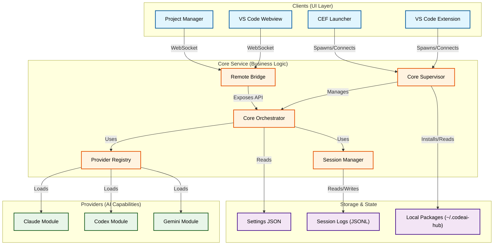

# CodeAI Hub — Project Structure Map

Этот документ визуализирует архитектуру проекта CodeAI Hub, показывая взаимосвязи между основными компонентами, и служит навигатором по детальной документации.

## Visual Architecture

---

## Module Specifications

### 1. Core Layer (Ядро)

**Core Orchestrator**
Центральный сервис, управляющий жизненным циклом приложения. Отвечает за маршрутизацию сообщений, управление состоянием и координацию провайдеров.
- **Документация**: [CoreOrchestrator.md](../Stacks/CoreOrchestrator.md)
- **Ключевые функции**: WebSocket сервер, Health check API, Session management.

**Service Intelligence Module (SIM)**
Модуль аналитики и улучшения контекста (зарезервирован для будущих фаз; сейчас не реализован).
- **Документация**: в разработке

### 2. Clients & UI (Клиенты и Интерфейс)

**UI Modules**
Набор пакетов пользовательского интерфейса, отделенных от основной логики расширения. Включает React-приложение для Webview и статический клиент для Launcher.
- **Документация**: [UI_Modules.md](../Stacks/UI_Modules.md)
- **Компоненты**: `vscode-webview`, `project-manager`.

**Launcher CEF**
Автономный запускатор на базе Chromium Embedded Framework (CEF) для macOS. Позволяет использовать CodeAI Hub без запущенного VS Code.
- **Документация**: [Launcher_CEF_Module.md](../Stacks/Launcher_CEF_Module.md)
- **Особенности**: Нативное меню, сохранение позиции окна, управление процессом ядра.

### 3. AI Providers (Провайдеры)

**Claude Module**
Интеграция с Anthropic Claude SDK. Обеспечивает поддержку thinking-блоков и потоковой передачи ответов.
- **Документация**: [Claude.md](../Stacks/Claude.md)

**Codex Module**
Модуль для работы с OpenAI Codex (и совместимыми моделями).
- **Документация**: [Codex_SDK_Module.md](../Stacks/Codex_SDK_Module.md)

**Gemini Module**
Интеграция с Google Gemini через CLI. Поддерживает динамическую загрузку ESM-модулей и управление сессиями через CLI-bridge.
- **Документация**: [Gemini_CLI_Module.md](../Stacks/Gemini_CLI_Module.md)

---

## Artifact Layout

Структура хранения локальных артефактов в `~/.codeai-hub/`:

- **`core/`**: Установленные версии ядра.
- **`packages/`**:
    - `launcher/`: Версии CEF лаунчера.
    - `ui/`: Версии UI бандлов (`vscode-webview`, `project-manager`) с symlink `current`.
- **`providers/`**: Установленные модули провайдеров (Claude, Codex, Gemini).
- **`sessions/`**: Логи сессий в формате JSONL.
- **`settings/`**: Пользовательские настройки.
- **`releases/`**: Кеш скачанных tar.bz2 архивов.
- **`~/.npm-global/`**: Глобальные CLI/SDK пакеты провайдеров (Claude/Codex/Gemini), обновляются Auto Update Service при старте ядра.
