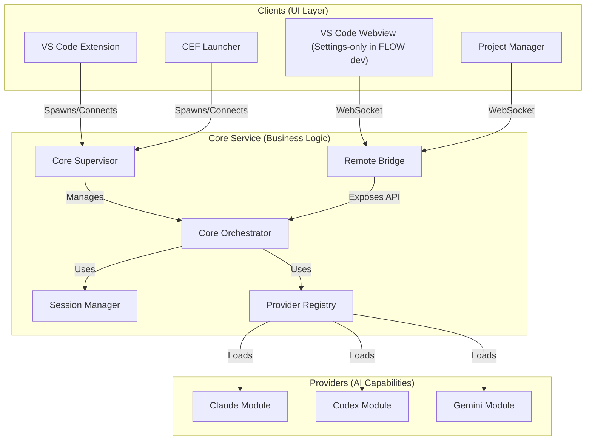

# CodeAI-Hub System Architecture

**Version:** 1.1.546
**Last Updated:** 2026-02-10
**Status:** Active reference (source of truth)

---

## Document Scope

Этот документ — **единственный источник правды** по архитектуре CodeAI-Hub. Он охватывает:
- Автономное ядро (Core Orchestrator)
- Extension Host Layer (VS Code)
- UI Bundles (VS Code Webview, Project Manager)
- CEF Launcher
- Провайдерные модули (Claude, Codex, Gemini)

Детальная документация по отдельным стекам вынесена в `doc/SolidWorks-Flow/Stacks/`.

### Активная архитектурная программа (Phase 124)

С 2026-02-10 в системе активен рефакторинг **Single Source of Truth** для UI/Runtime/Protocol контуров:
- базовый RFC: `doc/SolidWorks-Flow/System/SingleSourceOfTruth_Refactor.md`;
- аудит исходных дублирований: `doc/Sessions/Session001.md`;
- операционный план реализации: `doc/TODO/todo-plan.md` (Phase 124).

Ключевая цель программы: для каждого UI-элемента и runtime-контракта закрепляется один канонический владелец; параллельные legacy/fallback источники переводятся в deprecation и удаляются поэтапно.

Начиная с Phase 124, `scripts/check-architecture.sh` запускает guardrail `scripts/check-architecture-rules/ui-style-ssot.sh`, который блокирует возврат legacy style-source (включая `src/client/project-manager/styles/layout.css`) и дубли Session UI селекторов в `packages/ui/project-manager/styles.css`.

---

## 1. Architectural Overview

CodeAI-Hub — автономная платформа управления AI-сессиями. VS Code расширение — один из клиентов, подключающийся к общему ядру.



### Три слоя компонентов

1. **Extension Host Layer** — точка входа `src/extension.ts`, регистрация команд, webview и Core Supervisor.
2. **VS Code Webview UI** — React-приложение внутри редактора.
3. **Local CEF Client** — статический UI-бандл через Chromium Embedded Framework.

---

## 2. Core Components

### 2.1 Автономное ядро

Node.js сервис (`@codeai-hub/core@1.1.546`), упакованный как JS-бандл + официальный Node 20 runtime.

**Установка:** `~/.codeai-hub/core/<platform>/<version>/`

**Core Supervisor** (`@codeai-hub/core-supervisor`) выбирает runtime, запускает через:
```
<runtime>/node/bin/node <app>/dist/index.js
```

Переменные окружения: `CORE_HOST`, `CORE_PORT`, `CORE_MANAGED_MODE`, `*_WORKSPACE_PATH`, `*_MODULE_PATH`.

### 2.2 UI Bundles (v1.1.546)

Интерфейсы вынесены из VSIX в отдельные пакеты:
- `vscode-webview`: React-приложение для панели VS Code (на период разработки FLOW — Settings-only)
- `project-manager`: Статическая сборка Project Manager (единственный активный UI-клиент Core на период разработки FLOW)

**Установка:** `~/.codeai-hub/packages/ui/<bundleId>/<version>/` с symlink `current`.

### 2.3 TTL и Graceful Shutdown

Параметр `CORE_SHUTDOWN_GRACE_MS` задаёт интервал ожидания после ухода последнего клиента. Пока есть WebSocket-клиенты — ядро работает бесконечно.

### 2.4 Порты и владение ядром

`CorePortManager` и Supervisor используют `runtime-registry.json` (`network.corePort`). Перед стартом клиенты вызывают `detectRunning()` — если версия совпадает, просто attach к живому orchestrator.

### 2.5 Provider Version Telemetry

`ProviderVersionService` читает версии CLI/SDK через глобальный npm (`npm list -g`/`npm view`).

### 2.6 Session Continuity (CRITICAL)

Для долгоживущих workflow-сессий в системе нужен механизм непрерывности: при исчерпании контекстного бюджета модель должна автоматически сформировать handoff-отчёт, после чего Core создаёт новую сессию и продолжает работу, подавая отчёт как входной контекст.

Архитектура: `doc/SolidWorks-Flow/SessionContinuity/SessionContinuity.md`.
Порог запуска handoff рассчитывается по token usage (used/limit) и может быть настроен per-provider (например, Claude и Codex: remaining% threshold, default 30%).
Внутренние handoff-инструкции отправляются через `sendInternalMessage` и не должны попадать в user-facing историю.

### 2.7 Turn-state + Continuity Lock UI Contract (CRITICAL)

Чтобы исключить unlock-gap на границах `turn_completed`/continuity, UI и PM следуют unified input-lock контракту (snapshot-first):

1. Source-of-truth lock state — только `workspace:snapshot` (`turnState`, `resumeMode`, `finalTurnCompleted`, `continuityLockActive`, `continuityLockReason`, `terminalLockReason`, `continuityLockTransition.awaitingBootstrapTurn`); `session:stream` не мутирует lock.
2. **No-resume session**: после финального ответа сессия становится terminal/read-only; input больше не unlock.
3. **Resume-in-place session**: unlock разрешён только когда одновременно выполнены оба условия:
   - получен финальный `turn_completed` для текущего turn;
   - Core завершил post-turn context arbitration с явным snapshot-result `continuityLockReason=no_rollover_needed` (context threshold OK).
   - до явного решения Core удерживает `continuityLockReason=context_check_pending` (unlock запрещён).
4. Если threshold exceeded и нужен rollover, input остаётся locked; разрешено менять только `continuityLockReason` (без `unlock -> relock` окна).
5. **Resume-via-rollover session**: lock удерживается и в old session, и в newly created session; unlock допустим только после первого bootstrap assistant answer в new session (этот bootstrap-turn скрыт от пользователя).
6. **Description collector one-shot / no-resume** всегда остаётся в locked terminal/read-only после финального ответа.
7. Legacy `handoff_state` сохраняется только как backward-compatibility path; приоритет у snapshot continuity-lock контракта.
8. На accepted user submit Core обязан эмитить `turn_state=running` немедленно (до `adapter.sendMessage`) для provider-agnostic мгновенного lock.
9. Если `adapter.sendMessage` завершается ошибкой, Core обязан выполнить rollback: `turn_state=idle` + стандартный `session:error` (без залипания lock).

State-table для Session UI:

| Snapshot signals | Session status.connectionState | Input/Send | Working strip |
|---|---|---|---|
| `turnState=running` | `running` | заблокирован | показываем `working` |
| `turnState=idle` + `continuityLockActive=true`/`awaitingBootstrapTurn=true`/`continuityLockReason=context_check_pending` | `blocked` | заблокирован | показываем `resuming/locked` |
| `turnState=idle` + `resumeMode=resume_in_place` + `finalTurnCompleted=true` + `continuityLockReason=no_rollover_needed` | `idle` | доступен | скрываем |
| terminal no-resume (например description collector) | terminal/read-only | заблокирован навсегда | скрываем wait-strip, показываем terminal-copy |

Инварианты:
- `turn_completed` или `turnState=idle` сами по себе не дают unlock.
- После `turn_completed` Core обязан пройти `context_check_pending` до явного решения `no_rollover_needed|rollover_required`.
- В lock lifecycle разрешены только два terminal unlock-reason: `no_rollover_needed` (resume-in-place) и `resume_ready` (resume-via-rollover).
- Запрещён user-visible сценарий `running -> idle/unlocked -> locked` для одного и того же turn completion.
- При rollover `resume_failed|resume_timeout` меняют только reason/copy, но не открывают input.
- Unlock в rollover-path разрешён только после первого bootstrap assistant answer в target session.
- Description collector one-shot/no-resume не возвращается в editable state.
- Запрещён provider-specific late-lock сценарий: accepted submit без немедленного `turn_state=running` до первого provider marker.
- Запрещён send-failure сценарий без `turn_state=idle` rollback (stuck `running/blocked` после ошибки отправки).

Референс реализации Phase 101: `doc/SolidWorks-Flow/WorkspaceRuntime/WorkspaceRuntime.md`.

### 2.8 Claude One-Shot Session Contract (Phase 98)

Для `Claude_Module` целевая модель исполнения выровнена с Codex:

1. Один user/internal turn = один отдельный `query(...)` запуск (one-shot), обработка через FIFO очередь.
2. Source-of-truth `providerSessionId` — только stream-события SDK (`session_id`), а не file discovery.
3. Resume существующей Claude-сессии выполняется через `options.resume=<providerSessionId>` без `forkSession`.
4. Для каждого user turn обязателен lifecycle-контракт `turn_started` -> (`turn_completed` | `turn_failed`) ровно один раз.
5. Logger при resume/rebind дописывает существующий session лог (`append`), без truncate уже накопленных записей.

---

## 3. Extension Host Layer

### 3.1 Activation & Lifecycle

`src/extension.ts` активирует расширение, регистрирует команды (`codeaiHub.openSettings`, `codeaiHub.launchProjectManager`) и инициализирует `HomeViewProvider`.

### 3.2 UI Bundle Bootstrap

`ui-activation.ts` читает `assets/ui/manifest.json`, устанавливает отсутствующие tar.bz2 из `~/.codeai-hub/releases/` в `~/.codeai-hub/packages/ui/<bundle>/<version>`, создает symlink `current`.

### 3.3 Webview Provider

`HomeViewProvider` создаёт webview, подготавливает HTML и CSP, беря статику из `~/.codeai-hub/packages/ui/vscode-webview/current` (fallback — `media/`).

### 3.4 Message Routing

`home-view-message-router` обрабатывает события от webview (`session:create`, `provider:select`, `settings:update`) и проксирует в ядро через Remote UI Bridge.

### 3.5 Core Bootstrap

Ядро на мульти-тенантной архитектуре. `workspacePath` — свойство конкретной Сессии, не глобальный параметр. Один экземпляр ядра обслуживает несколько проектов.

### 3.6 Port Negotiation & Shutdown

Перед запуском новой версии расширение и лаунчер отправляют `POST /api/v1/shutdown`, ждут graceful-stop. При занятом порте перебирают пул `8080 → 8081 → … → 8092`.

### 3.7 Sticky Keepalive

`CoreKeepAlive` держит скрытое WebSocket-подключение к `ws://<host>:<port>/api/v1/stream`, поэтому ядро не зависит от состояния webview.

---

## 4. VS Code Webview UI

### 4.1 AppHost

Корневой React-компонент в режиме FLOW показывает Settings-only UI и не подключается к Core (сессии/чаты выполняются только в Project Manager).

### 4.2 Delivery

Webview грузит JS/CSS из `~/.codeai-hub/packages/ui/vscode-webview/current`. VSIX не содержит `react-chat.js`/CSS.

### 4.3 Settings UI

Панель настроек доступна из webview, без сессионного UI.

---

## 5. Local CEF Client (Project Manager)

### 5.1 Bundle

UI устанавливается в `~/.codeai-hub/packages/ui/project-manager/current`.

Начиная с Phase 124, единственный source-of-truth для layout/theme Project Manager — `packages/ui/project-manager/styles.css`; legacy-файл `src/client/project-manager/styles/layout.css` выведен из архитектуры.

Phase 125 UI contract for Session panel:
- `Session ID Bar` remains a fixed-height rail (`32px`, same as session tab height);
- left slot renders `ID: <8-char-prefix>-...` from `providerSessionId`;
- right slot renders two read-only placeholder rows (`5 houers`, `weekly`) with `80x4` grey progress bars;
- canonical implementation path: `src/client/ui/src/session/session-id-bar.tsx` + `media/session-view.css`.

Phase 126 visual tuning (same canonical path):
- right labels (`5 houers`, `weekly`) raised to `9px` for readability with tighter spacing (`gap: 1px`, `column-gap: 6px`);
- hint/status text color unified to `rgba(140, 140, 140, 1)` for `Session ID Bar`, `Press Enter to send...`, `Models/Tokens` summary and right-side session debug summary.

### 5.2 Runtime & Launcher Delivery

- `assets/cef/manifest.json` — CEF minimal-пакеты для Windows, macOS, Linux
- `assets/launcher/manifest.json` — версии `CodeAIHubLauncher`

Модули `runtime-installer.ts` и `launcher-installer.ts` скачивают архивы в `~/.codeai-hub/cef/` и `~/.codeai-hub/packages/launcher/`.

`launcher-installer` валидирует целостность runtime перед reuse: обязательны launcher executable и (на macOS) бинарник `Chromium Embedded Framework.framework/Chromium Embedded Framework`. При отсутствии обязательных файлов инсталляция считается повреждённой и переустанавливается.

### 5.3 Standalone Bootstrap

При запуске `CodeAIHubLauncher` проверяет core. Если не запущен — поднимает bundled Node runtime и стартует `app/dist/index.js`.

### 5.4 Logging

- Launcher: `~/.codeai-hub/logs/launcher/launcher.log`
- Core: `~/.codeai-hub/logs/core/core.log`
- Providers: `~/.codeai-hub/logs/<provider>/sdk-<provider>-<sessionId>.jsonl`

### 5.5 Workspaces (Project Manager)

- Список workspace хранится в Core registry `~/.codeai-hub/state/projects.json` и синхронизируется в UI через WebSocket (`projects:list` / `projects:update`).
- Каждый workspace имеет стабильный `workspaceSlug` (source-of-truth в registry) и используется как ключ для:
  - путей `.codeai-hub/<workspaceSlug>/...`;
  - polling `workflow-state` / `workflow-events` в Project Manager.
- Core хранит workflow state snapshot в `<workspaceRoot>/.codeai-hub/<workspaceSlug>/workflow/state.json` (включая `lastActive` для core-driven auto-resume).
- Add workspace:
  - VS Code bridge: `projects:pickFolder`;
  - CEF macOS: нативный Finder folder picker (возвращает абсолютный путь через `projects:folderPicked`);
  - CEF fallback (Windows/Linux): модалка ввода абсолютного пути;
  - после add/activate UI делает `POST /api/v1/orchestrator/workspace-session` (best effort), чтобы создать `.codeai-hub/<workspaceSlug>/` и включить watcher.
- При выборе workspace UI делает `POST /api/v1/orchestrator/workspace-activate` (best effort), чтобы Core мог инициировать core-driven auto-resume (resume authority = Core).
- После добавления workspace UI автоматически выбирает новый workspace в Project Manager.
- При смене workspace UI сбрасывает выбранный артефакт/просмотрщик.
- При смене workspace UI больше не инициирует resume напрямую (например, из `workflow-state` polling) — resume выполняется в Core и публикуется через `session:created`.
- Для пустого workspace (нет артефактов/continuity, все стадии `idle`) UI авто-открывает анкету описания и начинает процесс с нуля.

---

### 5.6 Workspace Runtime Snapshot Isolation (Phase 105)

Phase 105 вводит модуль `packages/core/src/workspace-runtime/` и переводит PM/Core на snapshot-first протокол.

Ключевые элементы:
- **Wire protocol**: `workspace:select` -> `workspace:select:ack` (+ `selectionId`) и `workspace:snapshot` (`selectionId` + `sequence`).
- **Core runtime module**:
  - `WorkspaceStore`: sharded state `Map<workspaceRoot, WorkspaceState>`;
  - `SessionRuntime`: turn-state FSM (`idle`/`running`), heartbeat tracking; watchdog auto-idle отключен по умолчанию (может быть включён явно);
  - `WorkspaceRuntimeFacade`: единая точка интеграции для bridge/handlers, hydration из `SessionManager`, debounce/coalesce snapshot push.
- **Snapshot-first lock**: PM вычисляет server-lock из `workspace:snapshot` (`turnState` + `continuityLockActive`), а не из поштучных `session:stream` `turn_state`.
- **Phase 107-109 lock transition contract**:
  - `workspace:snapshot.sessions[sessionId].resumeMode` + `finalTurnCompleted` — explicit resume arbitration mode (`no_resume`, `resume_in_place`, `resume_via_rollover`) и dual-gate readiness;
- `workspace:snapshot.sessions[sessionId].continuityLockReason` — canonical reason последнего lock шага (`context_check_pending`, `threshold_reached`, `report_in_progress`, `resume_bootstrap`, `no_rollover_needed`, `resume_ready`, `resume_failed`, `resume_timeout`, `terminal_no_resume`);
  - `workspace:snapshot.sessions[sessionId].terminalLockReason` — terminal/read-only marker для one-shot no-resume flow;
  - `workspace:snapshot.sessions[sessionId].continuityLockTransition` — transition metadata (`rolloverId`, source/target session ids, stage/run, `awaitingBootstrapTurn`, `updatedAt`);
  - если `awaitingBootstrapTurn=true`, PM обязан удерживать input lock даже при `continuityLockActive=false`, причём на обеих сторонах handoff (`sourceSessionId` + `targetSessionId`);
  - для rollover-path unlock разрешён только после первого bootstrap assistant answer в target session; `resume_failed|resume_timeout` не снимают lock автоматически.
- **Strict pipeline split (PM/UI)**:
  - `workspace:snapshot` — единственный канал state transitions для `connectionState` и continuity lock lifecycle;
  - `session:stream` — только token usage и контент, без lock/connection mutation.
- **Phase 110 PM visibility guard**:
  - принудительное скрытие description-сессий в центральной панели PM разрешено только после явного `reviewerSessionId` (handoff реально состоялся), чтобы collector-сессия оставалась видимой сразу после отправки анкеты.
- **Phase 111 internal workflow turn-state**:
  - internal dispatch (`sendInternalMessage`) теперь эмитит `turn_state=running`, чтобы PM/UI не разблокировали ввод в `idle` во время workflow/collector turn до получения terminal событий провайдера.
- **Phase 112 runtime watchdog**:
  - watchdog auto-idle отключен по умолчанию, чтобы долгие/"тихие" turn не могли сбрасывать `turnState` в `idle` по таймауту.
- **Phase 113 turn-completion rollover guard**:
  - при `turn_completed` Core не эмитит `idle`/`no_rollover_needed`, если rollover уже pending/in-flight; unlock разрешён только при terminal `resume_ready` (rollover path) или `no_rollover_needed` без pending rollover (resume-in-place path).
  - в `continuityLockTransition` добавлен явный маркер `rolloverPending`, чтобы PM/UI мог удерживать lock без промежуточного `idle`-фликера между сессиями.
- **Phase 114 atomic turn-end arbitration**:
  - обработка `turn_completed` теперь проходит через атомарный dual-gate: Core сначала дожидается завершения flow-node continuity arbitration по этому же событию, затем принимает unlock-решение (`idle/no_rollover_needed` только при явном `no rollover`).
  - если за время arbitration выставлен `rollover pending`, `turn_completed` не может эмитить промежуточный `idle`; UI не получает `unlock -> relock` окно между старой и новой сессией.
- **Phase 115 strict dual-confirmation unlock gate**:
  - после `turn_completed` Core всегда переводит lifecycle в `context_check_pending` и не эмитит `idle/unlock`, пока не получит explicit context decision для этого же turn.
  - Claude pipeline доставляет post-turn usage decision детерминированно в `turn_completed` payload (`tokenUsage/usage`) и дублирует его stream-event fallback; unlock разрешён только при canonical `no_rollover_needed`.
  - PM/UI удерживают `blocked` на `context_check_pending` и снимают lock только при `no_rollover_needed` (resume-in-place) или `resume_ready` (rollover bootstrap completed).
- **Phase 116 post-bootstrap lifecycle normalization**:
  - после `resume_ready` Core обязан очищать rollover pending-флаги (`flowNodeRolloverStarted|flowNodeRolloverInFlight`) и continuity lock context для source+target.
  - target session после bootstrap unlock переводится из `resume_via_rollover` в `resume_in_place` (сброс `finalTurnCompleted=false`) до первого обычного user turn.
  - первый обычный `turn_completed` в target после bootstrap должен проходить по canonical resume-in-place path (`context_check_pending -> no_rollover_needed`) без повторного залипания в `resuming` lock.
- **Scope sync**: Core синхронизирует client scope через `workspace:select` и применяет ingress guard для `session:create|session:message|session:delete`.

Статус legacy:
- `workspace:scope:set` (Phase 104 handshake) считается deprecated transitional path.

Детальный контракт Phase 105:
- `doc/SolidWorks-Flow/WorkspaceRuntime/WorkspaceRuntime.md`
- `doc/SolidWorks-Flow/WorkspaceRuntime/WorkspaceRuntime.md`

## 6. Providers

### 6.1 Claude & Codex

CommonJS модули, tarballs через `npm pack`. Инсталляторы диагностируют наличие пользовательских CLI.

**Claude defaults:** `~/.codeai-hub/settings/settings.json` хранит `providers.claude.defaultModel`.

### 6.2 Gemini

CommonJS модуль с динамическим `import()` для ESM-пакетов. Глобальная установка `@google/gemini-cli` и `@google/gemini-cli-core`.

**Phase 117 runtime compatibility contract:**
- `cli-bridge` больше не зависит исключительно от legacy `nonInteractiveToolExecutor`; при его отсутствии используется `scheduler_fallback` backend.
- `GeminiSessionManager` выполняет tool-calls через фасад `GeminiToolExecutorFacade`, который унифицирует execution path для разных layout версий `@google/gemini-cli-core`.
- Ошибки module layout compatibility классифицируются отдельно от auth/login ошибок на уровнях installer/provider.

**Phase 119 reviewer resume contract:**
- `GeminiProviderAdapter` поддерживает `resumeSession(sessionId, workspacePath?)`; runtime `GeminiSessionManager` передаёт `argv.resume` в CLI-конфигурацию для resume-path.
- В workflow-ветке `description/reviewer` Core сохраняет preferred provider (`snapshot.session.providerId`) при доступном resume у адаптера; при fallback публикуется явная диагностика причины.

**Operational freeze (2026-02-09):**
- сценарий `Description(one-shot) -> Reviewer(resume)` на Gemini подтверждён рабочим в `1.1.538`;
- дальнейшее развитие Gemini continuity/rollover поставлено на паузу до внедрения надёжной telemetry по фактическому remaining context window;
- в период паузы разрешены только стабилизационные bugfix-изменения.

---

## 7. Artifact Layout

```
~/.codeai-hub/
├── core/
│   └── darwin-arm64/1.1.546/
│       ├── node/
│       ├── app/
│       └── install.json
├── packages/
│   ├── launcher/macos-arm64/1.1.546/
│   └── ui/
│       ├── vscode-webview/
│       │   ├── 1.1.546/
│       │   └── current -> 1.1.546
│       └── project-manager/
│           ├── 1.1.546/
│           └── current -> 1.1.546
├── providers/
│   ├── claude/1.1.546/
│   ├── codex/1.1.546/
│   └── gemini/1.1.546/
├── state/
│   └── projects.json
├── settings/
│   └── settings.json
├── sessions/<workspaceKey>/<providerId>/<providerSessionId>.jsonl
└── releases/
    ├── CodeAIHubLauncher-macos-arm64-1.1.546.tar.bz2
    ├── vscode-webview-1.1.546.tar.bz2
    ├── project-manager-1.1.546.tar.bz2
    ├── claude-module-1.1.546.tar.bz2
    ├── codex-module-1.1.546.tar.bz2
    ├── gemini-module-1.1.546.tar.bz2
    └── codeai-hub-core-darwin-arm64-1.1.546.tar.bz2
```

---

## 8. Current Versions

| Component | Version |
|-----------|---------|
| VSIX | 1.1.546 |
| Core | 1.1.546 |
| UI Bundles | 1.1.546 |
| Claude Module | 1.1.546 |
| Codex Module | 1.1.546 |
| Gemini Module | 1.1.546 |
| Agent Shared | 1.1.387 |
| Description Agent | 1.1.387 |
| Virtual Simulation Agent | 1.1.387 |
| Diagram Modules Agent | 1.1.387 |
| Diagram Facades Agent | 1.1.387 |

---

## 9. Workflow (File-First Architecture)

С версии 1.1.440 workflow стадии (Description, Virtual Simulation, Diagrams) используют **file-first** подход:
- Structured output отключён
- Артефакты пишутся напрямую в `.codeai-hub/<workspaceSlug>/<stage>/...` (сущность `runs` удаляется)
- Watcher отслеживает файлы и обновляет workflow state для UI gating

**Подробнее:** `doc/SolidWorks-Flow/Workflow/Workflow_CLI_Steps_And_Watcher_Architecture.md`

---

## 10. Security & Configuration

### 10.1 Secrets

Токены и ключи сохраняются в `SecretStorage` VS Code; при недоступности — зашифрованы на стороне ядра.

### 10.2 CSP

Webview запрещает inline-скрипты, ресурсы грузятся из `vscode-resource:`.

### 10.3 Remote UI Bridge

Ограничивает число одновременных подключений и сбрасывает сессии после таймаута простоя.

---

## 11. Build & Tooling

### 11.1 Build Pipeline

VSIX не содержит JS/CSS бандлов. UI собирается в независимые tar.bz2:
- `vscode-webview.tar.bz2`
- `project-manager.tar.bz2`

### 11.2 Quality Gates

- `./scripts/check-architecture.sh`
- `npx ultracite check`
- `npx ts-prune`
- `npx jscpd --threshold 3 --silent --reporters console src --ignore "**/node_modules/**"`
- `npm run check:links`

### 11.3 Adding New Modules

Любой новый пакет должен быть подключён к pipeline сборки через `scripts/build-<module>.sh` или добавлен в `scripts/build-all.sh`. Gate перед релизом: `curl http://127.0.0.1:<port>/api/v1/health`.

---

## 12. Related Documents

- **Stacks:** `doc/SolidWorks-Flow/Stacks/` (CoreOrchestrator, Claude, Codex, Gemini, UI_Modules, Launcher_CEF)
- **Workflow:** `doc/SolidWorks-Flow/Workflow/Workflow_CLI_Steps_And_Watcher_Architecture.md`
- **Agent Packages:** `doc/SolidWorks-Flow/System/AgentPackages_Architecture.md`
- **SolidWorks Flow:** `doc/SolidWorks-Flow/`
- **Knowledge:** `doc/SolidWorks-Flow/knowledge/`
