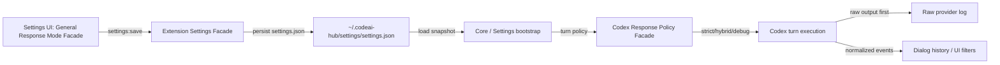

# Codex Response Modes + Raw Provider Diagnostics — Architecture

**Status:** Implemented on `main` (current SSOT + design history)  
**Updated:** 2026-03-13  
**Owner:** Oleksandr + Codex  
**Validated on:** `main` (`v1.1.724`)

---

## Status checkpoint (2026-03-13)

- `Settings -> General` уже владеет persisted policy `general.responsePolicy`.
- Карточка `Response Mode` живёт отдельно от `Core Controls`.
- User-facing Codex settings экспонируют только две активные модели: `gpt-5.3-codex` и `gpt-5.4`.
- Default policy для workflow-сценариев: `hybrid`.
- Raw provider rollouts и SDK JSONL используются как диагностический SSOT.
- Этот документ сохраняет исходную design-логику, но описывает уже внедрённый контракт, а не будущую baseline-ветку.

---

## 1) Original problem (resolved)

На старте baseline-линии `v1.1.720` модель `gpt-5.4` работала, но в user-facing dialog показывала только финальный ответ turn и теряла промежуточный progress/commentary.

Разбор реальных JSONL-артефактов показал две разные причины:
- **Upstream shaping:** текущий `outputSchema` + prompt в стиле `Return only JSON, no extra text.` меняют сам turn и могут заставлять провайдера не присылать commentary в привычной форме.
- **Downstream filtering:** даже уже пришедшие сигналы дополнительно режутся нашим pipeline и не всегда доходят до history/UI.

Следствие:
- мы не можем безопасно экспериментировать с новыми Codex-моделями;
- мы не имеем неизменяемого диагностического SSOT для сырого provider output;
- `structured output` смешан с живым пользовательским dialogue/progress;
- на момент начала работ General Settings не давали управлять этим runtime policy.

---

## 2) Design Goals

- Восстановить нормальный progress/commentary для `gpt-5.4` без подтягивания поздних PM/workflow-state рефакторингов из `main`.
- Сохранить `structured output` как инструмент, но сделать его настраиваемой policy, а не жёстким контрактом всего turn.
- Вынести управление policy в `Settings -> General`.
- Сделать новую опцию отдельным модулем со своим фасадом, в духе архитектуры проекта.
- Гарантировать неизменяемый raw provider log до наших UI/history фильтров.
- Сделать платформу устойчивой к будущим моделям, которые меняют phases, event shape или метрики intermediate output.

---

## 3) Non-goals

- Не переносить rollout-код и PM hydration/workflow-state refactor из поздних веток.
- Не удалять `structured output` глобально и безусловно.
- Не менять workflow navigation, PM layout или Session UI контракты вне зоны, реально нужной для response policy и diagnostics.
- Не превращать `Settings -> General` в монолитный god-component.

---

## 4) Product UX Contract

В `Settings -> General` появляется новая карточка:
- `Response Mode`

Поддерживаемые режимы:
- `Strict`
- `Hybrid`
- `Debug/Raw`

### 4.1 Mode semantics

**`Strict`**
- live turn может получать жёсткий `outputSchema`;
- используется для минимизации “лишних” токенов и для terminal machine-readable output;
- в UI редактируются:
  - strict schema;
  - strict instruction/prompt suffix.

**`Hybrid`**
- commentary/progress остаётся свободным;
- structured output применяется только к terminal-result слою;
- это текущий default для workflow-сценариев.

**`Debug/Raw`**
- schema injection отключается или становится максимально прозрачной;
- сохраняется максимальный объём raw provider output;
- режим используется для исследования новых моделей и для расследования regressions.

### 4.2 UX invariants

1. `General` tab не знает внутренностей Codex runtime и работает только через фасад settings-модуля.
2. `Restart Core` остаётся отдельной карточкой и не смешивается с response mode UI.
3. Пользователь всегда видит активный mode и понимает, что именно он делает с turn contract.
4. Переключение mode не должно менять PM/workflow-state поведение.

---

## 5) Settings Snapshot Contract

Новый general-level контракт:

```json
{
  "general": {
    "coreControls": {
      "allowRestart": true
    },
    "responsePolicy": {
      "mode": "hybrid",
      "strictOutput": {
        "schemaText": "{\n  \"type\": \"object\",\n  \"properties\": {\n    \"answer\": { \"type\": \"string\" }\n  },\n  \"required\": [\"answer\"],\n  \"additionalProperties\": false\n}",
        "instructionText": "You must respond with a JSON object that matches the provided schema.\nPopulate the field:\n- answer: the user-facing answer.\nReturn only JSON, no extra text.\n\nUser request:"
      }
    }
  }
}
```

### 5.1 Why `schemaText`, not raw parsed object

Для developer-facing настройки в UI важнее сохранить редактируемый источник правды, чем только финальный parsed object.

Поэтому:
- persisted SSOT для strict schema — текст JSON schema;
- валидация/парсинг выполняются фасадом settings/runtime;
- runtime не должен напрямую читать текст textarea из UI-компонентов.

### 5.2 Defaults

- `mode = "hybrid"`
- `strictOutput.schemaText` — bundled schema эквивалент текущему baseline-контракту `{"answer": "string"}`
- `strictOutput.instructionText` — текущий strict prompt template с явным перечислением полей и финальной строкой `User request:`

---

## 6) Raw Provider Diagnostics Contract

### 6.1 SSOT order

Для диагностики response policy вводится жёсткий порядок источников правды:

1. **Raw provider log**  
   Полный нативный provider output, записанный до наших display/history фильтров.

2. **Normalized internal events**  
   Наши нормализованные события для UI/history/replay.

3. **User-facing dialog history**  
   То, что реально показывается пользователю как бесконечный диалог.

### 6.2 Critical invariant

Потеря данных на уровне `normalized events` или `dialog history` не должна означать потерю сырых данных провайдера.

### 6.3 SDK logging invariant

Повторный `resume` на том же `thread_id` не должен затирать существующий JSONL-лог.  
SDK/diagnostic log обязан быть append-safe или rotate-safe.

---

## 7) Module Boundary and Facades

### 7.1 UI module in `Settings -> General`

Новый закрытый UI-модуль:
- `src/client/ui/src/components/settings/general-response-mode/`

Единственная публичная точка входа:
- `general-response-mode-facade.tsx`

Внешний импорт допустим только из:
- `src/client/ui/src/components/settings/general-settings.tsx`

Внутренние части модуля:
- selector/cards copy
- strict schema editor
- validation state / helper text
- mode-specific explanatory copy

### 7.2 Extension settings module

Новый закрытый settings-модуль:
- `src/extension-module/settings/general-response-mode/`

Единственная публичная точка входа:
- `general-response-mode-facade.ts`

Ответственность фасада:
- defaults
- normalize/parse persisted `responsePolicy`
- validation strict schema text
- safe fallback rules для corrupt settings file

`general-settings.ts` остаётся композиционным слоем, но не хранит новую логику внутри себя.

### 7.3 Codex runtime module

Новый закрытый runtime-модуль:
- `packages/Codex_Module/src/response-policy/`

Единственная публичная точка входа:
- `codex-response-policy-facade.ts`

Ответственность фасада:
- превратить persisted `responsePolicy` в runtime turn policy;
- решить, когда inject-ить strict schema;
- решить, какой режим commentary допустим;
- выставить policy для raw diagnostics/logging.

---

## 8) Runtime Behavior by Mode

### 8.1 Strict

- Turn может идти с `outputSchema`.
- Жёсткий prompt suffix разрешён.
- Commentary может не прийти в том же виде, что в Hybrid/Debug.
- Но raw provider log всё равно обязан сохраняться полностью в пределах того, что провайдер реально вернул под этим контрактом.

### 8.2 Hybrid

- Commentary не должен попадать под требование `only JSON`.
- Structured output относится только к terminal result.
- Если provider не прислал commentary, UI может использовать tool/file progress как деградационный fallback.

### 8.3 Debug/Raw

- Нет жёсткого schema pressure на live turn.
- Raw provider output сохраняется максимально полно.
- Этот режим используется как основной investigative mode для новых моделей.

---

## 9) Integration Map



---

## 10) Current implementation checkpoints

1. В `Settings -> General` есть отдельная Response Mode карточка, реализованная как самостоятельный модуль/фасад.
2. Default mode на `main` — `Hybrid`.
3. `Strict` даёт editable schema + editable instruction text.
4. `Debug/Raw` даёт исследовательский режим без жёсткой schema-injection зависимости.
5. Raw provider log можно использовать как диагностический SSOT.
6. Повторный `resume` не затирает исторический SDK JSONL лог.
7. Фикс commentary/progress для `gpt-5.4` доступен на `main` без переноса поздних PM refactor-изменений.

---

## 11) Related files / documents

- `doc/Sessions/Archive/Session061.md`
- `doc/Sessions/Archive/Session062.md`
- `doc/SolidWorks-WorkFlow/Modules/Codex.md`
- `doc/SolidWorks-WorkFlow/System/SystemArchitecture.md`
- `doc/SolidWorks-WorkFlow/Contracts/FacadeClassDiagram_DesignAndMaintenance.md`
- `packages/Codex_Module/src/messaging/structured-output-stream-controller.ts`
- `packages/Codex_Module/src/messaging/message-processor.ts`
- `packages/Codex_Module/src/logging/session-logger.ts`
- `packages/core/src/remote-bridge/handlers/session-request-handler.ts`
- `src/extension-module/settings/general-settings.ts`
- `src/client/ui/src/components/settings/general-settings.tsx`
