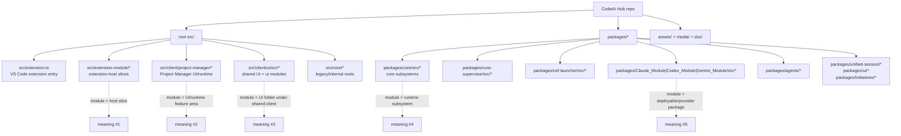
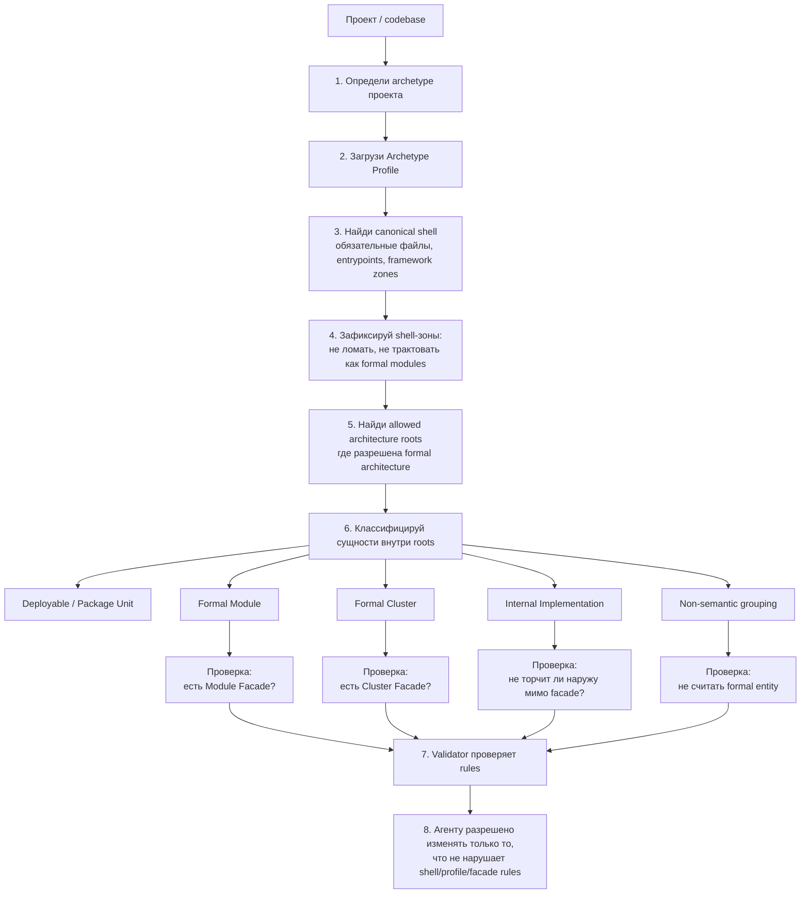

# Формальная модульно-кластерная архитектура для AI-first разработки

**Статус:** Discussion baseline
**Дата:** 2026-03-20
**Охват:** формализация архитектурных сущностей `Module` и `Cluster` для детерминированной AI-assisted / AI-driven разработки с явной привязкой к каноническим scaffold/file-system схемам конкретных типов приложений

**Связанные документы:**
- `doc/SolidWorks-WorkFlow/System/SystemArchitecture.md`
- `doc/SolidWorks-WorkFlow/Contracts/FacadeClassDiagram_DesignAndMaintenance.md`
- `doc/SolidWorks-WorkFlow/Plans/DiagramWorkflow_UserSurface_Architecture.md`
- `doc/SolidWorks-WorkFlow/Plans/Diagram_UserFacing_Layout_And_Format_Architecture.md`
- `doc/TODO/todo-plan.md`

---

## 1. Почему этот документ понадобился

Поводом стал seemingly-local вопрос про диаграмму `Diagram Modules`.

На практике выяснилось:
- текущая диаграмма показывает названия `service` / `store` / `gateway`, но не даёт пользователю ясной архитектурной картины;
- визуальные `cluster` и `module` сущности недостаточно формализованы в самой кодовой базе;
- из-за этого диаграмма плохо отвечает на главный инженерный вопрос: "что это за сущность и где её реальная граница?"

В ходе обсуждения стало понятно, что проблема не только в layout или тексте карточек.
Проблема глубже:
- архитектурные сущности должны быть пригодны для машинной интерпретации;
- иначе их невозможно надёжно валидировать, а значит невозможно и требовать от AI-агентов строгого соблюдения архитектурной дисциплины.

Для платформы, которая проектируется как среда совместной разработки человека и ИИ, это критично.

---

## 2. Классическая теория и наш осознанный отход от неё

Классическая теория модульности (Parnas, DDD, facade/separated-interface practices) согласна в одном:
- у модуля должен быть явный контракт;
- границы между модулями должны быть определены;
- высокая cohesion и низкая coupling желательны.

Но классическая теория не требует жёстко, чтобы:
- каждый модуль имел именно `facade-class`;
- каждый cluster имел собственный materialized cluster facade;
- каждая архитектурная сущность была выражена в файловой структуре в форме, пригодной для автоматической проверки.

Для обычной ручной разработки это допустимо.
Для AI-first deterministic platform этого недостаточно.

Поэтому этот документ предлагает сознательно усилить классические принципы:
- оставить идею modularity;
- но сделать архитектурные сущности не только понятными человеку, а ещё и формально проверяемыми.

---

## 3. Главный принцип

**Архитектурная сущность считается существующей только тогда, когда она выражена в кодовой базе в форме, пригодной для машинной проверки.**

Следствия:
- если сущность нельзя найти по файловой структуре и именованию, она слишком слаба для AI-governed разработки;
- если сущность нельзя проверить автоматическим gate'ом, она не является надёжным правилом архитектуры;
- если правило держится только на "прочитай документ и догадайся", оно не подходит как базовый закон платформы.
- при этом формальная grammar не должна ломать стандартную файловую схему самого archetype-проекта; она должна встраиваться в неё.
- если архитектурное решение, термин, словарь сущностей или filesystem-rule нельзя проверить обычным детерминированным скриптом, такое правило слишком слабо для platform baseline.

Иначе говоря:

**формализация = возможность алгоритмизации**  
**алгоритмизация = возможность архитектурных gate'ов**  
**gate'ы = управляемая AI-assisted разработка**

Дополнительный принцип для платформы:

**Мы не заменяем канонический scaffold конкретного типа приложения своей "универсальной" структурой.**  
**Мы накладываем formal architecture layer поверх archetype-specific shell.**

Ещё один обязательный принцип:

**Финальная проверка архитектурных правил должна выполняться не ИИ, а обычным скриптом.**  
**ИИ может помогать проектировать, объяснять и предлагать структуру, но validator должен быть deterministic и script-checkable.**

---

## 4. Термины

### 4.1. Archetype Shell

`Archetype Shell` — каноническая файловая и entrypoint-схема конкретного типа приложения, заданная его экосистемой, генератором или framework-level convention.

Примеры:
- `VS Code extension` shell с `package.json`, `src/extension.ts`, contribution points и required runtime files;
- shell для `Node.js service`;
- shell для `React webview`;
- shell для `CLI tool`.

Archetype Shell:
- определяет внешние обязательные файлы и папки;
- не должен ломаться нашей внутренней grammar;
- задаёт границы того, где вообще допустимо раскладывать formal architecture.

### 4.2. Archetype Profile

`Archetype Profile` — платформенный набор правил для конкретного типа проекта, который говорит агенту, как встраивать formal architecture внутрь канонического shell.

Archetype Profile определяет:
- какой shell считается каноническим;
- какие source roots допустимы для formal architecture;
- какие platform/framework entrypoints обязаны оставаться тонкими adapter/bridge слоями;
- какие naming/import/facade rules действуют внутри этого archetype.

Именно profile, а не "универсальная папочная схема", должен быть точкой применения AI-правил.

### 4.3. Package / Deployable Unit

`Package / Deployable Unit` — единица сборки, поставки или runtime attach, которую уже задаёт экосистема проекта.

Примеры:
- npm package;
- VS Code extension bundle;
- launcher;
- standalone desktop client;
- service process.

Package / Deployable Unit:
- не тождественен `Module`;
- отвечает на вопрос "как это собирается и поставляется", а не "какова минимальная формальная архитектурная единица";
- может содержать formal clusters и modules внутри разрешённых profile-зон.

### 4.4. Module

`Module` — минимальная формальная архитектурная единица системы.

Module обязан:
- быть видимым в файловой структуре как отдельная папка внутри допустимого architecture root;
- иметь собственный materialized facade-контракт;
- скрывать внутренние реализации за этим facade;
- быть пригодным для отдельной валидации и локального reasoning.

Базовая идея:
- нет facade → нет формального модуля.

### 4.5. Module Facade

`Module Facade` — кодовая сущность, которая materialize-ит внешний контракт модуля.

Это не просто документ и не просто намерение.
Это реальный файл/класс/entry-point, который:
- смотрит наружу модуля;
- принимает разрешённые входы;
- отдает разрешённые выходы;
- скрывает внутренние детали модуля.

Для данной методологии baseline-правило жёсткое:
- у каждого формального модуля должен быть свой facade.

### 4.6. Cluster

`Cluster` — формализованная архитектурная единица более высокого уровня, объединяющая несколько модулей в закрытую подсистему.

Cluster обязан:
- быть materialized как отдельная папка внутри допустимого architecture root;
- содержать в себе модули кластера;
- иметь собственный `Cluster Facade`;
- задавать явную внешнюю границу кластера.

Базовая идея:
- нет cluster facade → нет формального cluster.

### 4.7. Cluster Facade

`Cluster Facade` — materialized gate кластера.

Он:
- смотрит наружу кластера;
- принимает разрешённые входы в cluster;
- передает взаимодействия на module facades внутри кластера;
- нормализует внешний контракт кластера как подсистемы.

Архитектурный смысл:
- cluster facade делает cluster реальной, а не декларативной сущностью.

---

## 5. Proposed decision baseline

### 5.1. Нет формального модуля без facade

Если у сущности нет собственного facade, она не считается formal module.

Тогда это может быть:
- internal implementation fragment;
- helper;
- private class group;
- временный refactoring slice;
- но не модуль в архитектурном смысле платформы.

### 5.2. Нет формального cluster без cluster facade

Если несколько модулей просто лежат в одной папке и хорошо связаны, этого недостаточно.

Без cluster facade это:
- не cluster;
- а только folder grouping или исторически сложившаяся зона кода.

### 5.3. `Module Group` исключается из formal grammar

Мы сознательно не вводим `Module Group` как самостоятельную архитектурную сущность.

Причина:
- он не даёт собственного facade;
- не создаёт отдельного import gate;
- плохо поддаётся автоматической проверке;
- добавляет лишний промежуточный слой смысла между package / cluster / module;
- почти не помогает диаграмме как user-facing инженерному инструменту.

Допустимо только следующее:
- обычные non-semantic folder groupings для удобства навигации;
- namespace-like папки, которые не считаются formal entities;
- такие папки не требуют facade, не валидируются как архитектурная граница и не должны появляться на канонической diagram как отдельный слой.

### 5.4. Formal grammar не должна ломать archetype shell

Мы не проектируем одну универсальную файловую структуру для всех типов приложений.

Вместо этого:
- сначала признаём канонический scaffold конкретного archetype;
- затем встраиваем в него наши formal `Cluster` / `Module` / `Facade` rules;
- platform/framework-required entrypoints сохраняются на ожидаемых местах;
- business logic не должна размазываться по shell entrypoints, но и shell не должен переписываться под абстрактную "идеальную" схему.

Для примера:
- `VS Code extension` должен оставаться узнаваемым `VS Code extension`, а не превращаться в произвольную самодельную файловую систему;
- agent должен уметь продолжать работу внутри стандартного scaffold, а не только в специально придуманных с нуля репозиториях.

### 5.5. Каждый поддерживаемый тип проекта должен иметь свой Archetype Profile

Чтобы AI-агент мог действовать детерминированно, для каждого supported archetype нужен profile, который фиксирует:
- canonical shell;
- allowed architecture roots;
- entrypoint thinness rules;
- facade naming rules;
- import policy;
- mapping между deployable/package units и formal architecture.

Именно profile должен отвечать на вопрос:
- где внутри данного типа проекта разрешено materialize-ить formal modules и clusters;
- а где находятся shell-only файлы, которые нельзя трактовать как архитектурные модули.

При этом сам profile должен быть описан так, чтобы его правила можно было проверить скриптом:
- без semantic guesswork;
- без необходимости спрашивать LLM, "похоже ли это на cluster";
- через файловые правила, naming rules, import restrictions и другие machine-checkable признаки.

### 5.6. Boundary-only document недостаточен

Документ вида `boundary.md`, существующий сам по себе, полезен как объяснение, но слаб как механизм.

Он:
- может быть не прочитан;
- не участвует в import graph;
- не создаёт compile-time ориентир;
- не даёт надёжного gate'а.

Поэтому для этой методологии:
- `boundary` как идея допустим;
- но он должен быть materialized в коде через facade;
- документ может быть only supplementary layer.

### 5.7. Diagram semantics должна опираться только на materialized сущности

Если диаграмма хочет показать `cluster`, то cluster должен быть:
- реальной формальной сущностью;
- а не только аналитической группировкой из Markdown.

Иначе user видит красивые коробки без инженерной силы.

---

## 6. Почему это сильнее для AI-first среды

В обычной разработке мягкие правила ещё можно поддерживать через:
- review,
- командную память,
- наставничество,
- документацию.

В AI-first среде этого недостаточно.

AI-система должна уметь:
- распознать сущность;
- проверить её полноту;
- остановить нарушение правила;
- объяснить, почему правило нарушено.

Это приводит к жёсткому выводу:
- чем более формально выражена архитектура, тем надёжнее её может соблюдать агент;
- чем более она "размазана", тем быстрее агент уйдёт в произвольную интерпретацию.

Поэтому для будущей платформы формальный facade для модулей и кластеров — не эстетическая прихоть, а способ сделать архитектуру проверяемой.

---

## 7. Что именно можно будет валидировать алгоритмически

Если принять эту модель, становятся возможны автоматические проверки.

### 7.1. Archetype gate

Проверки уровня archetype/profile:
- распознан ли тип проекта и привязан ли к известному `Archetype Profile`;
- сохранены ли обязательные shell-файлы и папки на ожидаемых местах;
- не пытается ли formal architecture подменить или разрушить framework-required scaffold;
- лежат ли formal clusters/modules только в разрешённых `allowed architecture roots`;
- остаются ли platform entrypoints тонкими adapter/bridge слоями, а не носителями произвольной бизнес-логики.

### 7.2. Module gate

Проверки уровня модуля:
- есть ли отдельная папка модуля внутри разрешённого architecture root;
- есть ли facade-файл;
- соответствует ли имя facade naming rule;
- не импортируют ли внешние сущности внутренние классы модуля в обход facade;
- не превышен ли scope публичного контракта модуля.

### 7.3. Cluster gate

Проверки уровня кластера:
- есть ли папка cluster в допустимой зоне текущего profile;
- есть ли cluster facade;
- лежат ли module folders внутри cluster folder;
- идут ли межкластерные обращения только через cluster facades;
- не нарушена ли closed-subsystem policy;
- не размазан ли один и тот же formal cluster по нескольким случайным filesystem zones вне правил profile.

### 7.4. Diagram gate

Проверки уровня diagram workflow:
- `cluster` на диаграмме существует только если он подтвержден структурой кодовой базы;
- `module` на диаграмме существует только если он materialized как formal module;
- диаграмма не показывает `Module Group`, если это всего лишь folder grouping без самостоятельной boundary semantics;
- диаграмма не invent-ит псевдосущности, которых нет в code structure.

---

## 8. Что это усложняет

Эта модель сознательно дороже, чем "свободная" модульность.

Дополнительная цена:
- больше папок и entry files;
- больше проксирующего кода;
- больше архитектурной дисциплины;
- более жёсткие naming rules;
- необходимость вести archetype-specific profiles вместо одной "магической" общей схемы;
- необходимость поддерживать фасады даже там, где программисту вручную могло бы казаться "лишним".

Эта цена осознанно принимается ради:
- детерминизма;
- читаемости для не-программистов;
- машинной проверяемости;
- качества работы AI-агентов;
- повторяемости архитектурного стиля между многими будущими проектами.

---

## 9. Что эта модель даёт пользователю платформы

Если эту модель принять как базовую grammar платформы, то инженер, дизайнер или архитектор, не являющийся программистом, получает:
- понятную связь между стандартным типом приложения и нашей formal architecture;
- предсказуемую файловую систему без отказа от канонических scaffold-схем индустрии;
- очень понятную базовую единицу `Module`;
- понятную укрупняющую сущность `Cluster`;
- жёсткий файловый и кодовый след каждой архитектурной сущности;
- возможность видеть в диаграмме не "красивые коробки", а реальные, проверяемые элементы.

Для такого пользователя это намного сильнее, чем классическая гибкая, но размытая modularity.

---

## 10. Практический вывод

Для платформы CodeAI Hub как среды AI-assisted разработки предлагается следующее baseline-решение:

1. Признать `Archetype Shell` обязательным внешним контуром проекта, который нельзя произвольно ломать нашей внутренней grammar.
2. Ввести `Archetype Profile` как механизм адаптации AI-правил к конкретному типу приложения.
3. Развести `Package / Deployable Unit` и `Module`: package отвечает за сборку/поставку, module — за минимальную формальную архитектурную единицу.
4. Оставить `Module` минимальной обязательной архитектурной единицей.
5. Требовать от каждого `Module` собственного facade-контракта.
6. Разрешать `Cluster` только как формальную сущность с собственным cluster facade.
7. Исключить `Module Group` из formal grammar; разрешить только non-semantic folder groupings.
8. Не полагаться на `boundary.md` как на единственную форму границы.
9. Использовать документы как объяснение, но кодовые facade-сущности как основной носитель архитектурной грамматики.

Короткая формула:

**нет facade → нет formal module**  
**нет cluster facade → нет formal cluster**  
**нет archetype profile → нет детерминированного AI-governed filesystem contract**

---

## 11. Схемы на примере текущего репозитория CodeAI Hub

Ниже зафиксированы две схемы:
- как репозиторий читается сейчас;
- как он должен читаться после применения согласованной grammar.

Это не финальный migration-plan по файлам.
Это conceptual map, которая помогает не потерять договорённый смысл.

### 11.1. As-is: как репозиторий читается сейчас

Что эта схема показывает:
- слово `module` уже используется в нескольких несовместимых смыслах;
- package/deployable unit, runtime subsystem, UI feature area и formal module не разведены;
- канонический shell конкретного archetype и внутренняя архитектура часто смешаны в одном и том же корне;
- cluster boundaries в большинстве случаев не materialized как явные filesystem/code boundaries;
- agent не может надёжно понять по одному пути, где shell, где cluster, где module, а где просто historical folder grouping.

### 11.2. Target: как агент должен принимать решения по этой grammar

Что эта схема фиксирует:
- сначала агент определяет не `module`, а тип проекта и его `Archetype Profile`;
- shell конкретного типа приложения сохраняется и не переписывается под абстрактную универсальную схему;
- formal `Cluster` и `Module` разрешены только внутри `allowed architecture roots`, заданных profile;
- всё, что лежит вне этих зон, не должно по умолчанию объявляться formal architecture;
- `Module Group` как formal entity отсутствует: folder grouping либо internal, либо purely navigational;
- validator проверяет не "красоту папок", а соблюдение profile-aware architecture contract.

Эта схема важнее для платформы, чем конкретная целевая картинка каталогов, потому что:
- её может выполнять AI-агент как инструкцию;
- её должен проверять обычный deterministic script;
- она одинаково применима к разным типам приложений.

### 11.3. Что в этой модели универсально для любых приложений

Ниже перечислено то, что должно быть одинаковым для любых типов проектов:
- сначала определяется archetype проекта;
- затем загружается соответствующий `Archetype Profile`;
- канонический shell проекта не ломается;
- formal architecture materialize-ится только внутри разрешённых зон;
- у каждого formal `Module` обязан быть `Module Facade`;
- у каждого formal `Cluster` обязан быть `Cluster Facade`;
- internal implementation не должен торчать наружу в обход facade;
- non-semantic folder grouping не считается formal entity;
- скрипт-валидатор обязан проверять именно эти правила, а не требовать одну и ту же папочную схему для всех продуктов.
- если какое-то новое правило нельзя выразить в виде script-checkable validator rule, его нельзя считать обязательной частью platform grammar.

Именно это делает модель переносимой на:
- расширение для VS Code;
- плагин для Photoshop;
- website;
- desktop app;
- service;
- CLI;
- другие типы приложений.

### 11.4. Что задаётся profile-ом конкретного archetype

Ниже перечислено то, что меняется от типа проекта к типу проекта:
- какие файлы и папки составляют canonical shell;
- какие entrypoints являются framework/platform-required;
- какие зоны считаются `allowed architecture roots`;
- какие deployable/package units считаются базовыми;
- какие naming rules применяются к facade-файлам;
- какие import restrictions действуют между clusters/modules;
- где проходит граница между shell-only code и formal architecture.

Иначе говоря:
- универсальны сущности и алгоритм;
- специфичен только profile конкретного archetype.

### 11.5. Практическая интерпретация именно для нашего репозитория

Для CodeAI Hub это означает следующее:
- мы не должны насильно переделывать весь репозиторий под одну абстрактную папочную схему;
- мы должны распознать несколько archetype-контуров внутри одного monorepo:
  - `VS Code extension`;
  - `Project Manager client`;
  - `shared webview/UI`;
  - `core service`;
  - `launcher`;
  - `provider packages`;
- внутри каждого такого контура должен появиться свой profile-aware architecture contract;
- только после этого можно последовательно приводить файловую систему к состоянию, где clusters/modules/facades читаются без догадок и человеком, и агентом.

### 11.6. Интеграция с существующими quality gates

В проекте уже существуют quality gates и architecture checks, которые запускаются через git hooks.

Зафиксированное решение:
- мы не создаём отдельный параллельный механизм проверки архитектуры;
- мы расширяем уже существующие script-based gates;
- главным местом интеграции должен стать текущий `scripts/check-architecture.sh` и дополнительные rule-скрипты рядом с ним;
- `scripts/check-architecture.sh` обязан сканировать весь живой handwritten source surface, а не только один исторический subtree:
  - корневой `src/`;
  - каждый package source root `packages/**/src/`;
  - build outputs (`dist/`, `build/`, `node_modules/`) исключаются по директориям как generated artefacts, а не через неявное сужение scan surface;
- любые временные исключения для already oversized handwritten files должны фиксироваться только адресно через явный debt allowlist, а не через выпадение целых директорий из проверки;
- новые правила для `Archetype Profile`, `Cluster`, `Module`, `Module Facade` и `Cluster Facade` должны добавляться в эти existing gates по мере утверждения grammar;
- каждое новое обязательное архитектурное правило должно сначала получить script-checkable form, и только потом становиться обязательным quality gate.

---

## 12. Открытые вопросы для следующего обсуждения

Этот документ фиксирует baseline, но ещё не закрывает implementation details.

Нужно отдельно обсудить:
- какой минимальный набор `Archetype Profile` платформа должна поддерживать в первую очередь;
- как именно описывать canonical shell и `allowed architecture roots` для каждого archetype;
- как различать shell entrypoints, package/deployable units и formal modules;
- как именно должен называться facade-файл модуля;
- как именно должен называться cluster facade;
- обязан ли cluster facade быть одним файлом или допустим boundary-submodule;
- как различать package-level modules и internal modules;
- какой import policy считаем допустимой;
- как адаптировать текущую кодовую базу к новой grammar;
- как должна измениться диаграмма, чтобы она показывала именно formal entities, а не просто логические labels.

Только после этого можно переходить к рефакторингу кодовой базы и к переработке diagram workflow.
