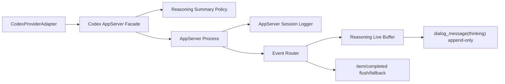

# Codex App-Server Live Reasoning And SDK Log — Planning Doc

## 1. Purpose

Довести активную Codex runtime line на базе `codex app-server` до того поведения, ради которого она и была выбрана как transport replacement:

- reasoning должен приходить в CodeAI Hub из real-time protocol потока инкрементально, а не одним финальным блоком;
- `~/.codeai-hub/logs/codex` должен снова получать file-backed SDK/app-server session logs;
- внешний provider contract для Core/UI должен остаться прежним: `providerId = "codexCli"`, тот же `ProviderAdapter`, тот же provider slot `codex`.

Этот planning-doc описывает не новый transport и не rollback к legacy rollout path, а точечную донастройку уже выпущенной app-server линии.

---

## 2. Validated Inputs (2026-04-19)

### 2.1. Что реально делает текущий app-server модуль

Подтверждено по коду:

- `packages/Codex_AppServer_Module/src/app-server/codex-app-server-facade.ts`
  - `summary` для `turn/start` захардкожен как `"auto"`;
  - в `thread/start` ещё присутствует stale field `experimentalRawEvents: false`.
- `packages/Codex_AppServer_Module/src/app-server/codex-app-server-event-router.ts`
  - reasoning deltas складываются во временный buffer;
  - `thinking` bubble эмитится только на `item/completed`;
  - `item/reasoning/textDelta` не обрабатывается.
- `packages/Codex_AppServer_Module/src/app-server/process/codex-app-server-process.ts`
  - stderr и protocol log records форвардятся только в reporter;
  - file-backed logger в `~/.codeai-hub/logs/codex` отсутствует.

### 2.2. Что подтверждено локальным probe `codex app-server`

На локальном `codex-cli 0.121.0` подтверждено:

- protocol реально поддерживает reasoning notifications:
  - `item/reasoning/summaryPartAdded`
  - `item/reasoning/summaryTextDelta`
  - `item/reasoning/textDelta`
- при `summary: "auto"` reasoning delta stream может вообще не прийти;
- при `summary: "detailed"` reasoning summary text реально приходит как последовательность малых delta notifications;
- `codex app-server` остаётся rich-client transport с first-class surface для:
  - `thread/start`
  - `thread/resume`
  - `turn/start`
  - `turn/interrupt`
  - `thread/read`
  - `thread/rollback`
  - auth/rate-limits/account APIs

### 2.3. Что уже умел legacy path

Подтверждено по legacy коду и runtime artifacts:

- старый `packages/Codex_Module` уже умел читать provider-native `agent_reasoning` из rollout JSONL и эмитить его по кускам;
- native rollout и app-server protocol — это разные каналы;
- наличие раздельных reasoning fragments в native JSONL не означает, что app-server при `summary: "auto"` обязан отдавать те же куски в real-time transport.

### 2.4. Почему баг виден пользователю именно так

- крупный reasoning block сейчас возникает потому, что новый router буферизует deltas до `item/completed`;
- русский reasoning сейчас ожидаем, потому что Core translation overlay считает `thinking` candidate-типом для перевода;
- пустая папка `~/.codeai-hub/logs/codex` сейчас не является crash-симптомом: file logger просто не был перенесён из legacy линии.

---

## 3. Problem Statement

Текущий релиз `1.2.22` переключил ядро на новый transport, но не закрыл ключевую UX-цель:

1. live reasoning из `codex app-server` не доходит до UI как растущий поток;
2. reasoning stream зависит от слишком слабой policy `summary: "auto"`;
3. новая линия потеряла file-backed диагностический лог, который был в legacy `Codex_Module`;
4. rollback к native rollout как к основному источнику thinking разрушил бы цель migration-а: держать Codex на protocol-native `thread/turn` линии.

Следовательно, нужен **bugfix scope внутри активной app-server архитектуры**, а не откат к старому transport.

---

## 4. Design Goals

### 4.1. Goals

- Сохранить app-server как canonical runtime transport для Codex.
- Получать reasoning в UI/Core из real-time app-server notifications, а не из native rollout tail.
- Сохранить внешний provider contract без смены `providerId`, loader seam и packaging slot.
- Вернуть file-backed session log в `~/.codeai-hub/logs/codex`.
- Удержать файлы в рамках cluster-модели и лимита micro-classes.

### 4.2. Non-goals

- Не откатывать Core обратно на legacy `packages/Codex_Module`.
- Не делать глобальный redesign translation overlay.
- Не вводить новый user-visible provider.
- Не смешивать app-server stream и rollout JSONL в один canonical live-thinking contract.

---

## 5. Chosen Approach

### 5.1. Reasoning stream policy

Внутри app-server линии нужен явный reasoning summary policy для live mode:

- default outbound mode для CodeAI Hub reasoning transport становится live-capable;
- минимальный безопасный baseline: `summary: "detailed"` для turn-ов, где reasoning summary включён;
- если user-level toggle reasoning disabled, transport по-прежнему не должен форсировать visible reasoning.

Смысл: CodeAI Hub не должен надеяться, что `summary: "auto"` случайно даст incremental deltas.

### 5.2. Incremental reasoning emission

Новый router обязан:

- принимать `item/reasoning/summaryTextDelta` как live append source;
- принимать `item/reasoning/textDelta` как более raw reasoning append source, если такой поток приходит;
- эмитить промежуточные `thinking` `dialog_message` инкрементально, не дожидаясь `item/completed`;
- использовать `item/completed` только как final flush / fallback reconciliation path.

UI уже умеет визуально схлопывать соседние `thinking` segments в один растущий bubble, значит provider layer может отдавать append-only increments без UI-redesign.

### 5.3. File-backed SDK/app-server log

Новая app-server линия получает собственный session logger cluster:

- target path: `~/.codeai-hub/logs/codex`
- format: append-safe JSONL
- source events:
  - outbound JSON-RPC requests
  - inbound JSON-RPC responses/notifications
  - protocol log records
  - child stderr lines
  - transport lifecycle events (`spawn`, `exit`, `restart`, `interrupt`)

Важно: logger не должен подменять raw provider truth в provider-home; это диагностический transport log уровня CodeAI Hub, а не replacement provider-native artifacts.

---

## 6. Target Architecture Changes

### 6.1. New internal seams

- `reasoning policy resolver`
  - решает, какой `summary` mode уходит в `turn/start`
- `reasoning live emitter`
  - преобразует delta notifications в append-only `thinking` messages
- `app-server session logger`
  - пишет JSONL diagnostics в `~/.codeai-hub/logs/codex`

### 6.2. Existing seams that remain stable

- `CodexProviderAdapter`
- `CodexModuleOptions`
- provider slot `~/.codeai-hub/providers/codex/latest`
- Core usage-limits path
- Core translation overlay path

---

## 7. File-Level Change Plan

### Stream A — Reasoning policy and protocol cleanup

Scope:

- `packages/Codex_AppServer_Module/src/app-server/codex-app-server-facade.ts`
- `packages/Codex_AppServer_Module/src/types/index.ts` if new options/types are needed
- related Codex doc(s)

Changes:

- replace hardcoded `"auto"` with explicit live-capable reasoning summary policy;
- remove stale `experimentalRawEvents` usage;
- preserve current outbound model/effort/outputSchema contract.

### Stream B — Incremental reasoning router

Scope:

- `packages/Codex_AppServer_Module/src/app-server/codex-app-server-event-router.ts`
- new helper file(s) under `packages/Codex_AppServer_Module/src/app-server/` if needed
- related Codex doc(s)

Changes:

- add handling for `item/reasoning/textDelta`;
- emit append-only `thinking` updates from deltas;
- keep `item/completed` as flush/fallback path;
- avoid file growth beyond architecture limits by extracting live-buffer helper if necessary.

### Stream C — SDK/app-server logger restore

Scope:

- `packages/Codex_AppServer_Module/src/app-server/process/codex-app-server-process.ts`
- new logging helper(s) under `packages/Codex_AppServer_Module/src/app-server/` or `src/logging/`
- related Codex doc(s)

Changes:

- add file-backed JSONL session logger;
- mirror useful process/protocol diagnostics without changing public adapter contract;
- keep logging append-safe and shutdown-safe.

### Stream D — Documentation and release verification

Scope:

- Codex SSOT / relevant contract docs
- `doc/TODO/todo-plan.md`
- session report / release closeout docs if the whole cycle is completed

Changes:

- sync Module/System docs with new live reasoning contract;
- verify targeted builds first;
- if scope closes fully, run full release checklist and build a new release.

---

## 8. Verification Strategy

### 8.1. Runtime verification

- targeted smoke test against `codex app-server`:
  - create thread
  - start turn with reasoning enabled
  - confirm receipt of incremental `thinking` dialog messages before `item/completed`
- confirm `summary: "detailed"` path still produces final answer and token usage correctly

### 8.2. Logging verification

- confirm creation of new JSONL file under `~/.codeai-hub/logs/codex`
- confirm file receives stderr / protocol request-response / notification records
- confirm logger remains append-safe across resume/restart

### 8.3. Build verification

- `npm run build --workspace @codeai-hub/codex-app-server-module`
- `npm run build --workspace @codeai-hub/core` if outward contract changes propagate
- full release cycle only after all streams close cleanly

---

## 9. Decision

Для этого scope выбирается путь:

- **оставляем `codex app-server` как canonical transport**
- **чинить live reasoning прямо на app-server stream**
- **возвращать sdk log как отдельный CodeAI Hub diagnostics layer**

Rollback к native rollout как основному live-thinking источнику в этом execution cycle не рассматривается.
