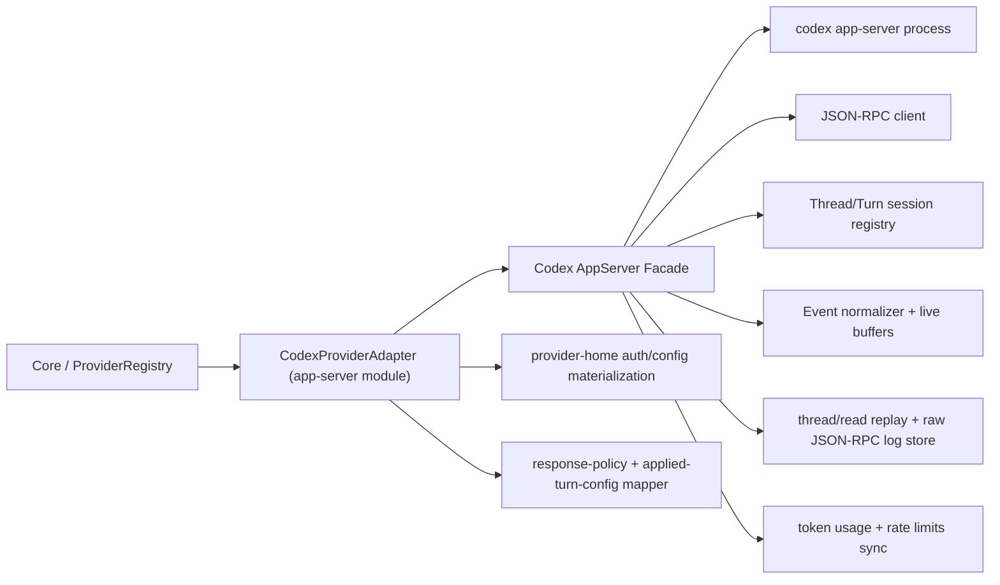

# Codex App-Server Module Architecture — Planning Doc

## 1. Purpose

Спроектировать новый провайдерный модуль Codex на базе `codex app-server` так, чтобы:

- Core мог переключиться на новый модуль с минимальным количеством правок;
- старый `packages/Codex_Module` можно было временно отключить без болезненного rollback;
- внешний контракт провайдера для CodeAI Hub остался прежним.

Главный практический результат этого planning-doc:

- новый модуль делаем как **parallel transport replacement**, а не как in-place rewrite текущего `Codex_Module`;
- Core и UI продолжают видеть **того же провайдера** (`codexCli` / `Codex`);
- переключение выполняется через уже существующий provider-loader seam, а не через новый routing слой.

---

## 2. Validated Inputs (2026-04-19)

### 2.1. Текущие seam'ы в кодовой базе

- Core загружает Codex-провайдер через `packages/core/src/provider-registry/provider-module-loader.ts`.
- Путь подмены уже существует:
  - installed provider slot: `~/.codeai-hub/providers/codex/latest`
  - env override: `CODEX_MODULE_PATH`
- Core runtime ожидает от Codex-модуля только совместимый export:
  - `CodexProviderAdapter`
- Core-facing adapter contract узкий:
  - `initialize()`
  - `createSession()`
  - `resumeSession()`
  - `sendMessage()`
  - `closeSession()`
  - `subscribe()`
  - optional `refreshUsageLimits()`
- Public provider identity сейчас закреплена как `providerId: "codexCli"` в applied-turn-config и session contracts.

### 2.2. Подтверждённые факты по `codex app-server`

Проверено 2026-04-19:

- локально установлен `codex-cli 0.121.0`;
- доступны команды:
  - `codex app-server --help`
  - `codex app-server generate-ts`
  - `codex app-server generate-json-schema`
- официальный protocol README (`openai/codex`) подтверждает:
  - `codex app-server` является интерфейсом, который Codex использует для rich clients, включая VS Code extension;
  - transport baseline — bidirectional JSON-RPC-like protocol over stdio/JSONL;
  - есть item lifecycle + delta notifications для `agentMessage`, `reasoning`, tool items;
  - reasoning summary stream поддерживается через `item/reasoning/summaryTextDelta` и `item/reasoning/summaryPartAdded`.
- сгенерированные локально bindings подтверждают наличие нужных RPC/notifications:
  - `ThreadStartParams`
  - `TurnStartParams`
  - `TurnInterruptParams`
  - `ThreadTokenUsageUpdatedNotification`
  - `GetAccountRateLimitsResponse`
  - `ItemCompletedNotification`
  - `TurnCompletedNotification`

### 2.3. Why this matters

Это означает, что app-server уже предоставляет именно тот transport surface, которого нам не хватает в текущем terminal-oriented SDK path:

- живые reasoning deltas;
- thread/turn lifecycle как first-class protocol;
- explicit interrupt path;
- thread-scoped token usage;
- protocol-native history/replay primitives.

---

## 3. Problem Statement

Текущий `packages/Codex_Module` построен вокруг terminal-oriented цепочки:

- `@openai/codex-sdk`
- `Thread.runStreamed(...)`
- patched `codex exec`
- rollout tailing / rollout replay
- subprocess kill patch для `Stop`

Эта архитектура дала рабочий baseline, но теперь стала ограничением:

1. progressive reasoning stream для Codex получается ненадёжно или terminal-only;
2. semantic provider behavior смешан с SDK/exec-специфичными workaround'ами;
3. `Stop` зависит от kill subprocess, а не от protocol-native interrupt;
4. переключение на новый transport in-place внутри того же модуля сделает rollback дорогим и рискованным;
5. новый transport нельзя проектировать на предположении, что rollout JSONL останется тем же semantic SSOT.

Следовательно, нужен **новый параллельный модуль**, который повторяет текущий внешний контракт провайдера, но меняет transport/runtime implementation.

---

## 4. Design Goals

### 4.1. Goals

- Сохранить `providerId = "codexCli"` во всех живых Core/UI/session contracts первой итерации.
- Сохранить Core-facing adapter surface и shape `CodexModuleOptions`.
- Сохранить текущие product-visible contracts:
  - effective model identity;
  - response policy (`strict` / `hybrid` / `debug_raw`);
  - structured output / output schema;
  - `Reasoning in dialog`;
  - source-first thinking + Core translation overlay;
  - session continuity / token usage / usage limits delivery;
  - unified-session persistence и dialog routing.
- Сделать switch дешёвым:
  - dev/canary switch через `CODEX_MODULE_PATH`;
  - release switch через тот же provider slot `codex`.
- Сохранить legacy module как fallback asset до стабилизации app-server line.

### 4.2. Non-goals

- Не вводить второго user-visible провайдера `codexAppServer` в UI.
- Не делать глобальный redesign ProviderRegistry.
- Не завязывать baseline на `experimentalRawEvents`.
- Не проводить большую дедупликацию legacy/new Codex code до первого рабочего switch.
- Не переписывать Claude/Gemini contracts в рамках этого scope.

---

## 5. Chosen Migration Strategy

### 5.1. Parallel module, not in-place rewrite

Предпочтительный путь:

- создать новый пакет `packages/Codex_AppServer_Module/`;
- оставить текущий `packages/Codex_Module/` как legacy implementation;
- новый пакет экспортирует тот же top-level symbol:
  - `CodexProviderAdapter`
- новый пакет принимает совместимый constructor contract:
  - `CodexModuleOptions`

Почему это лучше, чем rewrite текущего пакета:

- rollback = смена provider module path, а не `git revert` большого transport refactor;
- старый и новый transport не смешиваются в одном runtime cluster;
- проще держать execution scope локальным и micro-task friendly;
- можно переключать Codex provider slot по одному seam.

Ограниченная временная дубликация transport-specific helper-кода между legacy и новым модулем на этом этапе допустима: здесь важнее дешёвый switch/rollback, чем ранняя дедупликация.

### 5.2. Switch seam

Целевой switch path:

1. Development / canary:
   - `CODEX_MODULE_PATH=/abs/path/to/Codex_AppServer_Module`
2. Local installed provider:
   - build нового модуля кладётся в `~/.codeai-hub/providers/codex/<version>`
   - `latest` pointer переводится на app-server build
3. Release:
   - release pipeline пакует app-server модуль в **тот же** codex provider slot

Следствие:

- Core loader не должен знать, какой именно transport стоит за Codex provider slot;
- старый модуль временно остаётся в репозитории, но не является active packaged implementation.

---

## 6. Target Architecture

### 6.1. Stable compat boundary

Снаружи новый модуль обязан выглядеть как текущий Codex provider:

- Core продолжает вызывать тот же `ProviderAdapter`.
- UI / PM продолжают видеть `providerId = "codexCli"`.
- applied turn config остаётся Codex-specific envelope с тем же смыслом:
  - base/effective model identity
  - reasoning effort
  - `messagesForTheUserLanguage`
  - `translationEngineId`
  - visibility gating

Новый модуль обязан продолжать эмитить те event families, которые уже понимает `SessionProviderEventRouter`:

- `turn_started`
- `turn_completed`
- `turn_failed`
- `stream_event`
- `assistant`
- `thinking`
- `dialog_message`
- `system`

`sessionIdChanged` допустим только как temporary compat fallback, но не как target contract.

### 6.2. Runtime model

Новый transport работает как **one long-lived app-server process per adapter instance**, а не как `codex exec` subprocess per turn.

Один app-server process обслуживает:

- несколько Codex thread-ов;
- несколько runtime session-ов CodeAI Hub;
- отдельные turn-ы внутри этих thread-ов.

Mapping:

- `providerSessionId` = app-server `threadId`
- active turn state = tracked `turnId` per session

Это даёт нам native semantics для:

- `resume`
- `interrupt`
- thread history read
- thread token usage

### 6.3. Internal clusters

Новый пакет должен быть разрезан на маленькие transport-focused кластеры:

- `src/provider/codex-provider-adapter.ts`
  - public entrypoint для Core
- `src/app-server/codex-app-server-facade.ts`
  - единственная внутренняя точка входа в transport runtime
- `src/app-server/process/`
  - запуск/остановка child process
  - initialize handshake
  - transport health
- `src/app-server/protocol/`
  - JSON-RPC framing
  - request/response correlation
  - notification dispatch
- `src/app-server/session/`
  - mapping sessionId ↔ threadId
  - active turn bookkeeping
  - subscribe/unsubscribe state
- `src/app-server/turn/`
  - `thread/start`
  - `thread/resume`
  - `turn/start`
  - `turn/interrupt`
- `src/app-server/events/`
  - protocol notification normalizer
  - agent message delta buffer
  - reasoning summary buffer
  - tool/file-change progress mapping
- `src/app-server/history/`
  - `thread/read` rehydration
  - replay/cold-start helpers
  - raw JSON-RPC log persistence
- `src/app-server/usage/`
  - `threadTokenUsageUpdated`
  - `getAccountRateLimits` / `accountRateLimitsUpdated`

### 6.4. Reuse vs replace

Переиспользовать по смыслу можно:

- provider-home auth/config materialization;
- provider-owned `@openai/codex` CLI install story;
- response-policy defaults/types;
- applied turn config semantics;
- translation overlay contract;
- Settings/Core effective-model resolver contracts.

Не переносить как транспортный SSOT:

- `codex-sdk-manager.ts`
- `codex-sdk-patches.ts`
- rollout live tailing как primary semantic source
- subprocess-kill stop path как baseline stop mechanism

---

## 7. Contract Preservation Map

### 7.1. Core-facing contract

Должны сохраниться без product-visible изменений:

- `ProviderAdapter` surface
- `CodexModuleOptions`
- `providerId = "codexCli"`
- existing session binding / dialog routing expectations

### 7.2. Response policy

`TurnStartParams` уже поддерживает:

- `model`
- `effort`
- `summary`
- `outputSchema`

Следовательно:

- существующий `response-policy` фасад не меняет ownership;
- новый transport только маппит нормализованный turn config в protocol fields;
- `strict` / `hybrid` / `debug_raw` сохраняют тот же product contract.

### 7.3. Stop / interrupt

Target behavior:

- `Stop` должен идти через `turn/interrupt(threadId, turnId)`;
- kill whole `codex app-server` process допустим только как fatal recovery / shutdown path.

Это лучше текущего legacy path, где `Stop` опирается на `SIGTERM` дочернего `codex exec`.

### 7.4. Thinking / reasoning

Новый semantic mapping:

- `item/reasoning/summaryPartAdded`
- `item/reasoning/summaryTextDelta`

→ текущий CodeAI Hub visible thinking contract:

- `role: "assistant"`
- `tag: "thinking"`
- source-first emit
- translation потом через Core overlay

### 7.5. Assistant progress / terminal answer

- `item/agentMessage/delta` → текущий assistant progress/live text path
- final `item/completed(agentMessage)` → финализация assistant bubble
- `turn/completed` остаётся lifecycle boundary, а не единственным semantic source of assistant text

### 7.6. Usage / token telemetry

Новый baseline не должен зависеть от rollout file layout.

Target truth:

- `ThreadTokenUsageUpdatedNotification` → `token_usage`
- `GetAccountRateLimitsResponse` + `AccountRateLimitsUpdatedNotification` → `usage_limits`

Legacy rollout-based readers можно использовать только как temporary fallback during migration, но не как новый canonical path.

---

## 8. History And Diagnostics Truth

### 8.1. Semantic truth

Для app-server линии semantic source of truth меняется:

- live item lifecycle notifications;
- `thread/read` / persisted thread history from app-server protocol.

Практическое следствие:

- `thread/start` baseline должен включать `persistExtendedHistory: true`, чтобы app-server линия с первого дня сохраняла достаточно истории для replay/resume/read без зависимости от legacy rollout-tail path.

### 8.2. Diagnostic truth

Новый модуль обязан сохранять provider-owned raw diagnostics до UI/history filtering.

Предпочтительный путь:

- логировать inbound/outbound JSON-RPC frames под `CODEX_HOME` или рядом в provider-owned log root;
- хранить их отдельно от unified-session JSONL;
- не смешивать raw protocol log с user-visible dialog history.

### 8.3. Explicit decision

`experimentalRawEvents` не делаем baseline dependency первой итерации. Это unstable/internal surface. Если он пригодится для future diagnostics, его можно включить отдельным debug-only scope later.

---

## 9. Minimal Core Changes Required

### 9.1. Immediate binding must become provider-neutral

Сейчас `resolveProviderSessionId(...)` знает special-case:

- immediate binding hardcoded only for `geminiCli`

Для app-server это плохая модель, потому что `thread/start` и `thread/resume` сразу возвращают реальный `threadId`.

Следовательно, в этом scope нужно сделать маленькое generic расширение:

- перенести решение об immediate vs deferred binding из hardcoded provider-id logic в provider capability
- пример: `supportsImmediateBinding: boolean`

Тогда:

- legacy Codex module остаётся `false`
- новый app-server модуль ставит `true`
- Core не заставляет app-server имитировать temp id / delayed promotion

### 9.2. Compat fallback

Если для первого spike этот generic cleanup не будет готов, допустим временный compat path:

- app-server module возвращает provisional id;
- позже эмитит `sessionIdChanged`.

Но это **не target design**, а только fallback, если понадобится очень быстрый smoke build.

---

## 10. Build / Release Switch Strategy

### 10.1. Packaging

Новый app-server модуль должен уметь поставляться в тот же provider slot:

- install root: `~/.codeai-hub/providers/codex/<version>`
- manifest: `assets/providers/codex/manifest.json`
- archive identity для release остаётся codex provider archive

### 10.2. Build seam

Нужен ровно один switch point в build pipeline:

- либо параметризовать существующий `scripts/build-codex-module.sh`, чтобы он умел паковать active Codex implementation;
- либо добавить тонкий wrapper, который выбирает source package, но публикует результат в тот же codex provider slot.

Требование:

- release pipeline не должен знать о двух разных user-visible Codex providers;
- выбирается одна implementation, но slot остаётся один.

### 10.3. Legacy disablement

Первая release-line с app-server:

- пакует только app-server implementation в provider slot `codex`;
- legacy package остаётся в репозитории и может быть загружен через explicit override path при rollback/diagnostics;
- Core/UI contracts не меняются.

---

## 11. Execution Phases For Future `todo-plan.md`

### Phase 1 — Buildable parallel module scaffold

- создать `packages/Codex_AppServer_Module/`
- завести public export `CodexProviderAdapter`
- завести build/install seam для provider slot `codex`
- ввести provider-neutral `supportsImmediateBinding`

### Phase 2 — Transport core

- process manager
- JSON-RPC client
- initialize handshake
- `thread/start` / `thread/resume`
- `turn/start` / `turn/interrupt`

### Phase 3 — Event normalization

- assistant delta path
- reasoning delta path
- lifecycle mapping
- stop path
- error normalization

### Phase 4 — Replay and telemetry

- `thread/read` rehydration
- token usage
- usage limits
- raw diagnostics persistence

### Phase 5 — Release switch

- switch codex provider slot to app-server implementation
- update SSOT docs
- disable legacy path in release packaging
- keep rollback override documented

---

## 12. Context Pack For The Future `todo-plan.md`

Перед execution cycle нужно читать:

- `doc/SolidWorks-WorkFlow/System/SystemArchitecture.md`
- `doc/SolidWorks-WorkFlow/Docs_Index.md`
- `doc/SolidWorks-WorkFlow/Clusters/CoreOrchestrator.md`
- `doc/SolidWorks-WorkFlow/Modules/Codex.md`
- `doc/SolidWorks-WorkFlow/Contracts/Codex_ResponseMode_Settings_Architecture.md`
- `doc/SolidWorks-WorkFlow/Contracts/EffectiveModelIdentity_And_Settings_SSOT.md`
- `doc/SolidWorks-WorkFlow/Contracts/Dialogs_And_Continuity_Routing.md`
- `doc/SolidWorks-WorkFlow/Contracts/SessionContinuity.md`
- `doc/SolidWorks-WorkFlow/Contracts/WorkspaceRuntime.md`
- `doc/SolidWorks-WorkFlow/Contracts/SessionUI_Behavior.md`
- `doc/SolidWorks-WorkFlow/Plans/Codex_AppServer_Module_Architecture.md`
- `legacy session report (removed)`

---

## 13. Decision Summary

Зафиксированные решения этого planning-doc:

1. Новый Codex app-server transport делается как **отдельный модуль**, а не как in-place rewrite текущего `Codex_Module`.
2. Внешний provider contract для CodeAI Hub сохраняется: `codexCli`, тот же adapter surface, тот же settings/applied-config смысл.
3. Переключение делается через уже существующий Codex provider slot / module loader seam.
4. Target binding mode для app-server — **immediate binding** по реальному `threadId`; для этого нужен маленький generic Core cleanup.
5. Источником правды для нового transport становятся app-server item lifecycle + thread history, а не legacy rollout tailing.

---

## 14. External References

- Official app-server protocol README:
  - <https://github.com/openai/codex/blob/main/codex-rs/app-server/README.md>
- OpenAI architecture post:
  - <https://openai.com/index/unlocking-the-codex-harness/>
