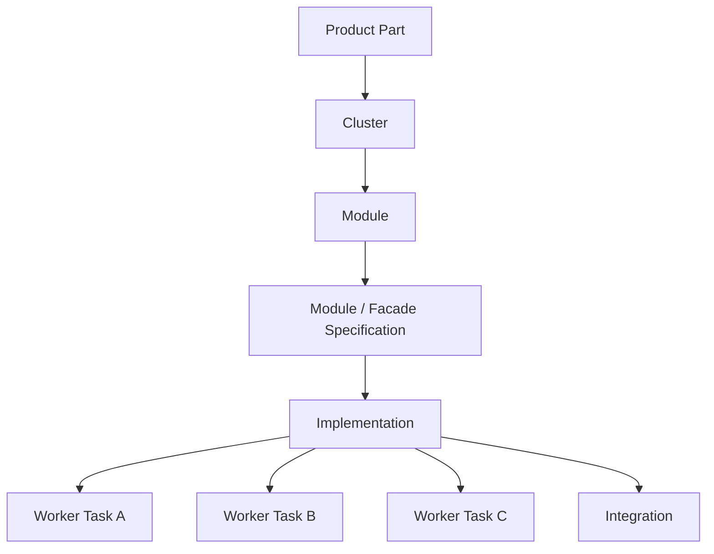

# Development Tree Implementation Lifecycle Planning

**Status:** Active planning source
**Created:** 2026-05-20
**Owner:** Oleksandr + Codex
**Scope:** канонизировать будущий lifecycle для шагов Development Tree после `Quality Gates Baseline`: спецификация модуля/фасада, implementation planning, параллельные worker-сессии, integration phase, отображение в Project Manager.

## 1. Принятое направление

Development Tree должен повторять технологическую модель SolidWorks: пользователь работает с деревом продукта, выбирает конкретный узел, проваливается в операцию над этим узлом и видит только релевантную сессию и релевантные артефакты.

Базовая модель:

- левый sidebar остается структурным деревом продукта и операций;
- средняя панель `Sessions` показывает только сессию выбранного шага;
- правая панель `Artifacts` показывает только user-facing артефакты выбранного шага;
- соседние шаги дерева не дублируются вкладками в `Sessions` или `Artifacts`;
- machine-readable JSON/read-model артефакты не показываются пользователю как обычные документы, если они не помогают принять решение.

## 2. Иерархия узлов

Для выбранного module node базовая вложенность такая:

```text
Product Part
└─ Cluster
   └─ Module
      └─ Module / Facade Specification
         └─ Implementation
            ├─ Worker Task / Agent Run 1
            ├─ Worker Task / Agent Run 2
            ├─ Worker Task / Agent Run 3
            └─ Integration
```

Правила отображения:

- `Product Part`, `Cluster`, `Module`, `Module / Facade Specification` и `Implementation` могут иметь подсвеченный ободок, если у них есть вложенные узлы.
- Leaf-узлы worker-сессий не получают ободок только ради статуса; статус показывается уже существующим механизмом индикаторов.
- Длинные имена узлов не должны обрезаться. Sidebar может быть шире, если это нужно для читаемости.
- `Implementation TODO Plan` не является отдельным узлом дерева. Это артефакт шага `Implementation`.
- `Parallel Implementation Waves` не является отдельным документом или абстрактным шагом. Реальные дочерние узлы создаются из плана как конкретные worker agent runs.
- `Module Verification` пока не вводится как отдельный обязательный user-facing узел. Проверки являются частью managed implementation lifecycle и commit/gate boundary. Отдельный review/test workflow можно проектировать позже.

### Граф вложенности



## 3. Module / Facade Specification

`Module / Facade Specification` — один шаг, одна сессия, один design agent, два user-facing артефакта:

- `module-spec.md`;
- `facade-contract.md`.

Почему один агент:

- фасадный контракт должен вытекать из алгоритмов, состояний, ошибок, входов/выходов и ownership boundaries модуля;
- два независимых агента повышают риск расхождения между поведением модуля и публичной boundary;
- при двух агентах почти неизбежно нужен третий reconciliation step, что перегружает базовый workflow.

Design Agent обязан:

- вести диалог с пользователем только в контексте выбранного module node;
- создать и обновлять `module-spec.md`;
- создать и обновлять `facade-contract.md`;
- не писать production-код;
- не создавать implementation plan;
- не запускать worker agents;
- не выполнять commit lifecycle самостоятельно.

User acceptance gate:

- пользователь принимает оба артефакта одним review gate;
- до acceptance `Implementation` заблокирован;
- если пользователь просит правки, возвращается та же design-сессия выбранного шага.

## 4. Implementation

`Implementation` — управляемый шаг под `Module / Facade Specification`.

Первая ответственность Implementation Agent: создать `implementation-todo-plan.md`. Этот план является user-facing артефактом шага `Implementation`.

Implementation Agent не становится runtime-оркестратором. Он проектирует план и может позже выполнять смысловую integration work, но порядок запуска worker-сессий, ownership, gating и commit lifecycle остаются у Core.

Артефакты шага:

- `implementation-todo-plan.md` — человекочитаемый план;
- `implementation-plan.json` — machine-readable projection для Core, не показывается как обычный пользовательский документ.

Допустимые варианты материализации JSON:

- агент пишет только Markdown, а Core парсит/материализует JSON;
- агент пишет Markdown и JSON, но Core валидирует JSON как canonical machine contract;
- если Markdown и JSON расходятся, Core блокирует execution и требует repair.

## 5. Роли агентов и Core

### Design Agent

Владеет смысловым design step:

- читает scoped upstream context выбранного module node;
- создает `module-spec.md`;
- создает `facade-contract.md`;
- отвечает на вопросы пользователя;
- открывает review gate через Core.

### Implementation Planning Agent

Владеет декомпозицией implementation:

- читает accepted `module-spec.md` и `facade-contract.md`;
- читает relevant skeleton/foundation context;
- читает Quality Gates baseline;
- создает `implementation-todo-plan.md`;
- размечает serial/parallel execution;
- назначает file ownership;
- формирует expected commit messages;
- выделяет обязательную `Integration` phase.

### Core / Script Orchestrator

Остается authority процесса:

- валидирует `implementation-todo-plan.md`;
- создает или валидирует `implementation-plan.json`;
- проверяет file ownership и конфликтующие scopes;
- создает дочерние worker session nodes под `Implementation`;
- запускает worker agents последовательно или параллельно согласно plan graph;
- не позволяет worker agent выходить за назначенный scope;
- запускает gates;
- управляет commit lifecycle;
- создает recovery/blocker state;
- продвигает следующий batch только после accepted commit boundary.

### Worker Agents

Выполняют конкретные микрозадачи:

- получают только свой scope;
- получают inline-context, нужный для своей задачи;
- не меняют общий implementation plan;
- не запускают другие worker sessions;
- не коммитят сами;
- возвращают patch/result в Core-managed lifecycle.

### Integration Agent

Выполняет смысловую склейку после batch workers:

- читает результаты завершенных worker tasks;
- читает diff summary, touched files, failed gates и accepted plan context;
- чинит wiring, exports, facade consistency, naming, type edges;
- обновляет документацию, если реализация уточнила контракт;
- не заменяет Core как оркестратор;
- работает внутри отдельной `Integration` phase из `implementation-todo-plan.md`.

## 6. Execution graph и метки плана

`implementation-todo-plan.md` должен быть одновременно readable для пользователя и parseable для Core. План обязан явно различать:

- последовательные задачи;
- параллельные группы;
- зависимости между задачами;
- ownership по файлам;
- expected commit message для каждой commit boundary;
- gates, которые должны пройти после задачи или группы.

Минимальные метки для machine-readable projection:

| Поле | Назначение |
| --- | --- |
| `taskId` | стабильный id микрозадачи |
| `phaseId` | фаза плана |
| `streamId` | stream внутри фазы |
| `executionMode` | `serial` или `parallel` |
| `parallelGroupId` | общий id группы задач, которые можно запускать одновременно |
| `dependsOn` | список taskId, которые должны завершиться раньше |
| `agentRole` | `planning`, `worker`, `integration` |
| `scope` | список файлов/пакетов, которыми владеет задача |
| `expectedOutputs` | ожидаемые файлы/изменения |
| `expectedCommitMessage` | commit message для Core-managed commit |
| `gates` | список targeted gates после задачи или группы |
| `userFacingNodeTitle` | имя дочернего узла в Development Tree |

Core обязан fail-close, если:

- две параллельные задачи владеют одним и тем же файлом без explicit integration owner;
- `dependsOn` ссылается на неизвестный taskId;
- worker task не имеет scope;
- commit boundary отсутствует;
- план пытается запустить worker до acceptance `Module / Facade Specification`;
- Integration phase отсутствует.

## 7. Обязательная Integration phase

Каждый implementation plan обязан содержать отдельную фазу:

```text
Phase N — Integration
```

Она не является декоративным UI-разделом. Это managed phase с обычными микрозадачами, scope, expected outputs, gates и commit boundaries.

Integration phase нужна потому что результаты параллельных worker agents редко становятся цельной архитектурной единицей без смысловой склейки.

Типичные задачи Integration phase:

- объединить результаты worker tasks;
- устранить конфликты типов, exports и imports;
- проверить, что facade contract соответствует implementation;
- синхронизировать module entrypoint;
- проверить, что новые классы не превышают 500 строк;
- обновить документацию, если implementation уточнил design;
- запустить targeted gates;
- подготовить user review summary.

Пример:

```markdown
## Phase 3 — Integration

### Stream: Integration Pass
1. [TODO] `phase3.integration.task1` Integrate worker outputs for `workflow-navigator` facade, exports, and state adapter wiring (executionMode: `serial`; agentRole: `integration`; scope: `product-parts/project-manager/clusters/workflow-and-artifact-ui/modules/workflow-navigator/**`; dependsOn: `phase2.worker-a.task1`, `phase2.worker-b.task1`, `phase2.worker-c.task1`; gates: `qg:typecheck`, `qg:lint`; expected commit: `feat: integrate workflow navigator module`).
2. [TODO] Git Commit: `feat: integrate workflow navigator module` (hash: TBD)
```

## 8. Пример структуры implementation-todo-plan.md

```markdown
# Implementation TODO Plan — workflow-navigator

## Source Artifacts
- `module-spec.md`
- `facade-contract.md`

## Machine Contract Summary
- `implementationPlanSchema`: `codeai-implementation-plan-v1`
- `moduleNodeId`: `project-manager.workflow-and-artifact-ui.workflow-navigator`
- `parallelism`: enabled
- `integrationPhaseRequired`: true

## Phase 1 — Planning Acceptance
### Stream: User Acceptance
1. [TODO] `phase1.acceptance.task1` User accepts this implementation plan before Core starts worker sessions (executionMode: `serial`; agentRole: `planning`; scope: user workflow; no commit expected).

## Phase 2 — Parallel Implementation
### Stream: Worker Batch A
1. [TODO] `phase2.worker-a.task1` Implement workflow navigator facade public API (executionMode: `parallel`; parallelGroupId: `batch-a`; agentRole: `worker`; scope: `workflow-navigator-facade.ts`, `workflow-navigator-contract.ts`; dependsOn: `phase1.acceptance.task1`; expected commit: `feat: add workflow navigator facade`).
2. [TODO] Git Commit: `feat: add workflow navigator facade` (hash: TBD)
3. [TODO] `phase2.worker-b.task1` Implement Core snapshot adapter (executionMode: `parallel`; parallelGroupId: `batch-a`; agentRole: `worker`; scope: `workflow-navigator-state-adapter.ts`; dependsOn: `phase1.acceptance.task1`; expected commit: `feat: add workflow navigator state adapter`).
4. [TODO] Git Commit: `feat: add workflow navigator state adapter` (hash: TBD)
5. [TODO] `phase2.worker-c.task1` Implement selected-node view model helpers (executionMode: `parallel`; parallelGroupId: `batch-a`; agentRole: `worker`; scope: `workflow-navigator-view-model.ts`; dependsOn: `phase1.acceptance.task1`; expected commit: `feat: add workflow navigator view model`).
6. [TODO] Git Commit: `feat: add workflow navigator view model` (hash: TBD)

## Phase 3 — Integration
### Stream: Integration Pass
1. [TODO] `phase3.integration.task1` Integrate worker outputs and run targeted gates (executionMode: `serial`; agentRole: `integration`; scope: `workflow-navigator/**`; dependsOn: `phase2.worker-a.task1`, `phase2.worker-b.task1`, `phase2.worker-c.task1`; gates: `qg:typecheck`, `qg:lint`, `qg:test-smoke`; expected commit: `feat: integrate workflow navigator implementation`).
2. [TODO] Git Commit: `feat: integrate workflow navigator implementation` (hash: TBD)
```

## 9. Project Manager UI contract

### Sidebar

Sidebar показывает:

- structural product hierarchy;
- выбранный operation node;
- дочерние execution nodes, если они реально существуют как сессии/agent runs.

Sidebar не показывает:

- JSON/debug artifacts;
- внутренние diagnostics как отдельные пользовательские шаги;
- worker microtasks, если за ними не стоит отдельная agent session.

### Sessions panel

`Sessions` показывает только сессию выбранного узла:

- для `Module / Facade Specification`: одна design-сессия;
- для `Implementation`: одна planning/orchestrator-сессия;
- для worker child node: одна worker-сессия;
- для `Integration`: одна integration-сессия.

Если внутри одного выбранного узла появится reviewer или repair session, она может быть вкладкой этого же узла. Но соседние узлы дерева не дублируются вкладками.

### Artifacts panel

`Artifacts` показывает user-facing артефакты выбранного узла:

- `Module / Facade Specification`: `module-spec.md`, `facade-contract.md`;
- `Implementation`: `implementation-todo-plan.md`;
- Worker Task: diff summary, touched files summary или generated docs, если они нужны пользователю;
- `Integration`: integration summary, gate output summary, final user review summary.

Machine-readable JSON можно показывать только в diagnostic/debug mode, но не как основной artifact tab.

## 10. Core-owned lifecycle

Core должен продолжать текущую архитектурную линию:

- clients are projections;
- agents produce content;
- Core owns state transitions;
- Core owns validation;
- Core owns commit lifecycle;
- Core owns worker session creation;
- Core owns recovery/blocker status.

Базовый порядок:

```text
Module / Facade Specification accepted
→ Core unlocks Implementation
→ Implementation Planning Agent creates plan
→ Core validates plan and materializes JSON projection
→ User accepts plan
→ Core creates worker child nodes
→ Core starts serial/parallel batches
→ Core commits accepted worker outputs
→ Core starts Integration phase
→ Core runs gates and commits integration
→ Core opens user acceptance gate
```

## 11. Open technical decisions

Эта planning source фиксирует принципиальную схему. Перед реализацией еще нужно отдельно спроектировать:

- точную JSON schema `codeai-implementation-plan-v1`;
- валидатор конфликтов ownership;
- API создания worker child nodes;
- механизм безопасного параллельного patch application;
- правило отображения worker tasks в sidebar, если task слишком много;
- формат worker diff summary для пользователя;
- repair lifecycle для failed worker или failed integration phase.
